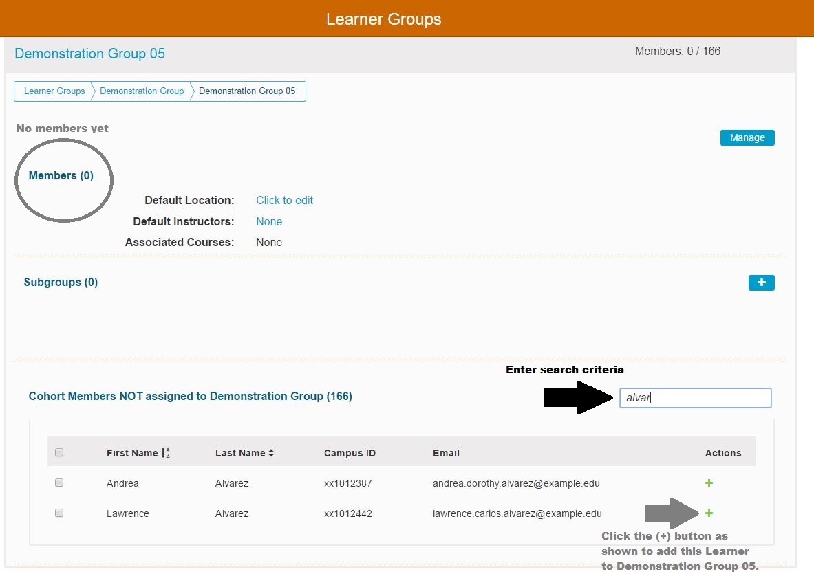

# Edit Membership

## Add Individual Learner to Group

In this example, there are no Learners in the group "Demonstration Group 05". The learner "Lawrence Alvarez" needs to be added to the group. This can be accomplished as shown below.

Once the green \(+\) has been clicked to add "Lawrence Alvarez" to the sub group "Demonstration Group 05", the screen updates to what is shown below and it is easy to verify the learner's enrollment in the group.

## Add Multiple Learners to Group

In this example the filtering functionality was not used; but it is evident that five Learners were selected using the check boxes provided and can now be moved into the Learner Group "Demonstration Group 05" with one button click.

## Removing One or More Learners from Group

