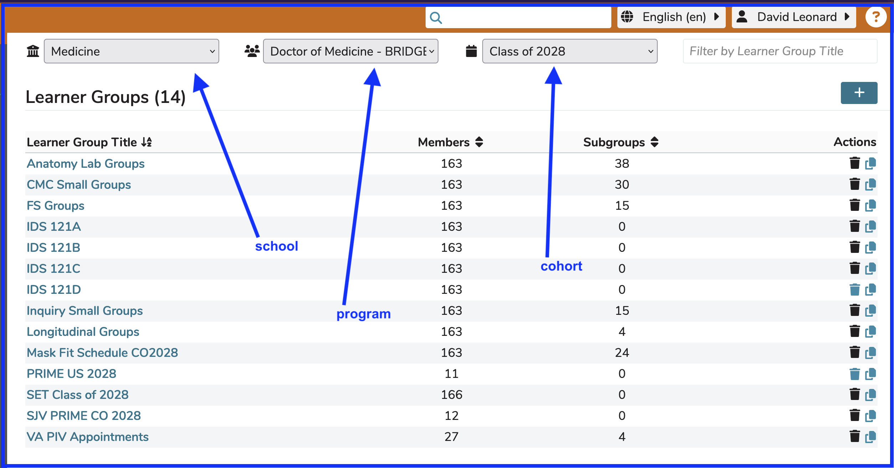
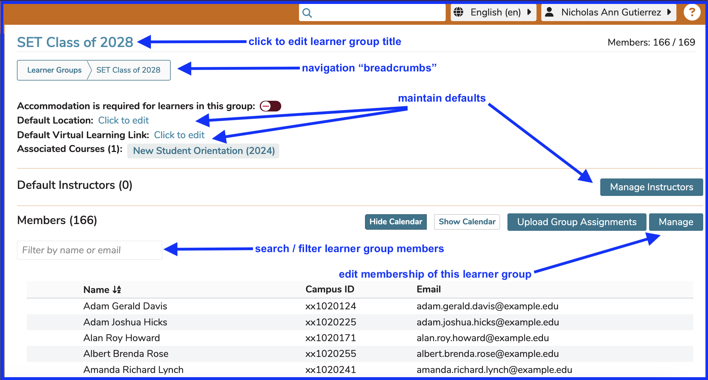

# Edit Learner Group

The first step in the editing and review process is to select school, program, and cohort. The drop-down boxes on the top of the screen are used to do this as shown below.

## Select School, Program, and Cohort

The school selector is the first drop-down menu available and visible on the page. It is shown below with Medicine already chosen as the School.

Now that Medicine has been selected, a program "Doctor of Medicine - BRIDGES" has been selected as shown above. The cohort "Class of 2028" has also been selected.

At this level, you can see the following fields ...

* Learner Group Title -- The title for this Learner Group (can be filtered)
* Members -- A count of the total of group and subgroup members
* Subgroups -- A count of all of the subgroups for this higher-level group
* Action menu -- Delete or Copy

### Filter by Group Title

The ability to filter by learner group Title makes it easy to find and select a group to modify. Any characters (1 or more) can be entered. The result set is updated to return only Learner Groups that contain that search string in their Learner Group Title.

In this example, the Learner Group and / or Subgroups to be modified is called "SET Class of 2028". Enter "se" (not case-sensitive) in the filter box as shown below.

### Sort Options

In addition to the filtering option explained above, the list of learner groups can be sorted (one sort applied at a time) by "Learner Group Title", "Members", or by "Subgroups".

Learner group titles can be sorted alphabetically ascending or descending whereas member count ("Members") or subgroup count ("Subgroups") can be sorted numerically by an ascending or descending sort.

### Edit Group Attributes

To edit a Group's attributes, click as shown above. The group's name is a hyperlink used to edit it or view its attributes / membership. In this example "SET Class of 2028" has been selected. The top part of the screen appears as shown below with selected features highlighted in the screen shot.

### Screen Elements

**Title:** Can be modified by clicking on it, making changes, and confirming.

**Manage:** Switched on or off by clicking the button. When "Manage" is turned on, the group assignment can be edited. The learners who need to be added to "Prologue Entire Class" can be found by searching and sorting. The learners who are not currently in the group appear in the lower part of the output grid.

**Learner List:** Any of these students can be assigned either into this group,back up to the cohort level or they can be moved into another group by navigating to the other group first.

**Default Location:** If a Room Number (Location) is not specified for a specific Offering, this default location is attached instead. This applies to Small Group offerings but not to Lectures.

**Default Instructor:** Same as with location.

[**Default Virtual Learning Link:**](https://iliosproject.gitbook.io/ilios-user-guide/learner-groups/learner-group-defaults#default-virtual-learning-link) Same as with location.

[**Learner Group Calendar:**](https://iliosproject.gitbook.io/ilios-user-guide/learner-groups/calendar) Display or hide calendar of events associated with this learner group and / or sub groups.

**Needs Accommodation:** This is set to affirmative by sliding the toggle as shown below. This is for virtual learning. The learner group has at least one member who requires accommodation like closed captions or something else in a virtual learning setting.

        Before ...

        After ...

**Associated Courses:** Read-only list of Courses that have this Learner Group attached to one or more Session Offerings.

### Group Members Listed

**Important Note**: The focus of editing group membership is the group itself rather than any given learner.

The first thing to remember is to always navigate to the Learner Group to which you wish to add or remove Learners.

The list of the learners currently enrolled in this group is shown below.

