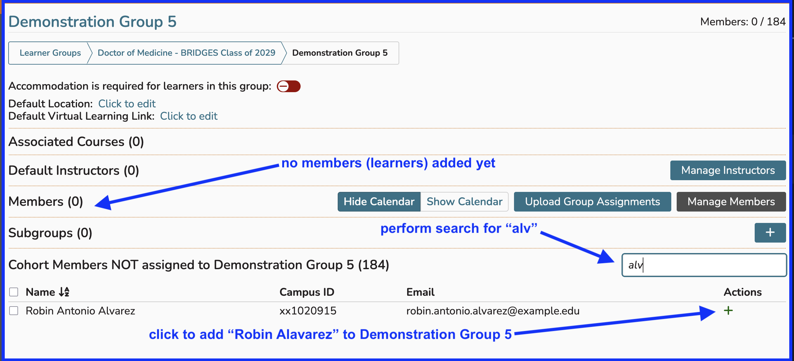
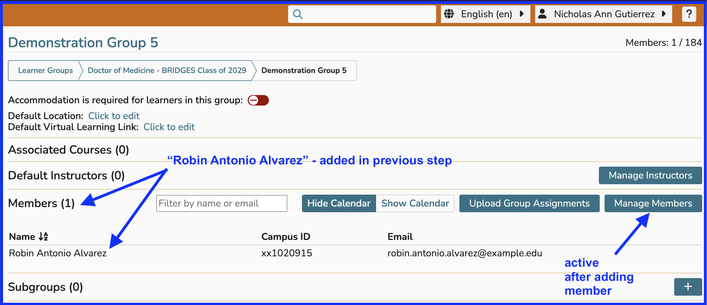
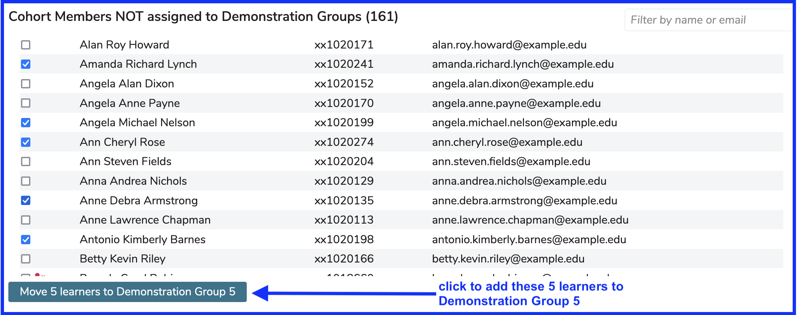
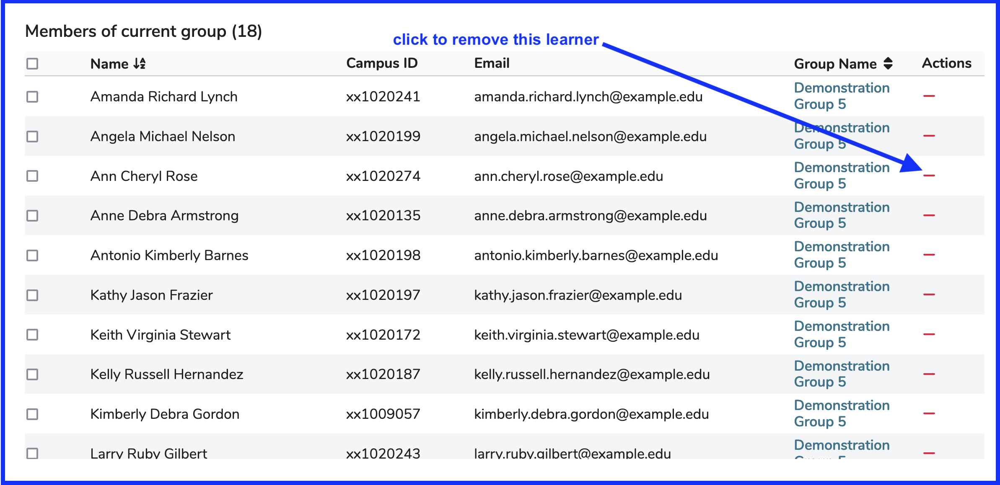
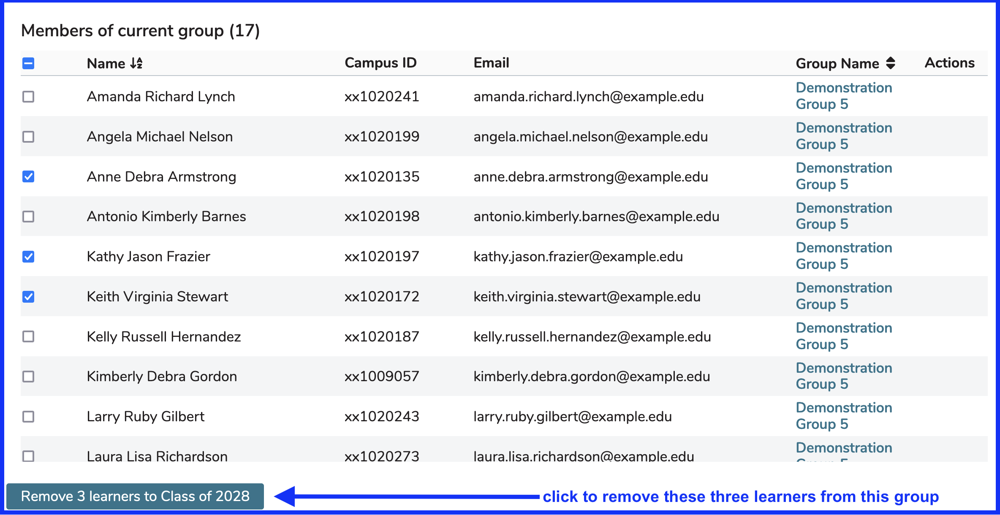
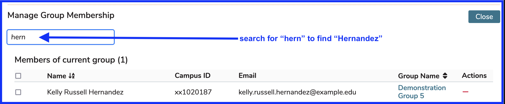

# Edit Membership

## Add Individual Learner to Group

In this example, there are no Learners in the group "Demonstration Group 05". The learner "Lawrence Alvarez" needs to be added to the group. This can be accomplished as shown below.

Once the green (+) has been clicked to add "Lawrence Alvarez" to the sub group "Demonstration Group 05", the screen updates to what is shown below and it is easy to verify the learner's enrollment in the group.

## Add Multiple Learners to Group

Users will need to scroll down to the lower part of the screen to access the area where Cohort members who have not been added to Demonstration Group or any of its sub groups is located.

In this example the filtering functionality was not used; but it is evident that five Learners have been selected using the check boxes provided and can now be moved into the learner group "Demonstration Group 5" with one button click.

## Remove Learners from Group

### One Learner
Below is a screen shot depicting a learner group in "Manage" mode. Before any learners have been selected using the check boxes on the left, there are red indicators available to remove any one learner immediately. This happens without confirmation. As an example, the learner "Ann Cheryl Rose" will be removed from the learner group as soon as the red line is clicked.

It is necessary (as in the "add" actions performed above) to click "Manage" after navigating to the correct learner group/sub group to perform maintenance.

### Multiple Learners

Once one or more learners have been selected for removal using the provided check boxes, the red "instant remove" action items disappear. We are now in multi-edit mode. 

Three learners have been selected to be removed from this learner group. This is accompished by clicking on the check boxes as shwon below.

Learners to be removed ...
* "Anne Debra Armstrong"
* "Kathy Jason Frazier"
* "Keith Virginia Stewart"

### Search for Learner(s)

There is a search box available at the top of the listing of learners in the current group. This can be utilized to find specific learners to remove.

At this point either method, instant click, or select to remove using check box and button, can be used because nothing has been selected yet.

