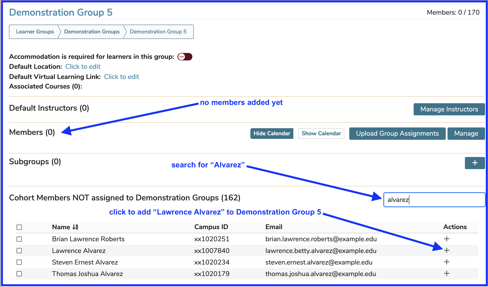
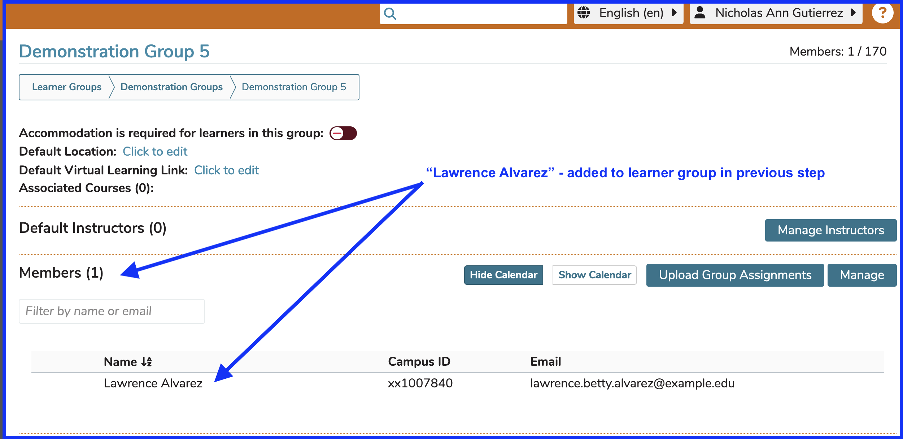

# Edit Membership

## Add Individual Learner to Group

In this example, there are no Learners in the group "Demonstration Group 05". The learner "Lawrence Alvarez" needs to be added to the group. This can be accomplished as shown below.

Once the green (+) has been clicked to add "Lawrence Alvarez" to the sub group "Demonstration Group 05", the screen updates to what is shown below and it is easy to verify the learner's enrollment in the group.

## Add Multiple Learners to Group

Users will need to scroll down to the lower part of the screen to access the area where Cohort members who have not been added to Demonstration Group or any of its sub groups is located.

In this example the filtering functionality was not used; but it is evident that five Learners have been selected using the check boxes provided and can now be moved into the learner group "Demonstration Group 5" with one button click.

## Remove One or More Learners from Group

