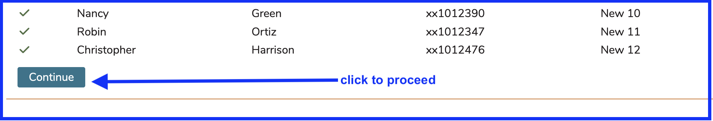
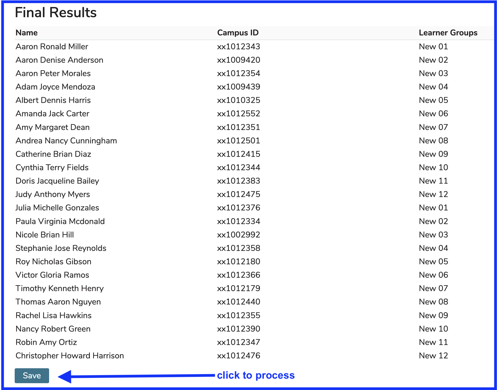

# Group Assignment Tool

This tool accepts a comma or tab delimited file to define Ilios users to be uploaded or assigned into the Learner Groups \(Sub Groups\) of which they need to be assigned as members.

While it is a requirement that users have to exist in Ilios and be students in the correct Cohort, the term "upload" is still correct in the sense that a document (.csv, .tsv, .txt) that exists outside of Ilios needs to be "uploaded" into Ilios to process the Learner Group assignments specified in the document.

## How To Use It ...

### Activate the Tool

To start this process, click as shown below.

The group created for this example is called "Gold Team Exam Group". As indicated in the screen shot above, there are 12 sub groups already created to hold the incoming learners contained in the delimited file that will be uploaded.

Clicking the **"Sample File"** link will cause a file called "SampleUserUpload.tsv" to be downloaded to your computer. Open this file in Excel to view its contents. It will initially be stored in your "Downloads" folder. The screen shot below is from the sample .tsv file opened in Excel. It contains no data but indicates the four fields that need to be included in any .tsv, .csv, or .txt file to be uploaded.

* **First:** Learner's first name.
* **Second:** Learner's last name.
* **Campus ID:** Unique identifier of the Learner in the Campus' information system. These must match exactly. If there are leading zeroes, they will need to be included. Try formatting the column in Excel \(or other\) as "Text" if that is the case.
* **Sub Group Name:** Name of the Sub Group into which this Learner should be placed in Ilios. This group can either be created in Ilios in advance or it can be created by using this process instead.

### Create Upload File

Using the empty sample file as a template, create a file using Excel or Text Pad \(or other text editor\). This part is up to your comfort level and preference.

In Excel, the following file with sample data has been created.

The file in this case has been titled "SampleUserUploadNewSubs2.tsv". It is a tab separated file. There are 24 students to be assigned to their correct Sub Groups, which are named "New "##" where "##" refers to a number between 01 and 12. These Sub Groups are nested under a parent Learner Group called "New".

### Attach Upload File

The first step here is to navigate to the higher level Learner Group with the title "Gold Team Exam Group". As shown below, this Learner Group has 9 Sub Groups. Three of the 12 Learner Groups will be created for demonstration purposes.

After clicking the **"Upload Group Assignments"** button and then **"Choose File**, a dialog box similar to the one shown below will appear. The exact appearance of this file dialog box will vary depending on the operating system of your computer, tablet, or phone. The example shows a Mac laptop.

### In Case of Errors

**NOTE**: The "Start Over" button can be used if there are issues with the information contained in the upload file. This stops the process and allows the the upload file to be fixed berore trying again. 

Using the "Close" button in the above-referenced scenario will close this "Upload Group Assigments" functionality. 

Records with issues (such as not being part of the cohort or incorrect ID) are displayed at the top of the output with the valid records being displayed below. 

### Ready to Process

Now that the correct file has been selected and any and all errors have been corrected, click Open and see the results as shown below. The label indicates there are 24 valid users to be assigned into the Learner Groups.

Scroll to the bottom of the screen and click as shown below to continue.

**NOTE:** If these records do not look correct for any reason, you can still back out and fix the upload file and try again once the file has been corrected.

After clicking **Continue**, the screen takes on the following appearance. Refer to the on-screen instructions for more information. In the three cases where a Learner Group match was not found immediately, you can create the group specified by the upload file or select one of the other existing groups.

In this example, the **Create This Group** button will get clicked for all three of the yellow-highlighted group mismatches.

The results of this action are shown below. All groups from the file (Uploaded Group) match a correct Existing Group. All backgrounds are green with correct selections made.

### Final Results

Scroll down below here to find a section entitled "Final Results". This shows the pairings of the learners and the groups into which they will be assigned.

At the bottom part of the screen (may require a bit of scrolling depending on how many Learners are being assigned), the **"Save"** button is available to process the group assignment and make the save to the database.

### Verify Results

After clicking **Save** as shown above, the learners will all be placed in their assigned sub groups.

Below is a high level view of the fact that each of the sub groups now contains two members. This is what is expected given the upload file that was used.

Click on any of the sub groups to review and confirm group membership.

