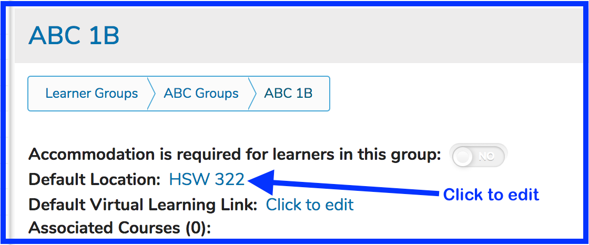
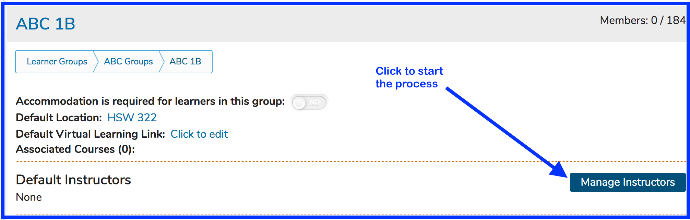
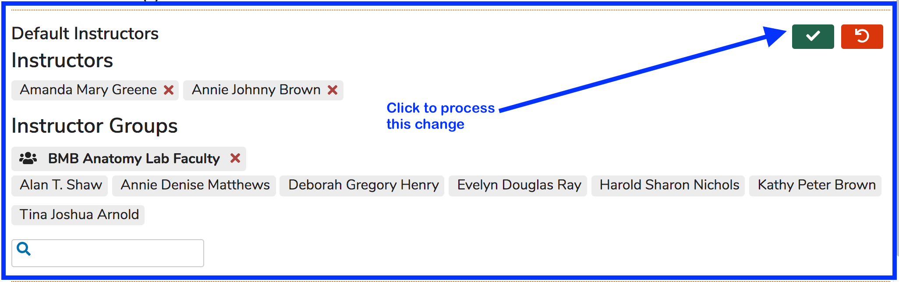

# Learner Group Defaults

****

**NOTE**: Default values for small group offerings are applied when the offerings are first created. Offerings that were saved previously will **NOT** get updated if / when the defaults are changed. The offerings retain the original values that were in place for the Learner Group default values when they were created.

## Default Location

To specify a default location for a small group offering to take place, the following steps can be taken.

* Select the Learner Group to modify and click "Click to edit" or if there already is a default location, it will be hyperlinked. Clicking on the text value of the default location will open the editing pane.

* After following the step indicated above, the "Click to edit" Default Location field changes into a text box allowing the default location to be entered manually. This is shown below. The default location has been entered for this Learner Group "HSW 322".

* Click the green check box or press Enter on the keyboard to save this specification.

Now that it has been saved, "HSW 322" appears as a clickable hyperlink in case changes need to be made. Small Group offerings that get created going forward will obtain this value as the Offering's location. This will not affect or update previous small group offerings associated with this learner group.

## Default Instructor(s)

The process for adding default instructor(s) is similar with the exception being you can add more than one Instructor or Instructor Group as the default.&#x20;

#### Add Default Instructor(s)

**Step One**

**Step Two**

After clicking as shown above, the screen adjusts to allow for the search for one or more instructors to be performed.

**Step Three**

Search for and select several Instructors and an Instructor Group. The instructors who are in the group are listed as shown below.

After performing the action shown above, all 7 members of the "BMB Anatomy Lab Faculty" Instructor group along with the 2 individual Instructors have been assigned to be default instructors for any newly created offerings associated with this Learner Group.

After confirming by clicking the check box button ...

## Default Virtual Learning Link

This is used to set a default virtual learning link for this small group. Remote learning has made this important in recent years. The value can be pasted or entered as shown in an updated screen shots shown below.

To finish the process, click the green confirmation button or press enter on the keyboard. Members of "Anatomy Lab Groups 01" will see the default virtual learning link in the offering detail. Every small group offering for this group will obtain these very useful default values.

## Needs Accommodation

This is used when one or more learners in a learner group require accommodations to successfully participate in remote learning activities.

Initially (before being set), the toggle appears as shown below. The default for any learner group is "No"

Slide the toggle over to the right by clicking it.

You can review and verify which learner groups have had this value set. Refer to the arrows in the screen shot below.

These groups are subgroups. From the parent group (one level up), this is how these designations appear.

Learners in these groups will NOT see this anywhere in the offering view on calendar or Week at a Glance. This is only for administrative purposes.
