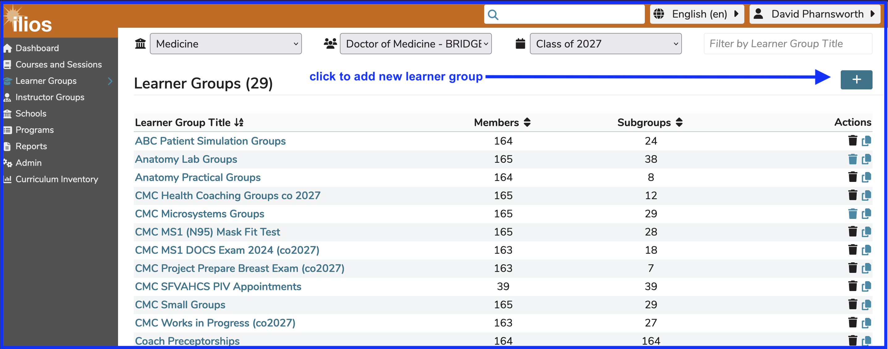
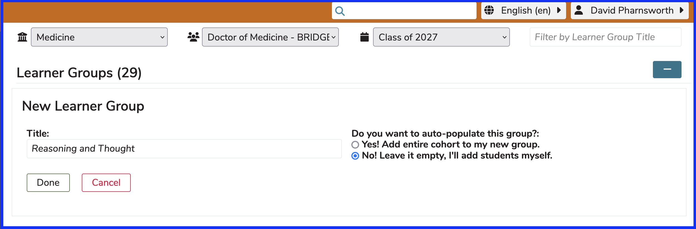
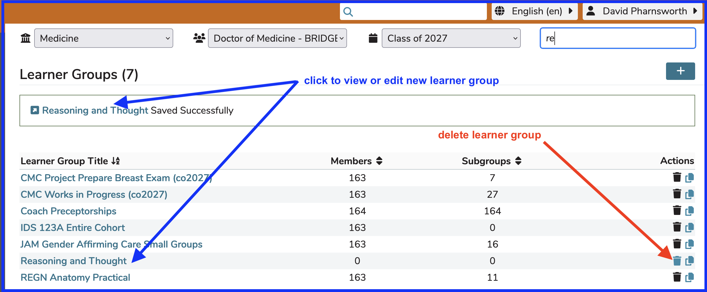
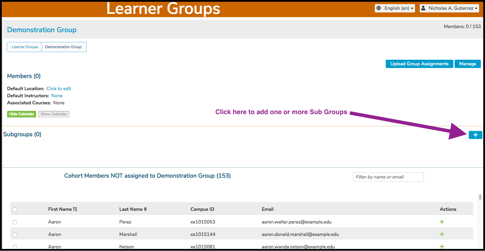

# New Learner Group

To add a new Learner Group, select a Program and Cohort and click the (+) icon as shown below to start the process of adding a new top-level Learner Group.

## Add Learner Group 

## Membership Options

As shown below, you can choose to add the entire cohort to the new group or leave it empty. A learner group title (name) must be a minimum of three characters in length.

After clicking "Done", the new learner group is added to the appropriate list (shown below). The list is sorted initially by title in alphabetical order. The sort order can be changed by the user to be Member or Subgroup counts instead of title. The new learner group "Reasoning and Thought" has been added with no students included. They can be added later of course.

**NOTE**: This newly added Learner Group can still be deleted since it has not been attached to any Offerings yet.

The new learner group detail screen appears as shown below. Sub groups can added to any group (even another sub group) as shown in the [Sub Groups](https://iliosproject.gitbook.io/ilios-user-guide/learner-groups/sub-groups) section.

## Add Sub Groups

The parent group in this case is the new learner group recently added in this section. Click on the (+) icon as shown above to begin the process of adding one or more sub groups.

