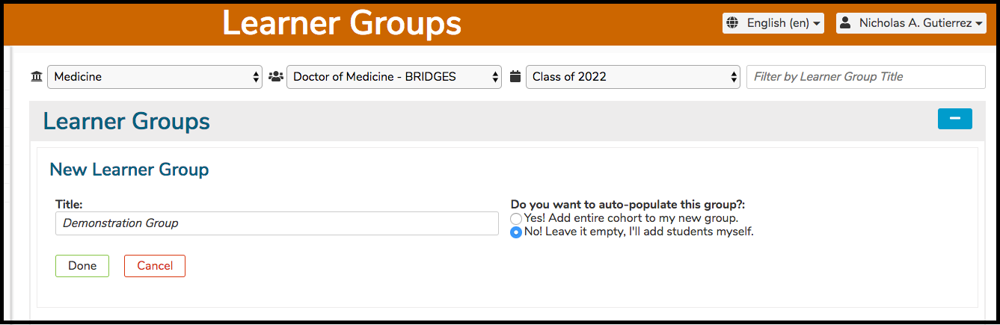
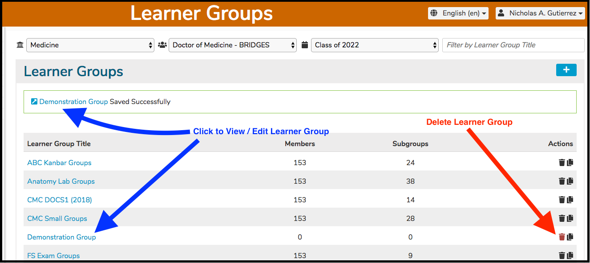

# New Learner Group

To add a new Learner Group, select a Program and Cohort and click the \(+\) icon as shown below to start the process of adding a new top-level Learner Group.

As shown below, you can choose to add the entire cohort to the new group or leave it empty.

After clicking Done, the new Learner Group is added to the Learner Group list \(shown below\). The list is sorted in alphabetical order. The new Learner Group "Demonstration Group" is added with no students included.

**NOTE**: This newly added Learner Group can still be deleted since it has not been attached to any Offerings yet.

The new Learner Group detail appears as shown below. Sub groups can added to any group \(even another sub group\) as shown in the [Sub Groups](https://iliosproject.gitbook.io/ilios-user-guide/learner-groups/sub-groups) section.

Once the Parent Group has been selected, click on the \(+\) icon as shown above to begin the process of adding a sub group.

