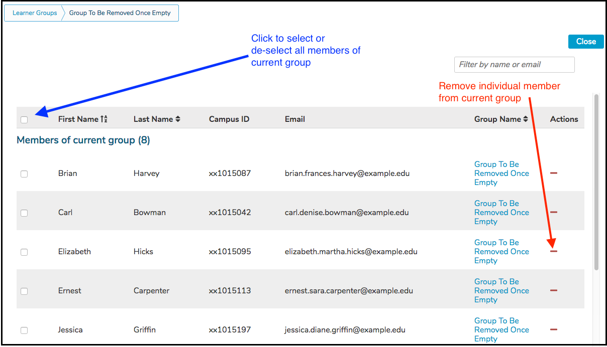
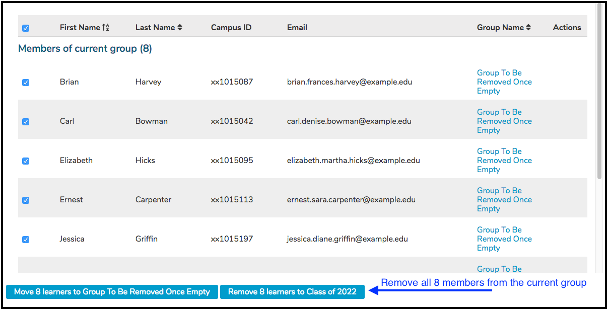
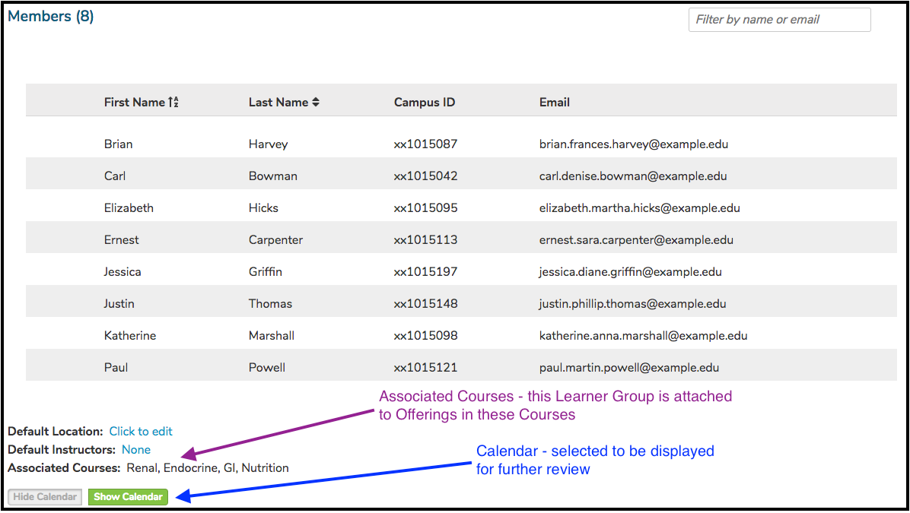
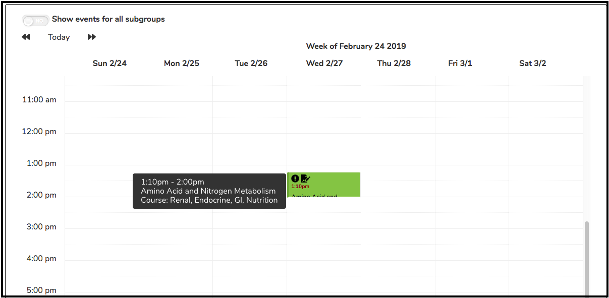
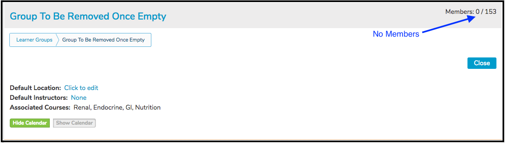
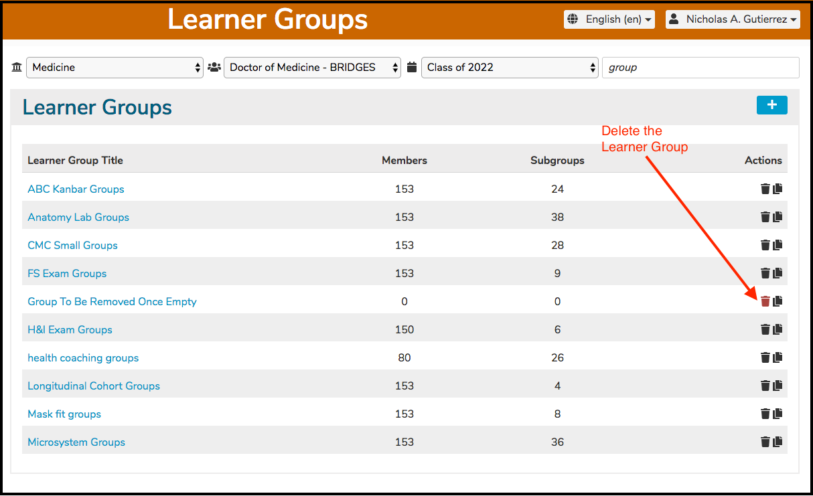
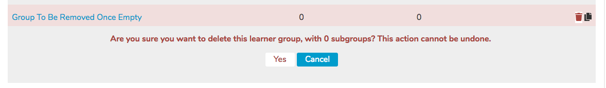

# Delete Learner Group

## Delete Learner Group

If you have been assigned permissions to delete Learner Groups, the trash can icon will be displayed allowing this functionality. The delete button (trash can icon) is displayed under the Actions menu as shown below.

**IMPORTANT NOTE:** Learner Groups can be deleted if they have not been associated with any Learning Events (ILM's or Offerings).

### Remove Members From Learner Group

Removing all members from a Learner Group can be done in bulk. A test group is shown below. Members can also be removed individually as shown below by the red arrow.

Once the check box has selected as shown by the action indicated by the blue arrow above, the process of removing all of the members of the current Learner Group continues as demonstrated below. 

**IMPORTANT NOTE:** The members being removed are being removed from this Learner Group only. They are **NOT** being removed from any other Learner Group.

### Check For Sessions Before Removing Learner Group

It is important \(even if the group has already been emptied of members\) to make sure the Learner Group is not attached to any Courses and Sessions. There are several easy ways to make sure this is the case before permanently deleting the Learner Group.

The removal of the Learners from the Learner Group has not yet taken place. This is a good time to review for sessions and offerings with which this Learner Group is associated - before removing the members.

The calendar selected as shown above details the Offerings - may not be displayed if far in future or past. The screen shot far below shows the "mouse over" of the calendared event. The session has not been published. This is known by appearance of the "Not Published" icon. 

After removing the Learners ...

If you are comfortable with deleting the Learner Group ...

After clicking as shown ...

Click "Yes" and the Learner Group just disappears from the list and has been deleted completely.

