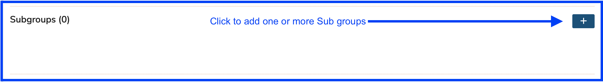
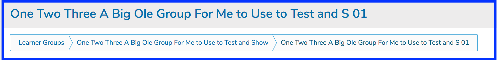
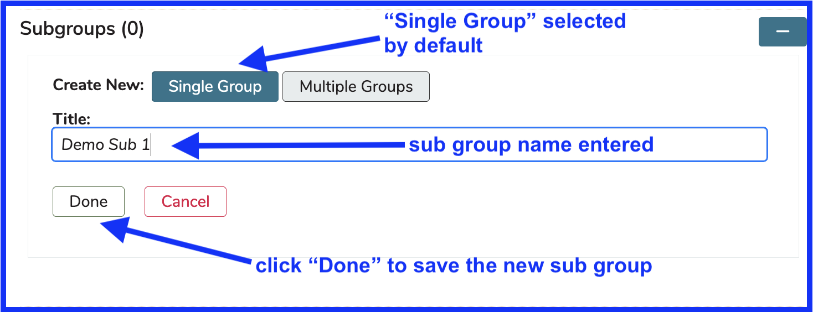
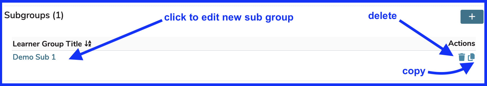
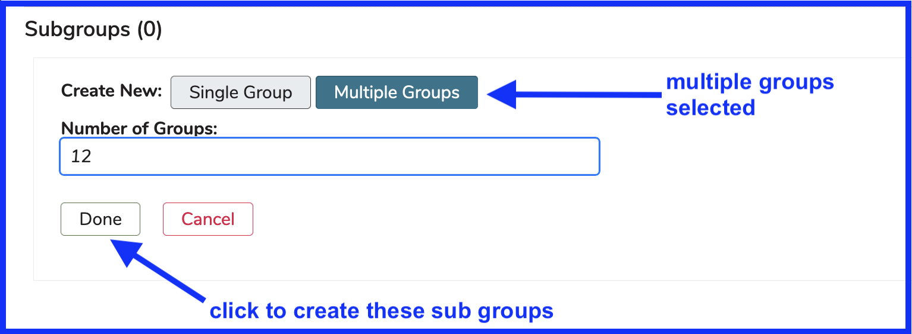
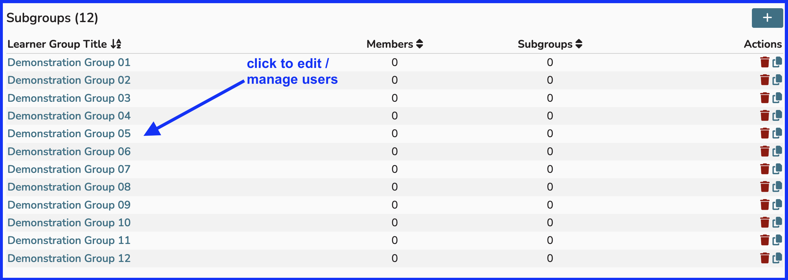
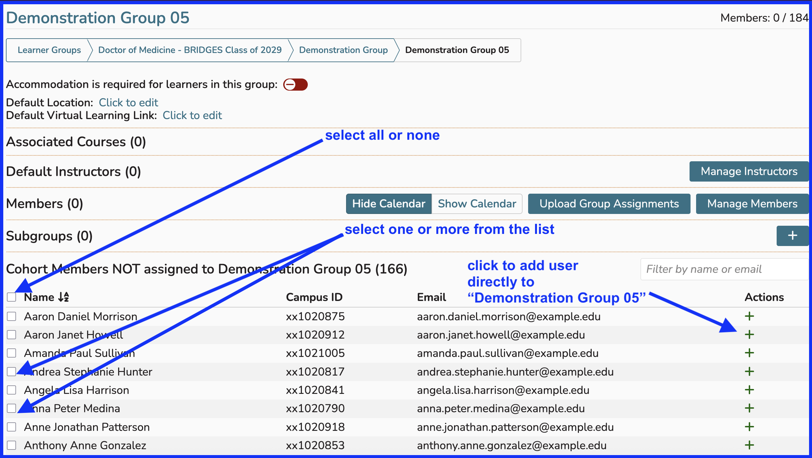

# Subgroups

Subgroups are simply learner groups within learner groups. A learner who is in a subgroup is also a member of any parent group. To add one or more subgroups, navigate to a learner group that needs to have one or more subgroups created below it. Click as shown below to start this process.

**NOTE**: Although this may not occur frequently, it is worth noting that the maximum length of a learner group or subgroup name is 60 characters. If an auto-generated sub group name ends up exceeding 60 characters, the characters before the numerical characters at the end of the subgroup name will be truncated. This is shown below. The subgroup's full name would have been "One Two Three A Big Ole Group For Me to Use to Test and Show 01". That would have required more than 60 characters. The following characters got removed in order to allow for the subgroup's numerical value to appear ... "how ".

## Add Single Subgroup

Click to start the process of adding a subgroup as shown below. Adding a "Single Group", meaning one group, is the default.

Once added, the newly created subgroup (Demo Sub 1) appears as shown below. It can be modified by clicking on the Title provided. There are no members in this subgroup. They should be added manually. Also, there are no members in the parent group because the option to create an empty group was selected when it was created. Alternatively, the entire Cohort could be included in the parent group ("Demonstration Group"). The subgroup that was just created can deleted by clicking on the trash can icon (under "Actions"). You will be asked to confirm this action since deletion is an action that cannot be undone.

## Add Multiple Subgroups

Any number of subgroups can be added automatically as well. The names will increment based on the number of subgroups desired. In this case since the parent group is called "Demonstration", the subgroups will be named "Demonstration 01" through "Demonstration 12".

After completing this action, the newly created (and automatically named) subgroups appear as shown below. Adding members to any of the newly created subgroups can be performed as shown below.

## Add Learners

To add learners to any of these subgroups, first the subgroup needs to be selected.

See below how the screen appears after selecting "Demonstration Group 05".

The check boxes on the left should be used in cases where you want to add multiple people to a group or subgroup. In the case where you just want to add one individual person, the green (+) buttons on the right should be utilized.

**NOTE:** If you are using the check boxes to add or remove multiple learners to or from a learner group, the add or remove button under the "Actions" menu will no longer be visible while using the check boxes.

Click [here](https://iliosproject.gitbook.io/ilios-user-guide/learner-groups/edit-group-properties/edit-group-membership) for more information on editing learner group membership.
