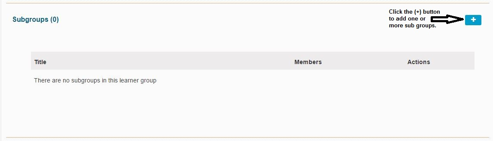
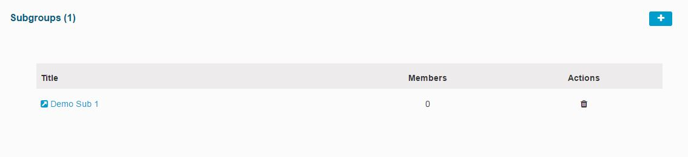

# Sub Groups

To add one or more Sub Groups, click as shown below to start this process.

## Add Single Sub Group

Adding a single sub group is the default \(as shown below\).

Once added, the newly created sub group \(Demo Sub 1\) appears as shown below. It can be modified by clicking on the Title provided. There are no members in this sub group. They should be added manually. Also, there are no members in the Parent Gruop because the option to create an empty group was selected when it was created. Alternatively, the entire Cohort could be included in the Parent Group \(Demonstration Group\). The sub group that was just created can deleted by clicking on the trash can icon \(under "Actions"\). You will be asked to confirm this action since it cannot be undone.

## Add Multiple Sub Groups

Any number of sub groups can be added automatically as well. The names will increment based on the number of sub groups desired. In this case since the Parent Group is called Demonstration, the sub groups will be named Demonstration 01 through Demonstration 12.

After completing this action, the newly created \(and automatically named\) sub groups appear as shown below. Any of the newly created sub groups can be edited in the following ways ...

* Add Learners to the Group

To add learner to any of these sub groups, first the sub group needs to be selected.

See below how the screen appears after selecting "Demonstration Group 05".

The check boxes on the left should be used in cases where you want to add multiple people to a group or sub group. In the case where you just want to add one individual person, the green \(+\) buttons on the right should be utilized.

