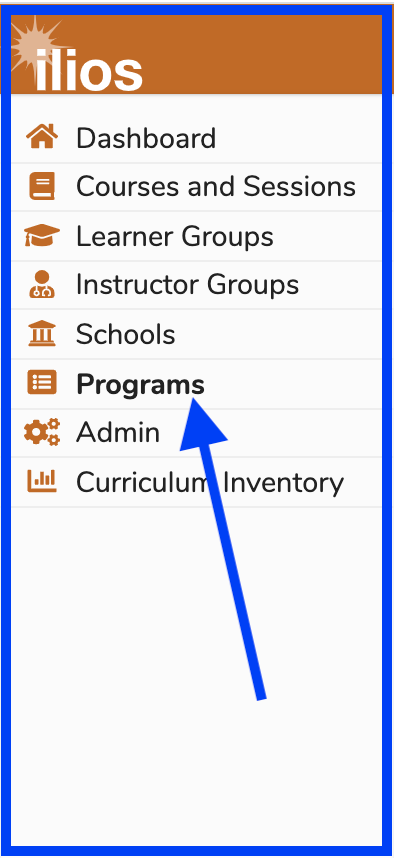

# Programs

The Ilios Programs module allows for the creation and management of any number of unique programs of study for your institution. A program may be defined as a course of study which has 1 or more academic years of involvement, and in which learners matriculate and graduate as an identifiable group \(a “cohort” of learners\). An institution may have any number of programs.

This model allows for the greatest flexibility among institutions to manage programmatic curricula according to their own models and needs.

To create or edit a program, a user must have full edit privileges. First, access the Programs screen by selecting Programs from the Ilios menu.

## Program Attributes

* _**Name:**_ Up to 200 characters in length.  Click on the name to edit it.
* _**Short Title:**_ (abbreviation) - Up to 10 characters in length. Click on the "Click to edit" label or existing short name hyperlink to edit this.
* _**Duration:**_ May be between 1 and 10 years.  Click on the number (in this example 4) to edit this value.

A newly-entered Program will need to have Program Year(s) set up in order to associate Learner Groups (Students) to the Program and its offerings.

#### Quick Links...

### [Add New Program](https://iliosproject.gitbook.io/ilios-user-guide/programs/add-new-program)

### [Edit Program](https://iliosproject.gitbook.io/ilios-user-guide/programs/edit-program)

### [Program Years](https://iliosproject.gitbook.io/ilios-user-guide/programs/add-program-year)

### [Competency Map Download](https://iliosproject.gitbook.io/ilios-user-guide/programs/competency-map-download)

### [Program Year Objective Visualization](https://iliosproject.gitbook.io/ilios-user-guide/programs/program-year-objective-map-visualization)

