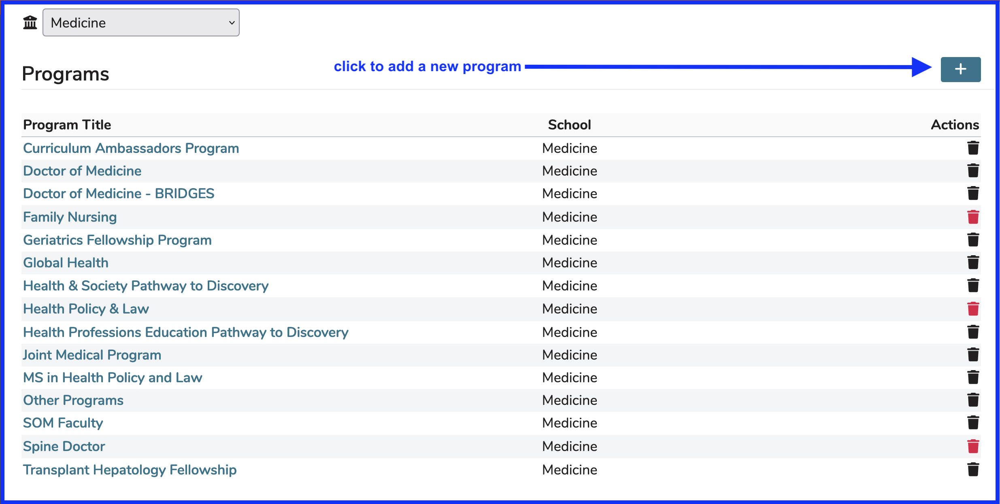
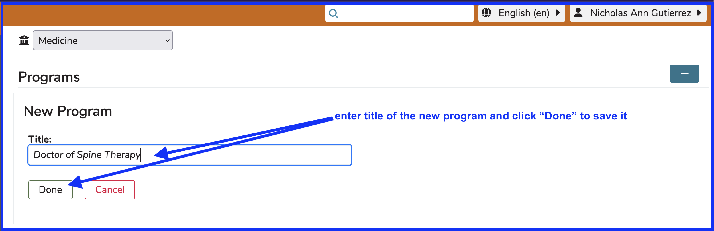
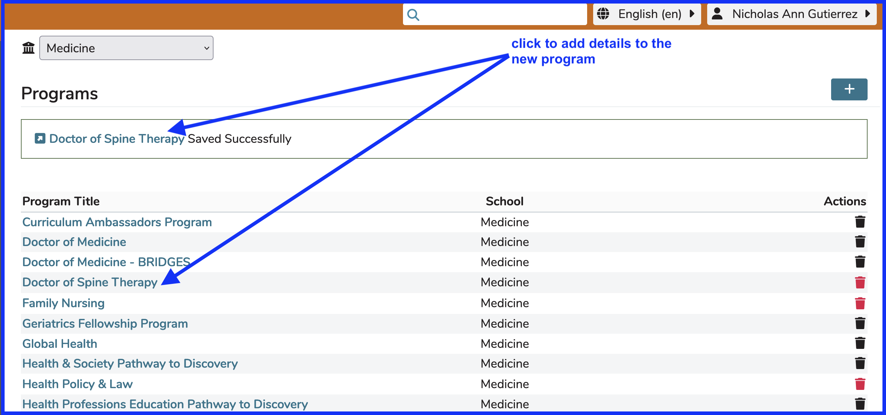

# Add New Program

Once on the Program screen, click on the “+” button, and provide a Title for the Program to add. Clicking the Done button will save your work immediately as a new Program ready for use.

To add details to the Program, you can use the hyperlink provided once the save event has been completed. See below.

Once a program is created, other attributes may be added to that program by creating individual Academic Years. The Academic Year is a container for all curricular material for that particular year of the program. All additional program attributes are unique to each academic year of that program; attributes given to a program’s academic year and saved will be automatically copied to the next academic year, so it is best to create a single academic year, add its attributes, and then add further years as needed.

