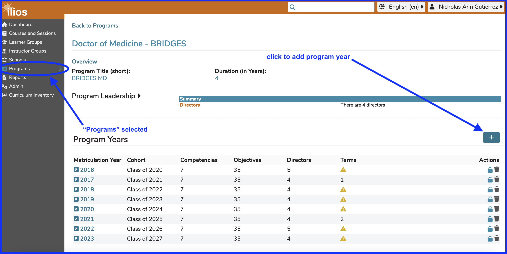
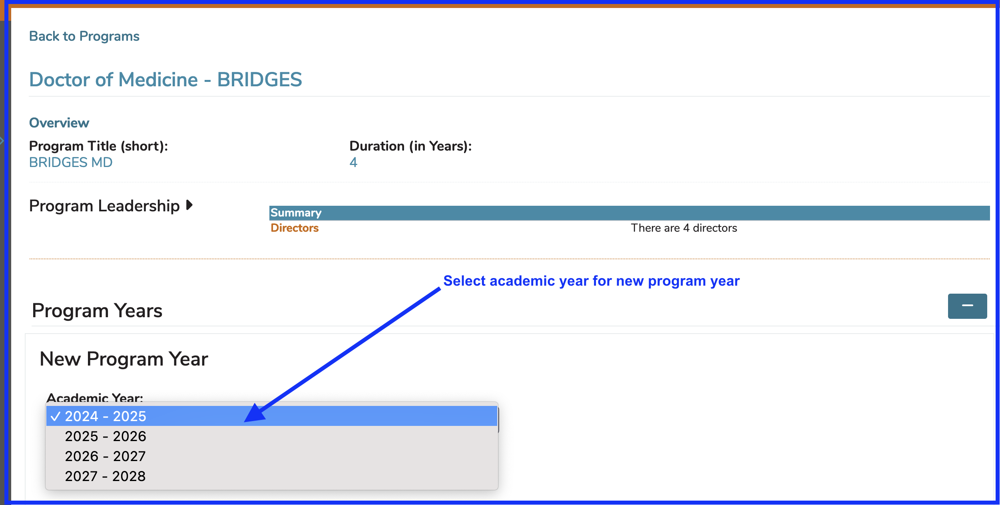
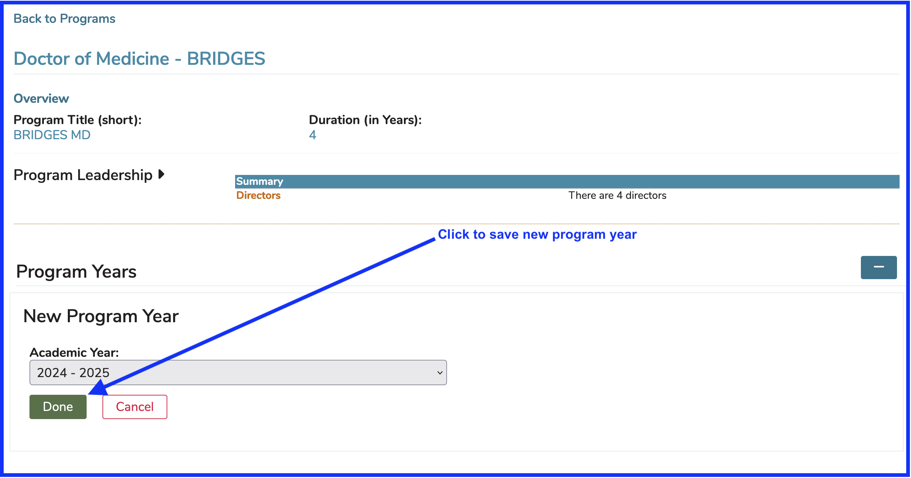
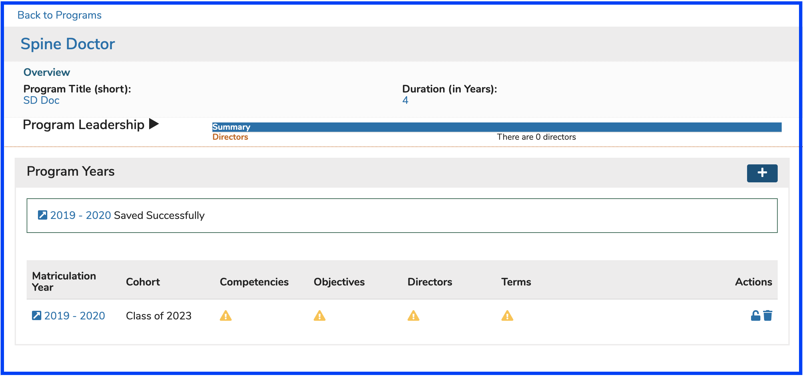

A program year is essentially a year of instructional activity for any given program. The process of adding one or more program years is detailed below along with the configurable attributes of a program year.

# Add Program Year

Once a program has been created, it is easy to add "program years". A program year refers in the simplest sense to a year of instruction for a selected program. The steps below will show how to get this done in Ilios.

**Step 1:** Click the (+) to begin the process of adding the Program Year.

**NOTE** If program years have already been added to your program, creating a new program year will use the attributes assigned to the previous year, in essence "rolling over" the previous program year - saving work effort. Each program year can then be individually modified.

The following information from the previous program year (if applicable) will be automatically added to the new one being created ...

* **Competencies**
* **Objectives**
* **Leadership:** refers only to directors at the program year level
* **Vocabulary Terms:** can be added to program year objectives as well

Matriculation Year and Cohort title will be assigned automatically to the values associated with the selected Academic Year based on program duration (years).

**Step 2:** Select the Academic Year from the provided drop-down menu. Only academic years that have not already been associated with a program year will appear available for selection. Each academic year can be assoicated with one program year. 

* **Academic Year:** This is selected from the drop-down at the time of program year creation. This can be configured at the school level in either an entire year format (2025) or a split year format (2025-2026).

Save when done by clicking the "Done" button as shown below.

Indicators are provided when Program Year information is missing. Click on the provided link to further modify the Program Year. The following Program Year Attributes can be edited.

**NOTE**: A new Cohort is automatically created with the creation of a new Program Year. The Matriculation Year matches the Academic Year chosen during the creation of the Program Year. The Cohort is named by its expected year of Graduation, which is determined by the length (in Years) of the Program.

## Attributes

* **Leadership:** In the case of program years, leadership refers uniquely to directors who are selected from list of available names. The list is populated with all Ilios users with permissions in the current school. 
* **Competencies:** selected from a school-specific, pre-defined list of competency domains and sub-domains.
* **Objectives:** Free text entry. Program Objectives, once entered, may be associated with any one of the available Competencies. Program Year Objectives can be sorted in the same way that Session Objectives and Course Objectives can be sorted. Refer to sorting [Course Objectives](../courses-and-sessions/courses/sort-objectives.md) or [Session Objectives](../courses-and-sessions/sessions/sort-objectives.md) for reference. These Program Year objectives can, and should be, attached as parents to course objectives. This is demonstrated [here](https://iliosproject.gitbook.io/ilios-user-guide/courses-and-sessions/courses/course_objectives/add-parent-objective). These can be thought of as graduation requirements since they are specific educational outcomes expected of this group of students (Cohort) upon their graduation. Program Year Objectives (like Course or Session Objectives) can be tagged using Vocabulary Terms and / or MeSH Terms.
* **Terms:** selected from a school-specific, pre-defined list of one or more Vocabularies.
* **Associated Courses:** This is a read-only list of courses assoicated with this program year. Courses utilize learner groups for enrollment typically. Learner groups are associated with one or more cohort(s), which are associated with a program year.

To search for a previously created Program, enter a part of the name of the program into the “Filter by Program title” field, then click on the adjacent search icon or hit the return button on your keyboard or merely keep typing until the results are found. A list of all matches will populate your search panel; highlighting and selecting the desired program will load it to your screen.
