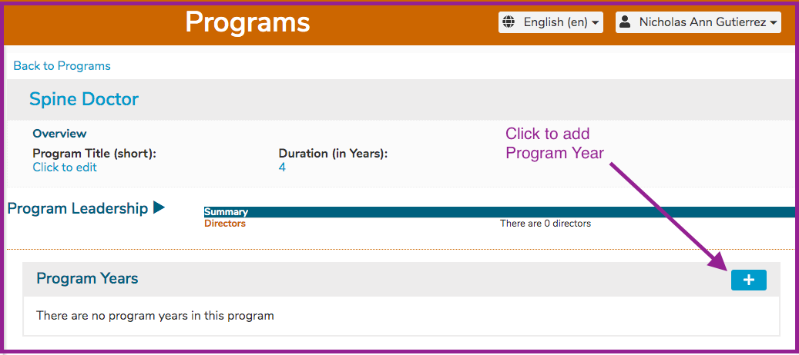
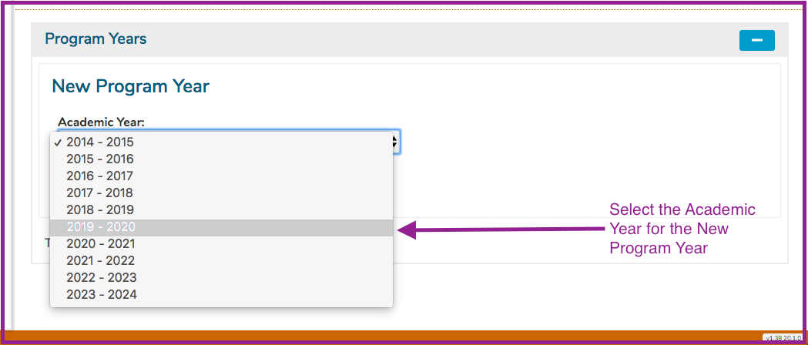
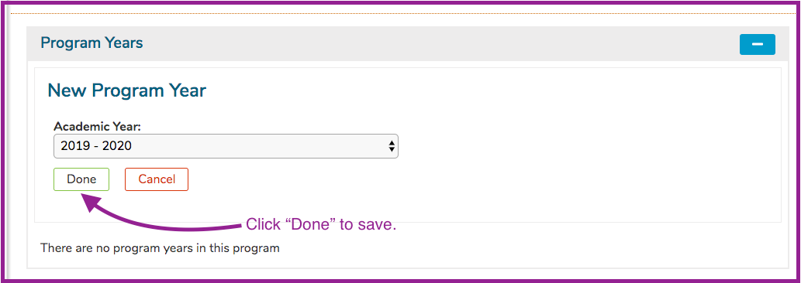
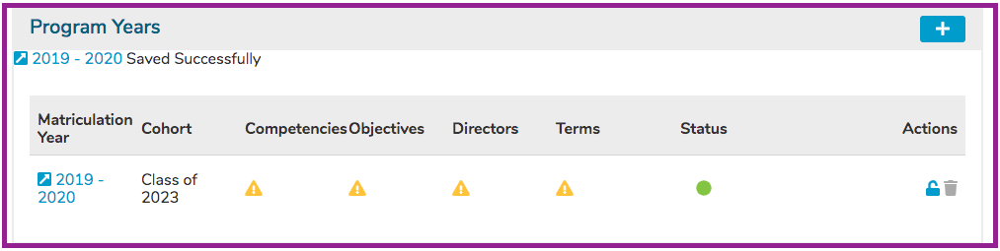

# Add Program Year

**Step 1:** Click the \(+\) to begin the process of adding the Program Year.

**Step 2:** Select the Academic Year.

Save when done by clicking the Done button as shown below.

Indicators are provided when Program Year information is missing. Click on the provided link to further modify and / or publish the Program Year. The following Program Year Attributes can be edited.

**NOTE**: A new Cohort is automatically created with the creation of a new Program Year. The Matriculation Year matches the Academic Year chosen during the creation of the Program Year. The Cohort is named by its expected year of Graduation, which is determined by the length \(in Years\) of the Program.

## Program Year Attributes

* _**Academic Year:**_ This is selected from the drop-down.
* _**Competencies:**_ selected from a school-specific, pre-defined list of competency domains and sub-domains.
* _**Objectives:**_ Free text entry. Program Objectives, once entered, may be associated with any one of the available Competencies. Program Year Objectives can now be sorted in the same way that Session Objectives and Course Objectives can be sorted. Refer to sorting [Course Objectives](../courses-and-sessions/courses/sort-objectives.md) or [Session Objectives](../courses-and-sessions/sessions/sort-objectives.md) for reference. Program Year Objectives can be thought of as graduation requirements since they are specific educational outcomes expected of this group of students \(Cohort\) upon their graduation. Program Year Objectives \(like Course or Session Objectives can be tagged using Vocabulary Terms and / or MeSH Terms.
* _**Terms:**_ selected from a school-specific, pre-defined list of one or more Vocabularies.
* _**Directors:**_ Selected from list of available names. The list is populated with users identified and tagged as “Director” level in the user access system.
* _**Stewarding Department\(s\) or School\(s\):**_ Selected from a list of available departments/schools, which are loaded into the system on implementation. Assigning a school or department other than the default school of the program will provide access to that program and its associated curriculum for the stewarding school, allowing for interdisciplinary curriculum development and management. **PLEASE NOTE:** for any course which has multi-school stewardship, that course will appear in the search listings for each stewarding school. This may make it appear to some users that there is a unique course in each school which shares the same attributes, but this is not the case. It is the same course, and each school is accessing the same data.

To search for a previously created Program, enter a part of the name of the program into the “Filter by Program title” field, then click on the adjacent search icon or hit the return button on your keyboard or merely keep typing until the results are found. A list of all matches will populate your search panel; highlighting and selecting the desired program will load it to your screen.

