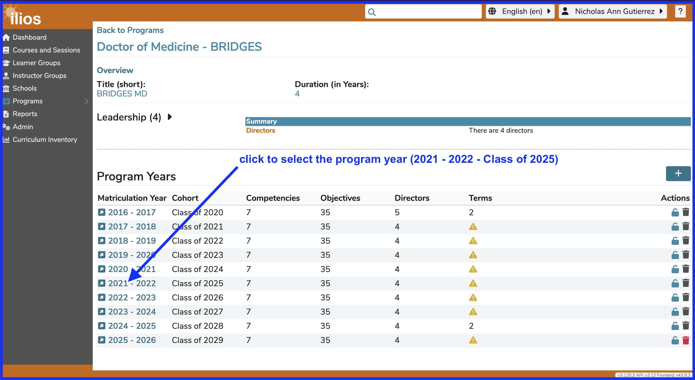

A program year is essentially a year of instructional activity for any given program. The process of adding one or more program years is detailed below along with the configurable attributes of a program year.

# Add Program Year

Once a program has been created, it is easy to add "program years". A program year refers in the simplest sense to a year of instruction for a selected program. The steps below will show how to get this done in Ilios.

**Step 1:** Click the (+) to begin the process of adding the Program Year.

**NOTE** If program years have already been added to your program, creating a new program year will use the attributes assigned to the previous year, in essence "rolling over" the previous program year - saving work effort. Each program year can then be individually modified.

The following information from the previous program year (if applicable) will be automatically added to the new one being created ...

* **Competencies**
* **Objectives**
* **Leadership:** refers only to directors at the program year level
* **Vocabulary Terms:** can be added to program year objectives as well

Matriculation Year and Cohort title will be assigned automatically to the values associated with the selected Academic Year based on program duration (years).

**Step 2:** Select the Academic Year from the provided drop-down menu. Only academic years that have not already been associated with a program year will appear available for selection. Each academic year can be assoicated with one program year. 

Save when done by clicking the "Done" button as shown below.

Indicators are provided when Program Year information is missing. Click on the provided link to further modify the Program Year. The following Program Year Attributes can be edited.

**NOTE**: A new Cohort is automatically created with the creation of a new Program Year. The Matriculation Year matches the Academic Year chosen during the creation of the Program Year. The Cohort is named by its expected year of Graduation, which is determined by the length (in Years) of the Program.

## Attributes

* **Academic Year:** This is selected from the drop-down. This can be configured at the school level in either an entire year format (2019) or a split year format (2019-2020).
* **Competencies:** selected from a school-specific, pre-defined list of competency domains and sub-domains.
* **Objectives:** Free text entry. Program Objectives, once entered, may be associated with any one of the available Competencies. Program Year Objectives can be sorted in the same way that Session Objectives and Course Objectives can be sorted. Refer to sorting [Course Objectives](../courses-and-sessions/courses/sort-objectives.md) or [Session Objectives](../courses-and-sessions/sessions/sort-objectives.md) for reference. These Program Year objectives can, and should be, attached as parents to course objectives. This is demonstrated [here](https://iliosproject.gitbook.io/ilios-user-guide/courses-and-sessions/courses/course_objectives/add-parent-objective). These can be thought of as graduation requirements since they are specific educational outcomes expected of this group of students (Cohort) upon their graduation. Program Year Objectives (like Course or Session Objectives) can be tagged using Vocabulary Terms and / or MeSH Terms.
* **Terms:** selected from a school-specific, pre-defined list of one or more Vocabularies.
* **Directors:** Selected from list of available names. The list is populated with all Ilios users with permissions in the current school. 

To search for a previously created Program, enter a part of the name of the program into the “Filter by Program title” field, then click on the adjacent search icon or hit the return button on your keyboard or merely keep typing until the results are found. A list of all matches will populate your search panel; highlighting and selecting the desired program will load it to your screen.

# Edit Program Year

There are many things that can edited for any given Program Year. Since Program Years can be rolled over, you can roll Program Year over and then make additional changes to the newly created Program Year. The options are detailed below.

To start with, navigate to Programs and select a Program. In this case, "Doctor of Medicine - BRIDGES" has been selected.

## View Program Detail

## Select Program Year

For this example, and in order to show more detail in upcoming steps, Matriculation Year "2016-2017" with the Cohort of "Class of 2020" has been selected. At the time of this edit, those students will have recently graduated. This is useful in detailing Competency use throughout the student's educational trajectory. They will have already learned the Topics and Competencies on offer in the Program. Reporting out will provide more robust results.

Here is the resulting display after selecting "Class of 2020" as the Program Year. Editing a Program Year means utilizing the navigation shown below. 

When reviewing Program Year Objectives, you can not only download the Competency Map, you can review how these Program Year Objectives are mapped to Course Objectives as parents.

# Program Year Objectives

## Add Objectives

Adding one or more program year objectives is easy to do from this screen. One thing to keep in mind is that once these objetives have been entered, they get rolled over for each new program year. 

To add an objective to any program year, select the program year and expand the list to reveal the details as shown below.

**Step One:** Expand the list of program year objectives.

<figure>
  
  <figcaption>
      
expand the list of program year objectives - step one

  </figcaption>
</figure>

## Attach Vocabulary Terms

The process for adding one or more vocabulary terms to an program year objective is similar to the same action performed at the course and/or session level. The interface and steps, since they do vary a bit, will be shown in detail below.

**Step One:** Select the program year objective to which to add one or more vocabulary terms and click "Add New" as shown below.

<figure>
  
  <figcaption>
      
select program year objective and click to add vocabulary term - step one

  </figcaption>
</figure>

**Step Two:** Select the vocabulary term to add to the program year objective.

<figure>
  
  <figcaption>
      
select vocabulary term to add - step two

  </figcaption>
</figure>

**Step Three:** Save to process the attachment of the term to the program year objective.

<figure>
  
  <figcaption>
      
vocabulary term added - step three

  </figcaption>
</figure>

**Final Step: Review:** The vocabulary term has now been added to the program year objective. The process had been completed. 

<figure>
  
  <figcaption>
      
vocabulary term added - final step - review

  </figcaption>
</figure>

This process can be repeated to add more terms. More than one term can be added (or removed) at any given time. After reviewing the recent addition, it is easy to perform follow-up changes whenever needed.

## View Objective Mapping

This shows where the Program Year objectives (graduation requirements) have been linked to Course objectives, which in turn can be linked to Session objectives. 

Below is a sample screen shot illustrating this. The Program Year Objective "MK2 (graduation) ..." has been expanded by clicking the arrow to the left of the Objective. Viewable are the Courses in which this was taught along with the text values of the associated Course Objectives.

Any, or all, of these Program Year Objectives can be expanded individually to reveal these useful details. The toggles for activating / de-acitivating program year objectives are in read-only mode when the selection is expanded. The blue one in the screen shot below is ready for use.

Below is a list of Program Year Objective attributes that can be edited or changes that be made here.

* **Sort Objectives**: Use this to set the order in which these objectives will appear - drag and drop. Refer to sorting [Course Objectives](../courses-and-sessions/courses/sort-objectives.md) or [Session Objectives](../courses-and-sessions/sessions/sort-objectives.md) for reference. 
* **[**Download Competency Map**](https://iliosproject.gitbook.io/ilios-user-guide/programs/competency-map-download)**
* **Edit Description**: Clicking on the description of a Program Year Objectives will bring up an editing control.
* **Competency**: The school level Competency / Domain can be set here.
* **Vocabulary Terms**: Terms can be attached to Program Year Objectives in the same manner as they are to 
Courses and [Sessions](https://iliosproject.gitbook.io/ilios-user-guide/courses-and-sessions/sessions/edit-session#manage-terms).
* **MeSH Terms**: Same as with Vocabulary Terms but using MeSH instead
* **Active**: The toggle provided here indicates if an Objective is currently active and can be selected at the Course level. Clicking on the toggle will de-activate the Objective, not destroying any legacy data but making sure it can not be selected going forward. Historical data will appear read-only.
* **Trash**: The trash can will only appear active if the selected Program Year has not been used as a Parent Objective for any Course Objective.
