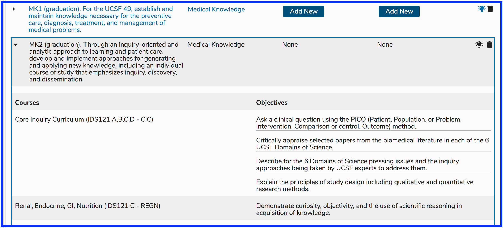

# Program Years

## **Add Program Year**

**Step 1:** Click the \(+\) to begin the process of adding the Program Year.

**Step 2:** Select the Academic Year.

Save when done by clicking the "Done" button as shown below.

Indicators are provided when Program Year information is missing. Click on the provided link to further modify the Program Year. The following Program Year Attributes can be edited.

**NOTE**: A new Cohort is automatically created with the creation of a new Program Year. The Matriculation Year matches the Academic Year chosen during the creation of the Program Year. The Cohort is named by its expected year of Graduation, which is determined by the length \(in Years\) of the Program.

## Program Year Attributes

* _**Academic Year:**_ This is selected from the drop-down.
* _**Competencies:**_ selected from a school-specific, pre-defined list of competency domains and sub-domains.
* _**Objectives:**_ Free text entry. Program Objectives, once entered, may be associated with any one of the available Competencies. Program Year Objectives can be sorted in the same way that Session Objectives and Course Objectives can be sorted. Refer to sorting [Course Objectives](../courses-and-sessions/courses/sort-objectives.md) or [Session Objectives](../courses-and-sessions/sessions/sort-objectives.md) for reference. Program Year Objectives can be thought of as graduation requirements since they are specific educational outcomes expected of this group of students \(Cohort\) upon their graduation. Program Year Objectives \(like Course or Session Objectives can be tagged using Vocabulary Terms and / or MeSH Terms.
* _**Terms:**_ selected from a school-specific, pre-defined list of one or more Vocabularies.
* _**Directors:**_ Selected from list of available names. The list is populated with users identified and tagged as “Director” level in the user access system.

To search for a previously created Program, enter a part of the name of the program into the “Filter by Program title” field, then click on the adjacent search icon or hit the return button on your keyboard or merely keep typing until the results are found. A list of all matches will populate your search panel; highlighting and selecting the desired program will load it to your screen.

## Edit Program Year

There are many things that can edited for any given Program Year. Since Program Years can be rolled over, you can roll Program Year over and then make additional changes to the newly created Program Year. The options are detailed below.

To start with, navigate to Programs and select a Program. In this case, "Doctor of Medicine - BRIDGES" has been selected.

#### Program Detail

#### Select Program Year

For this example, and in order to show more detail in upcoming steps, Matriculation Year "2016-2017" with the Cohort of "Class of 2020" has been selected. At the time of this edit, those students will have recently graduated. This is useful in detailing Competency use throughout the student's educational trajectory. They will have already learned the Topics and Competencies on offer in the Program. Reporting out will provide more robust results.

Here is the resulting display after selecting "Class of 2020" as the Program Year. Editing a Program Year means utilizing the navigation shown below. 

When reviewing Program Year Objectives, you can not only download the Competency Map, you can review how these Program Year Objectives are mapped in Courses Objectives as parents.

#### View Objective Mapping

Below is a sample screen shot illustrating this. The Program Year Objective "MK2 \(graduation\) ..." has been expanded by clicking the arrow to the left of the Objective. Viewable are the Courses in which this was taught along with the text values of the associated Course Objectives.

Below is a list of Program Year Objective attributes that can be edited or changes that be made here.

* **Sort Objectives**: Use this to set the order in which these objectives will appear - drag and drop
* \*\*\*\*[**Download Competency Map**](https://iliosproject.gitbook.io/ilios-user-guide/programs/competency-map-download)\*\*\*\*
* **Edit Description**: Clicking on the description of a Program Year Objectives will bring up an editing control.
* **Competency**: The school level Competency / Domain Knowledge can be set here.
* **Vocabulary Terms**: Terms can be attached to Program Year Objectives in the same manner as they are to Courses, Sessions etc.
* **MeSH Terms**: Same as with Vocabulary Terms but using MeSH instead
* **Active**: The light bulb icon indicates if an Objective is currently active and can be selected at the Course level. Clicking on the light bulb will de-activate the Objective, not destroying any legacy data but making sure it can not be selected going forward. Historical data will appear read-only.
* **Trash**: The trash can will appear active if the Program Year in question has not been used as a Parent Objective for any Course Objective.

