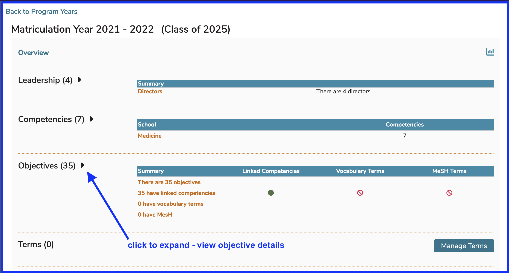
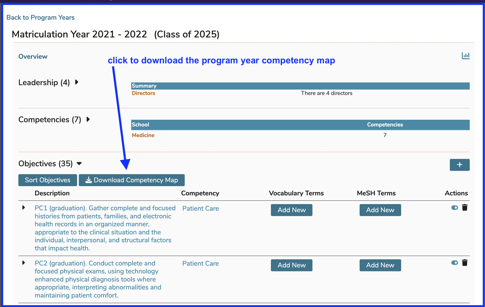

# Competency Map Download

It is easy enough to download the Competency Mapping for any specified Program Year within your school.  To do this, simply click as shown below. This is available from the Programs tab.

## Expand Program Year Objectives

It is necessary to expand the Objectives as shown below in order to download the Competency Map.

## Download Competency Map

After clicking as shown above, at the lower left hand corner of your browser window, you will see a file such as the following appear.

When opening it in Excel on a Mac, it initially appears as shown below (Before ...). There are many techniques that can be used to make it more presentable. You can also save it as an .xlsx or other Excel file format once the adjustments have been made.

You can view this in Finder (Apple) or Windows Explorer (WIndows) and save it to a more appropriate location of your chosing. Later, right click on it and choose to open it however you would normally open a .csv file. Excel or other text or spreadsheet applications should work.

Suggested actions ...

* Bold and customize the field names (top row)
* Make the `mapped_course_objective` field much wider
* Once widened, use Align text / "word wrap" on the `mapped_course_objective` field
* Fix the top row so the file can be scrolled.

Before ...

After ...

You can sort the output however you would it sorted as well as move columns around and any other changes you may wish to perform once the file has been downloaded.

**IMPORTANT NOTE:** These Program Years are based on Matriculation Year so if the year selected is 17-18 for example, the mappings are probably not complete yet for the later years of these students' educational experience. This is because the mappings may have not been completed yet in Ilios for Courses, Sessions, and Offerings which are scheduled to take place in the future.

