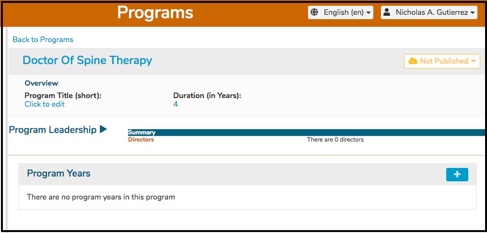
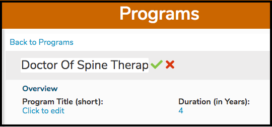
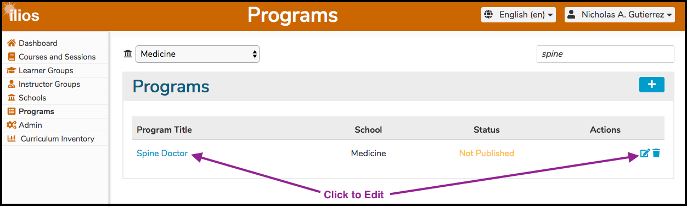
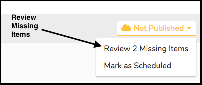

# Edit Program

 As far as the Program itself is concerned, the fields that can be modified are listed below. Editing any of these fields will have long reaching effects.

* [Program Title](https://iliosproject.gitbook.io/ilios-user-guide/programs/edit-program#edit-program-title)
* [Publication Status](https://iliosproject.gitbook.io/ilios-user-guide/programs/edit-program#update-publication-status)
* [Program Title \(short\)](https://iliosproject.gitbook.io/ilios-user-guide/programs/edit-program#add-edit-short-title)
* Duration \(in years\)
* Program Leadership - \(add/remove Program Directors\)

**NOTE:** The newly created Program "Doctor of Spine Therapy" cannot be published yet. The Program must have some Program Years created before publishing \(making it visible and usable within Ilios\) can take place.

#### Edit Program Title

To edit a program's Title, all that is needed to do is to click on the Title itself, edit it if desired, and then confirm the changes. The process is shown below.

After click on "Doctor Of Spine Therapy", the field becomes editable and appears as shown below. 

The text will be changed to "Spine Doctor" and confirmed.

* Change the text.

* Confirm the change and review the results.

#### Update Publication Status

To publish \(or un-publlish\) a Program is quite easy to do following the simple steps laid out below.

* Search for and retrieve the Program record to modify

* Change the selected value in the Status Drop-Down menu. In this case, the Program "Spine Doctor" has not actually been used yet and has no associated program years so it cannot be published completely anyway since there is nothing to show to students. Reviewing the missing items will help determine and confirm why this is the case. "Mark as Scheduled" is as far along in the publication process as we can proceed until program years are added to the Program.

#### Add / Edit Short Title

Since this is a newly created program, there has been no short title entered yet. To enter the short title ...

* Enter the desired short title. The minimum length for a short title value is 2 characters. The short title "SD Doc" has been entered into the Program Title \(short\) field as shown below.

* After saving the record, "Click to edit" has been replaced with the Program's actual short title "SD Doc".

