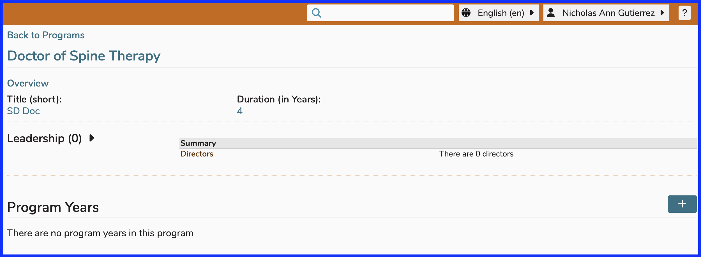
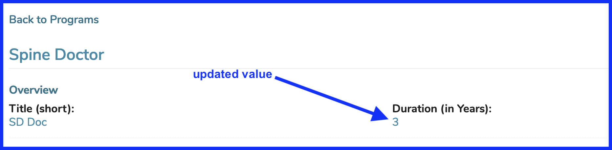
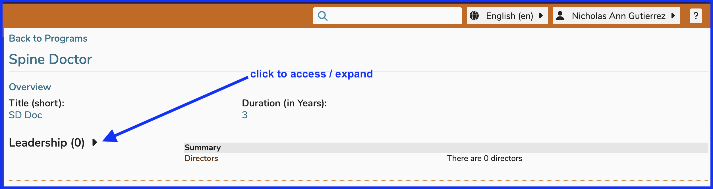

# Edit Program

 As far as the Program itself is concerned, the fields that can be modified are listed below. Editing any of these fields will have long reaching effects.

* [Title](https://iliosproject.gitbook.io/ilios-user-guide/programs/edit-program#edit-program-title)
* [Short Title](https://iliosproject.gitbook.io/ilios-user-guide/programs/edit-program#add-edit-short-title)
* [Duration (in years)](https://iliosproject.gitbook.io/ilios-user-guide/programs/edit-program#change-program-duration-years)
* [Leadership](https://iliosproject.gitbook.io/ilios-user-guide/programs/edit-program#program-leadership) - (add/remove Directors)

## Edit Title

To edit a program's Title, all that is needed to do is to click on the Title itself, edit it if desired, and then confirm the changes. The process is shown below.

After clicking on the Program's title "Doctor Of Spine Therapy", the field becomes editable and appears as shown below. 

The text will be changed to "Spine Doctor" and confirmed.

* Change the text value for Program Title

* Confirm the change and review the results.

## Add / Edit Short Title

Since this is a newly created program, there has been no short title entered yet. To enter the short title ...

* Enter the desired short title. The minimum length for a short title value is 2 characters. The short title "SD Doc" has been entered into the Program Title (short) field as shown below.

* After saving the record, "Click to edit" has been replaced with the Program's actual short title "SD Doc".

## Update Duration (Years)

Modifying the duration of a program is easily accomplished in Ilios. Following the steps below will complete this task.

## Update Leadership

Please refer to the [Permissions Matrix](https://www.dropbox.com/s/431sdj2bfoi3v1f/Ilios%20New%20Default%20Permissions%20Matrix.pdf?dl=0) to review what rights within the Ilios system will be granted when users are added as Program Directors.

