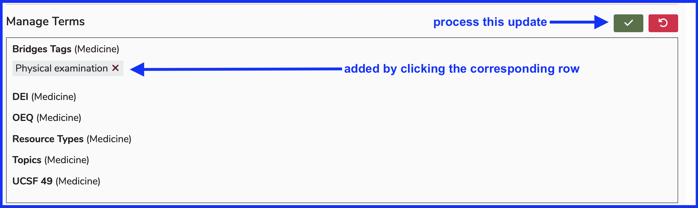

# Edit Program Year

There are many things that can edited for any given Program Year. Since Program Years can be rolled over, you can roll Program Year over and then make additional changes to the newly created Program Year. The options are detailed below.

To start with, navigate to Programs and select a Program. In this case, "Doctor of Medicine - BRIDGES" has been selected.

## View Program Detail

## Select Program Year

For this example, and in order to show more detail in upcoming steps, Matriculation Year "2021-2022" with the Cohort of "Class of 2025" has been selected. At the time of this edit, those students will have recently graduated. This is useful in detailing Competency use throughout the student's educational trajectory. They will have already learned the Topics and Competencies on offer in the Program. Reporting out will provide more robust results.

Here is the resulting display after selecting "Class of 2025" as the Program Year. Editing a Program Year means utilizing the navigation shown below. 

When reviewing Program Year Objectives, you can not only download the Competency Map, you can review how these Program Year Objectives are mapped as parents to Course Objectives.

## Manage Leadership

Leadership in the context of a program year is limited to Directors, who can perform any and all maintenance of this program year and will be included in any leadership report for the program year.

### Show Details 

Initially details are collapsed as shown below. Click to expand and show details.

After clicking as shown above, the 4 directors are listed. From here, you can manage leadership (directors) at the program year level.

### Search for Leadership

Any Ilios user can be added to the role of program year director. After clicking "Manage Leadership", the sceeen appears similar to what is shown below.

It has been decided that the Ilios user "Ann Rachel Greene" should be added to Leadership (as a Director) for Class of 2025. The partial search string entered, "ann rac", is sufficiiently narrow to return four records. 

After selecting "Ann Rachel Greene" to be added as a program year director, it is necessary to save this action to add this record to program year leadership. 

There are now 5 directors listed, including the one we added in the previous step. 

### Save Changes 

The list will get refreshed with the new record added to the list. 

## Manage Competencies

The next section that can be managed here is Competencies. The process is similar to the one documented above regarding managing leadership. Initially, the screen appears in a collapsed (non-expanded) state. 

### Show Details

After clicking to show more details ...

The competencies associated with this program year are now listed. The button "Manage Competencies" should be clicked to review the mapping and make any changes. 

In the "competencies listed" image above, a total of 7 competencies appear. All of these are at the same level - the school competency level. We will see this in the screen shot below where none of the sub-domains of these higher level competencies have been selected for use in this program year - Class of 2025. Those are the lower level values that have not been selected.

### Select Competencies

For the sake of demonstration, we are going to add all three sub-domains that pertain to the school competency "Interpersonal & Communication Skills" to the Class of 2025 program year competency framework. Any of these three sub-domains can now be used to further differentiate and specify the expetise needed to graduate as a member of this class. 

After performing the save event as shown below to process the update, the new sub-domains are added to the program year competency listing. 

### View Updated List

The list of competencies associated with this program year (Class of 2025) now appears as shown below. These competencies can be applied to program year objectives.

### View Updated Mapping Options

Now that we have updated the competencies that can be associated with program year objectives, this is how it appears when one would choose to change the competency association at the program year objective level.

The image below comes from the expanded list of program year objectives. We are using the first one as an example. Currently that first objective had been associated with the competency domain of "Patient Care". The other options are shown here including the three sub-domains added recently. To change this association to either a higher level domain or one of the newly added sub-domains, click the radio button by the preferred option and save the record. This selection is limited to one option, hence the use of radio buttons rather than check boxes.

**QUICK NOTE:** If a higher level competency is selected, it is assumed that any sub-domains are also selected. If one lower level sub-domain is selected and not any others, the other sub-domains are inferred to have been not selected. The parent domain can be configured to be included as a tagging option or not. 

## Manage Objectives

The next area of maintenance is the one devoted to managing program year objectives (graduation requirements). This is currently in its own section available [here](https://iliosproject.gitbook.io/ilios-user-guide/programs/add-program-year/objectives_maintenance).

## Manage Terms

### Click to Start

Click as shown below to begin the process of managing terms associated with the given program year. Terms can be reviewed, added, or removed individually or in a bulk operation. 

### Select Vocabulary

Now that the "manage terms" functionality has been activated, the first step in adding one or more vocabulary terms to a program year is to select the vocabulary within which the term is a selectable item. The School of Medicine at UCSF vocabularies are shown in the screen shot below. 

Using "Bridges Tags" as our selected vocabulary, we can proceed searching for and / or selecting terms to use with this program year. 

### Filter for Term

Now that the vocabulary "Bridges Tags" has been selected, individual terms can be selected from the available list. The list can also be filtered to limit the results and make the correct easier to find in case the list is long (and it generally is).

A filter was applied in this case for the value "ph". This limits the result set to list only terms that contain the filter by value "ph". There are six such from which to choose after applying the filter.

### Mouse-over for Detail

Any of the returned terms in the selected vocbulary can be hovered over with the mouse to display more information about their potential usage. This is shown below for the term "Physical examination". 

### Select Term

Now that we have determined "Physical examination" is indeed the term we would like to add, the process begins with simply clicking anywhere in the row of the term to be added. After performing that action, the screen changes as shown below.

### Term Added

In the previous step, the term was added to the program year. Review the results of this action below.

Click "Manage Terms" to perform further maintenance to program year term assignment. Removing one or more terms from a program year is as easy as clicking to remove the term and then saving the record - essentially the reverse of the process involved in adding terms.

### Remove Term

Although this is mentioned above, some screen shots and additional documentation might prove to be useful. This example uses the same program year (Class of 2025) as in the previous sections except we are showing that one of the five terms that have been added in the meantime needs to be removed. 

**Terms Displayed**

**Click to Remove**

To remove a term, the first step is to click on the badge icon of the term to be removed - in this case "Geriatrics".

**Update Program Year**

After clicking to remove "Geriatrics", the screen is updated as shown below with the four remaining terms still associated with the program year. 

After clicking as shown, the four terms remain. 

## Available Actions 

Under the "Actions" heading, there are two options available. The delete button is only active when the program year has not been attached to any cohort which is in turn, associated with any course.

### Delete Program Year

As mentioned above, a program year can be deleted if it has not yet been used by a cohort attached to any course.

### Lock Program Year

Program years can be in effect "locked" in a similar manner as to what can happen in any course in Ilios. This means the program year's relationship with Leadership, Competencies, Objectives, and Terms can no longer be changed. The program year is in its final state. If it becomes unlocked, modifications can proceed normally.

## Associated Courses 

There is a list of courses available at the bottom of the Program Year detail screen where you can review which courses are tied to the currently selected program year. This just means a cohort associated with the selected program year is attached at the course level to all of these courses. The courses are hyperlinked here for easy reference. 

### Collapsed Mode 

Initially, this shows up in a similar manner to what is shown below. This is before clicking the triangle "expander" to do exactly that - expand the viewpoint to show the selection in full. 

### Expanded Mode

This is shown (partial list anyway) in "expanded" mode. Collapsed mode will be added here soon. 

