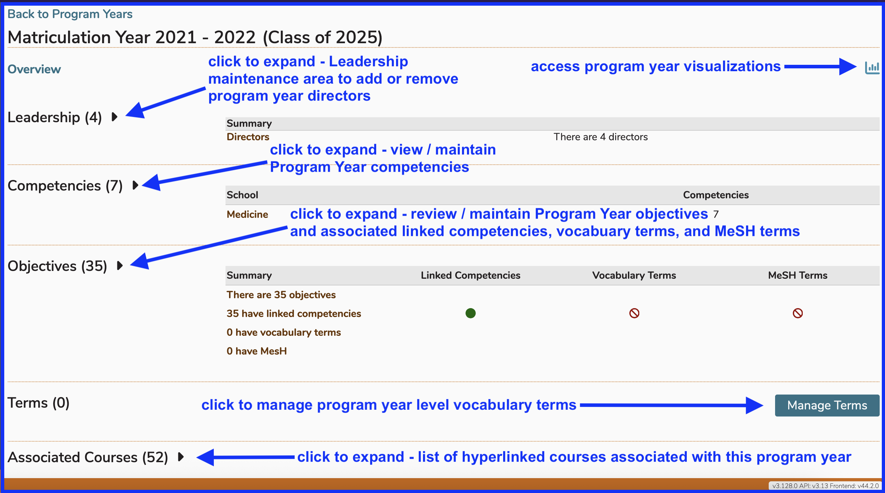

# Edit Program Year

There are many things that can edited for any given Program Year. Since Program Years can be rolled over, you can roll Program Year over and then make additional changes to the newly created Program Year. The options are detailed below.

To start with, navigate to Programs and select a Program. In this case, "Doctor of Medicine - BRIDGES" has been selected.

## View Program Detail

## Select Program Year

For this example, and in order to show more detail in upcoming steps, Matriculation Year "2021-2022" with the Cohort of "Class of 2025" has been selected. At the time of this edit, those students will have recently graduated. This is useful in detailing Competency use throughout the student's educational trajectory. They will have already learned the Topics and Competencies on offer in the Program. Reporting out will provide more robust results.

Here is the resulting display after selecting "Class of 2025" as the Program Year. Editing a Program Year means utilizing the navigation shown below. 

When reviewing Program Year Objectives, you can not only download the Competency Map, you can review how these Program Year Objectives are mapped to Course Objectives as parents.

## Manage Leadership

Leadership in the context of a program year is limited to Directors, who can perform any and all maintenance of this program year and will be included in any leadership report for the program year.

### Show Details 

Initially details are collapsed as shown below. Click to expand and show details.

After clicking as shown above, the 4 directors are listed. From here, you can manage leadership (directors) at the program year level.

### Search for Leadership

Any Ilios user can be added to the role of program year director. After clicking "Manage Leadership", the sceeen appears similar to what is shown below.

It has been decided that the Ilios user "Ann Rachel Greene" should be added to Leadership (as a Director) for Class of 2025. The partial search string entered, "ann rac", is sufficiiently narrow to return four records. 

After selecting "Ann Rachel Greene" to be added as a program year director, it is necessary to save this action to add this record to program year leadership. 

There are now 5 directors listed, including the one we added in the previous step. 

### Save Changes 

The list will get refreshed with the new record added to the list. 

## Manage Competencies

The next section that can be managed here is Competencies. The process is similar to the one documented above regarding managing leadership. Initially, the screen appears in a collapsed (non-expanded) state. 

### Show Details

After clicking to show more details ...

The competencies associated with this program year are now listed. The button "Manage Competencies" should be clicked to review the mapping and make any changes. 

In the "competencies listed" image above, a total of 7 competencies appear. All of these are at the same level - the school competency level. We will see this in the screen shot below where none of the sub-domains of these higher level competencies have been selected for use in this program year - Class of 2025. Those are the lower level values that have not been selected.

### Select Competencies

For the sake of demonstration, we are going to add all three sub-domains that pertain to the school competency "Interpersonal & Communication Skills" to the Class of 2025 program year competency framework. Any of these three sub-domains can now be used to further differentiate and specify the expetise needed to graduate as a member of this class. 

After performing the save event as shown below to process the update, the new sub-domains are added to the program year competency listing. 

### View Updated List

The list of competencies associated with this program year (Class of 2025) now appears as shown below. These competencies can be applied to program year objectives.

