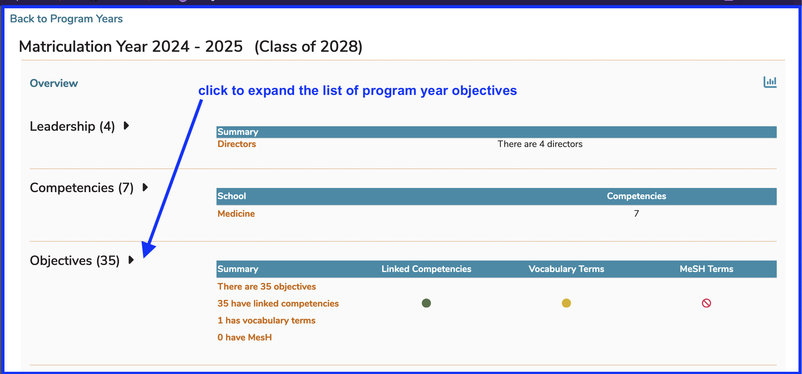
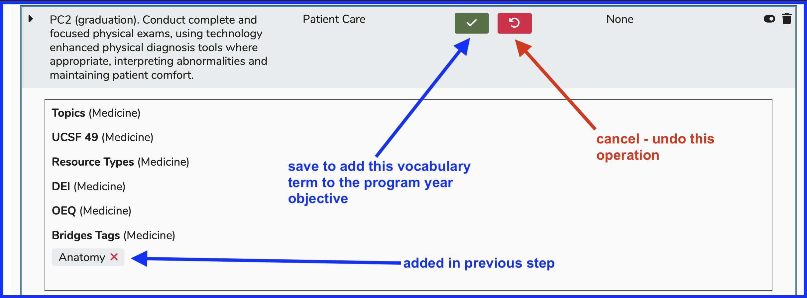
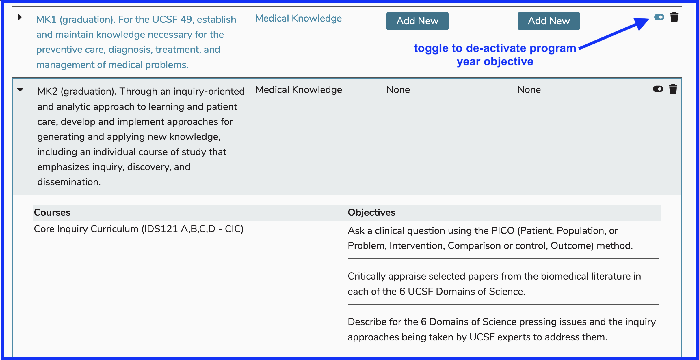

# Maintainance - Program Year Objectives

Objectives for each distinct program year can be added, edited, or removed. The previous year's objectives get added automatically to a new program year but can be maintained individually.

## Add Objectives

Adding one or more program year objectives is easy to do from this screen. One thing to keep in mind is that once these objetives have been entered, they get rolled over for each new program year. 

To add an objective to any program year, select the program year and expand the list to reveal the details as shown below.

**Step One:** Expand the list of program year objectives.

<figure>
  
  <figcaption>
      
expand the list of program year objectives - step one

  </figcaption>
</figure>

## Attach Vocabulary Terms

The process for adding one or more vocabulary terms to an program year objective is similar to the same action performed at the course and/or session level. The interface and steps, since they do vary a bit, will be shown in detail below.

**Step One:** Select the program year objective to which to add one or more vocabulary terms and click "Add New" as shown below.

<figure>
  
  <figcaption>
      
select program year objective and click to add vocabulary term - step one

  </figcaption>
</figure>

**Step Two:** Select the vocabulary term to add to the program year objective.

<figure>
  
  <figcaption>
      
select vocabulary term to add - step two

  </figcaption>
</figure>

**Step Three:** Save to process the attachment of the term to the program year objective.

<figure>
  
  <figcaption>
      
vocabulary term added - step three

  </figcaption>
</figure>

**Final Step: Review:** The vocabulary term has now been added to the program year objective. The process had been completed. 

<figure>
  
  <figcaption>
      
vocabulary term added - final step - review

  </figcaption>
</figure>

This process can be repeated to add more terms. More than one term can be added (or removed) at any given time. After reviewing the recent addition, it is easy to perform follow-up changes whenever needed.

## View Objective Mapping

This shows where the Program Year objectives (graduation requirements) have been linked to Course objectives, which in turn can be linked to Session objectives. 

Below is a sample screen shot illustrating this. The Program Year Objective "MK2 (graduation) ..." has been expanded by clicking the arrow to the left of the Objective. Viewable are the Courses in which this was taught along with the text values of the associated Course Objectives.

Any, or all, of these Program Year Objectives can be expanded individually to reveal these useful details. The toggles for activating / de-acitivating program year objectives are in read-only mode when the selection is expanded. The blue one in the screen shot below is ready for use.

Below is a list of Program Year Objective attributes that can be edited or changes that be made here.

* **Sort Objectives**: Use this to set the order in which these objectives will appear - drag and drop. Refer to sorting [Course Objectives](../courses-and-sessions/courses/sort-objectives.md) or [Session Objectives](../courses-and-sessions/sessions/sort-objectives.md) for reference. 
* **[**Download Competency Map**](https://iliosproject.gitbook.io/ilios-user-guide/programs/competency-map-download)**
* **Edit Description**: Clicking on the description of a Program Year Objectives will bring up an editing control.
* **Competency**: The school level Competency / Domain can be set here.
* **Vocabulary Terms**: Terms can be attached to Program Year Objectives in the same manner as they are to 
Courses and [Sessions](https://iliosproject.gitbook.io/ilios-user-guide/courses-and-sessions/sessions/edit-session#manage-terms).
* **MeSH Terms**: Same as with Vocabulary Terms but using MeSH instead
* **Active**: The toggle provided here indicates if an Objective is currently active and can be selected at the Course level. Clicking on the toggle will de-activate the Objective, not destroying any legacy data but making sure it can not be selected going forward. Historical data will appear read-only.
* **Trash**: The trash can will only appear active if the selected Program Year has not been used as a Parent Objective for any Course Objective.

