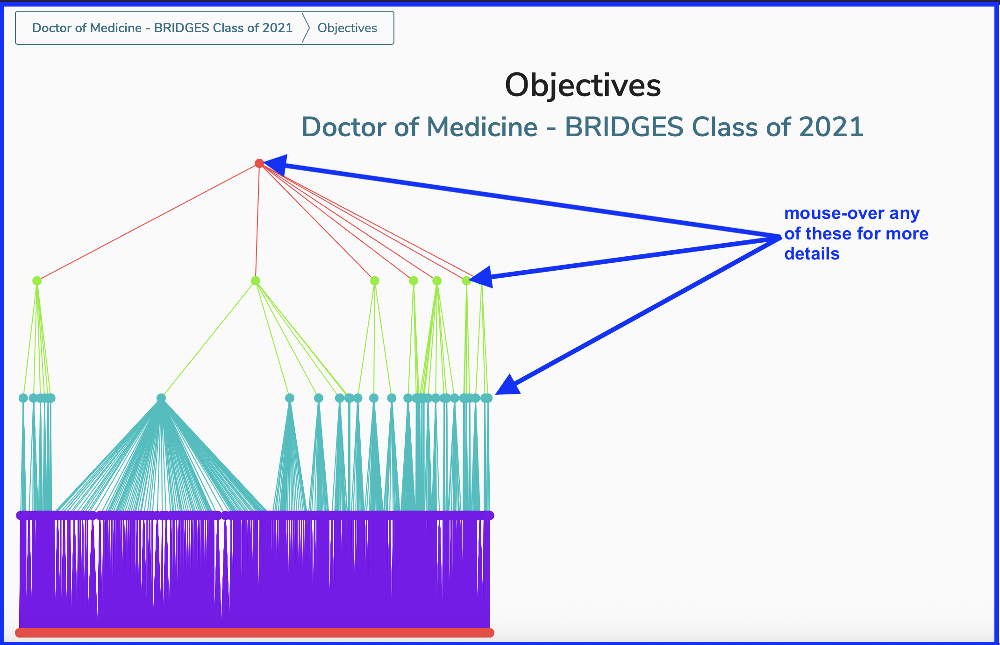

# Program Year Objective Visualization

This is a very dense and detailed visualizsation showing program year objectives being mapped down to the course and session level, indicating how this mapping has occured.

It may be helpful to select a matriculation year with a considerable amount of data with a graduation year close to the current year. This will help reflect the full curriculum in detail. The image also points out the location of leadership at both the program and program year level.

Once the data has been processed after a second or two, the following high level visualization appears on screen. The mouse can be used to hover over and reveal more details about the underlying data.

The highest level mouse-over view is shown below.

Mousing over further down at each level will reveal the appropriate details. 

It is also possible to go down to the Course Objective level, which is the lowest level of this visualization. 

