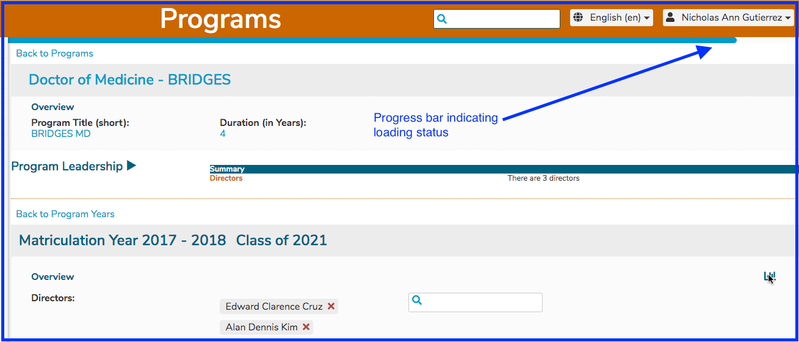
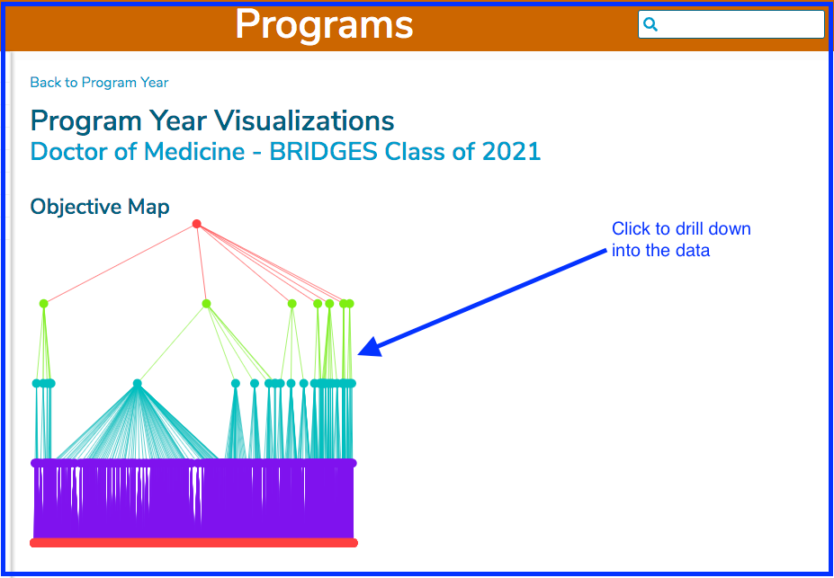
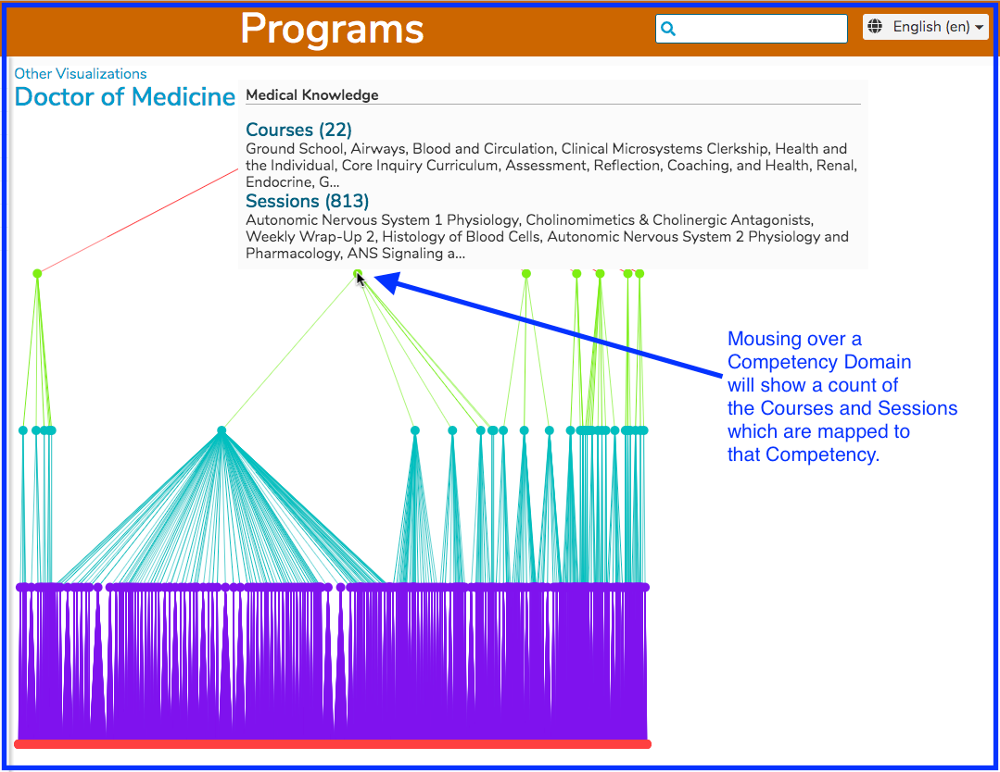
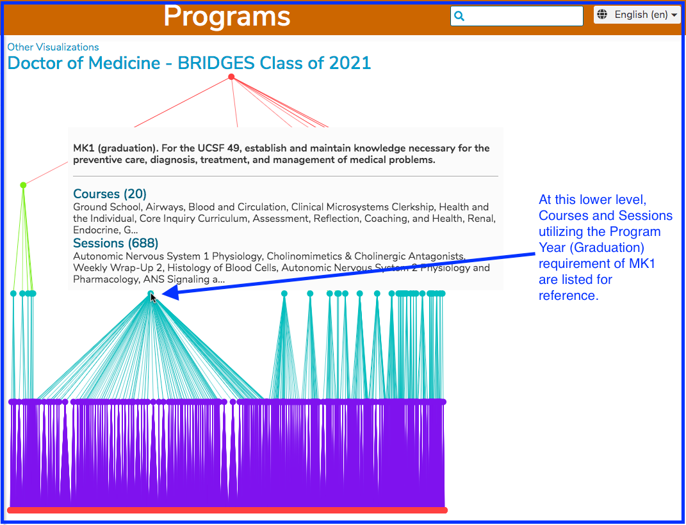
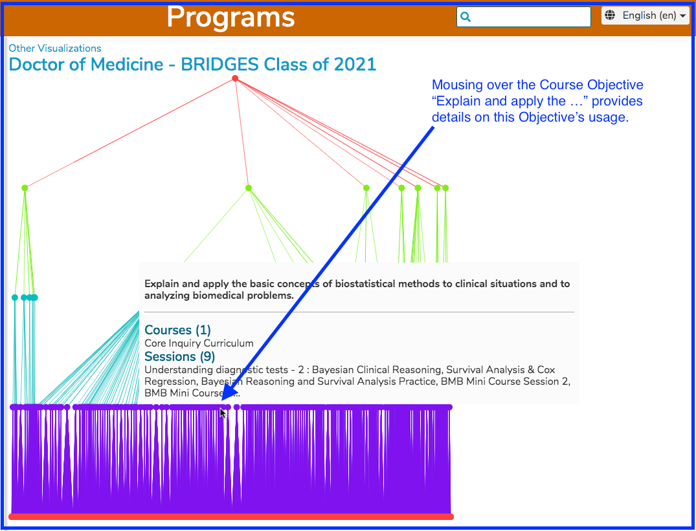

# Program Year Objective Visualization

Since this requires some heavy calculations, a blue progress indicator bar will appear as the graph \(visualization\) is being generated. 

Once the progress bar has completed its journey, the following high level visualization appears on screen. This needs to be clicked to drill down to be able to review the data.

After clicking as shown above, the visualization can be reviewed. This is currently required as an extra step due to the fact that we may have more visualizations at this higher level in the future.

Clicking further down at each level will reveal the appropriate detail. 

It is also possible to go down to the Course Objective level, which is the lowest level of this visualization. 

