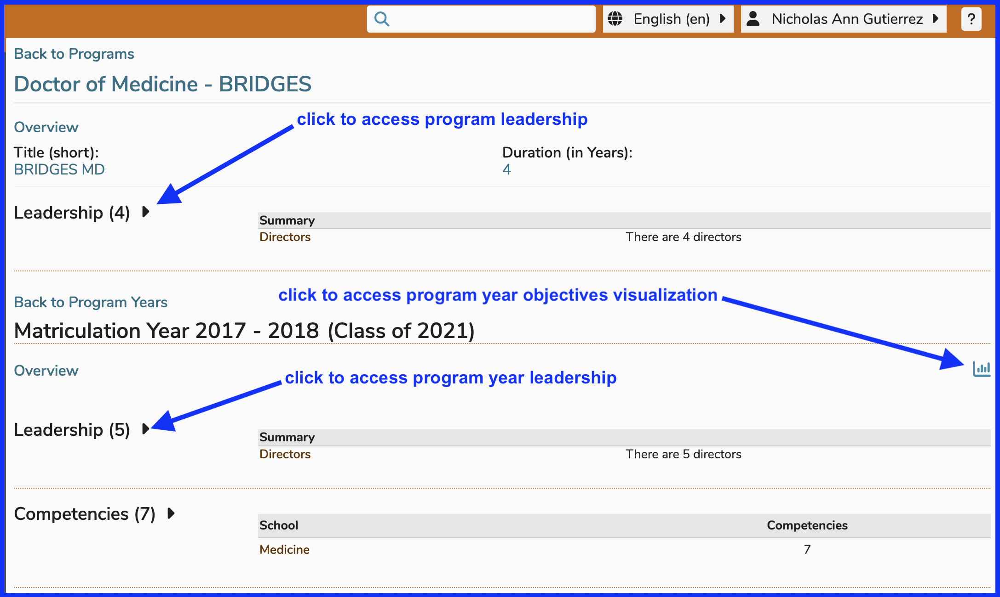
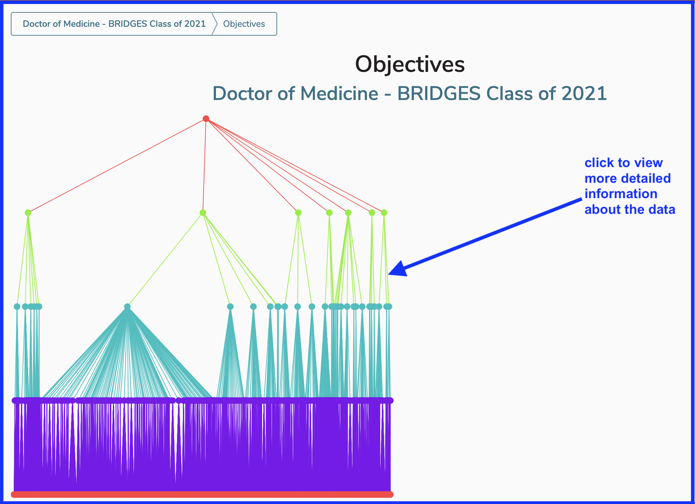
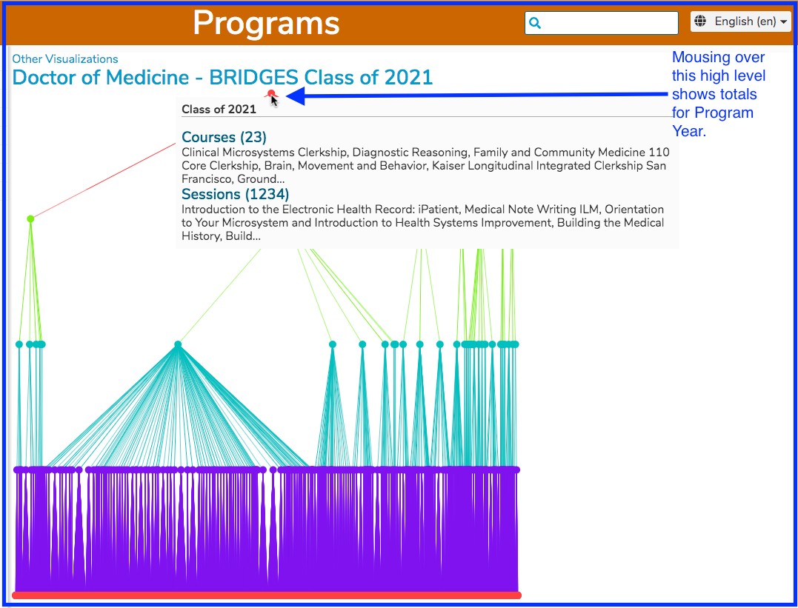
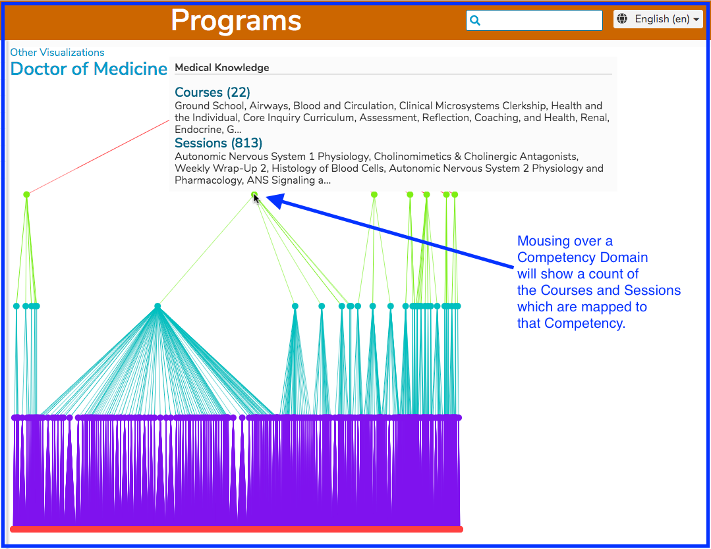
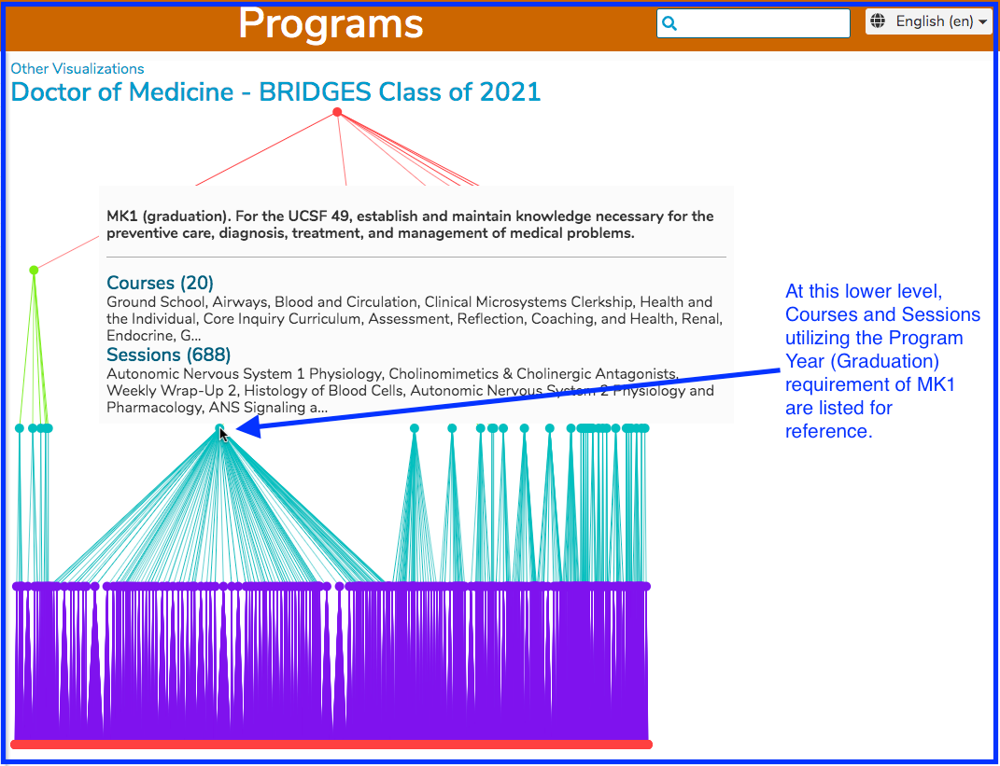
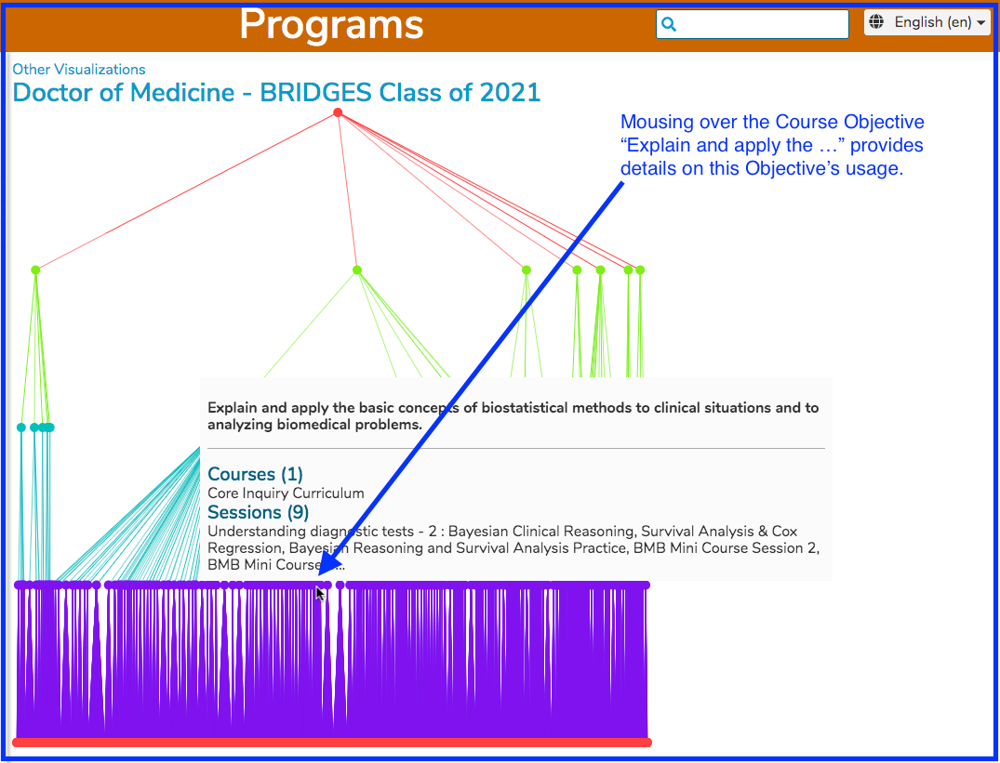

# Program Year Objective Visualization

This is a very dense and detailed visualizsation showing program year objectives being mapped down to the course and session level, indicating how this mapping has occured.

It may be helpful to select a matriculation year with a considerable amount of data with a graduation year close to current year. This will help reflect the full curriculum in detail.

Once the data has been processed after a second or two, the following high level visualization appears on screen. This needs to be clicked to drill down to be able to review the data.

After clicking as shown above, the visualization can be reviewed. This is currently required as an extra step due to the fact that we may have more visualizations at this higher level in the future.

Clicking further down at each level will reveal the appropriate detail. 

It is also possible to go down to the Course Objective level, which is the lowest level of this visualization. 

