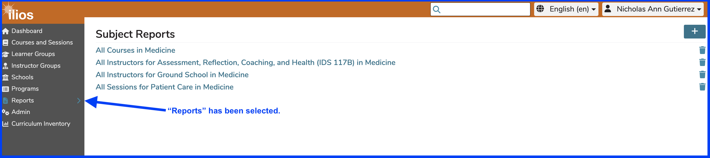
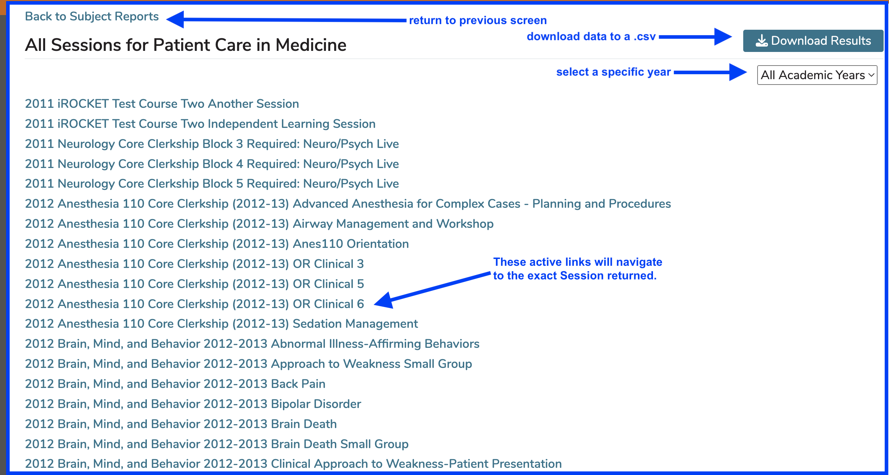

### Reports
Reports now live in their own large area rather than the compact My Reports of yesteryear. This allows for better visibility of results as well as inclusion of data tables and legends.

This shows a typical user's saved reports.

Running any of the reports here is as easy as simply clicking on the link. This is shown below.

After clicking as shown above, the screen will refresh with the data outputted to the screen. 

As shown above, there is a link available to download the report's output. After clicking as shown above (on a Mac anyway), the following dialog box appears. 

