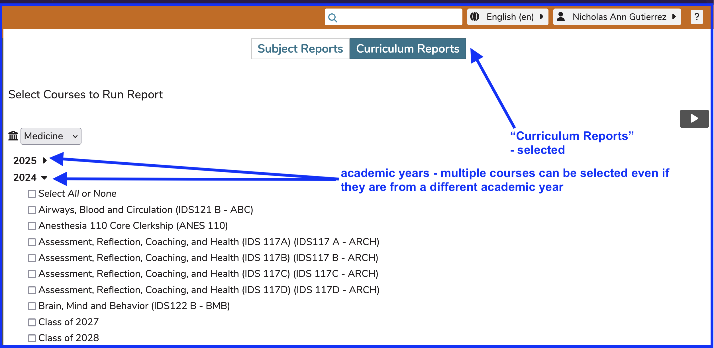
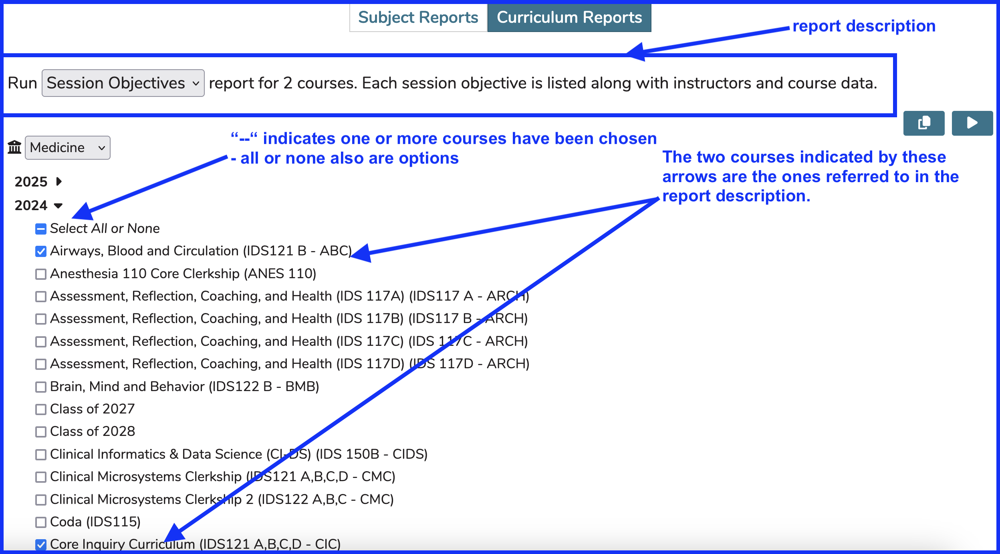
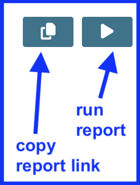
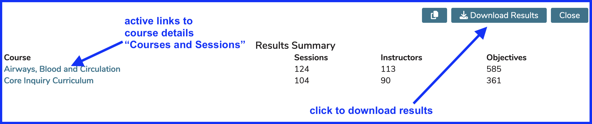

## Select Courses 

The first step in generating a report using the new self-service "Curriculum Reports" interface is to select one or more courses to be included in the output.

### Courses Chosen

In the screen shot below, two courses have been chosen. 

### Options

Currently (in March 2024), we are offering two options for report output. More will be offered soon. 

1.  Session Objectives 
2.  Learner Groups

The available buttons perform the actions of copying a shareable link to a generated report or running the report for the current user.

After the report gets run, a download button appears for the user to export the data (in .csv format) to a location of their choice.

### Buttons Shown

The "copy link" and "run report" buttons are shown below. Hopefully it is obvious in the "courses chosen" image above that these buttons are available at the upper right portion of the screen even though that image does not specifically indicate their existence.

## View Results

After clicking the "Run" button, the screen will display a progress bar briefly and then present the user with the "Results Summary" screen where the data gets summarized and becomes available for download.

### Results Summary

The "copy link" button remains in this view, along with a "close" button just to close this screen and return to design view at the root of "Curriculum Reports". The courses are hyperlinked as indicted in the image, along with the download button.

### Download Results

If the download button is utilized, the user will be prompted like any other downloaded file as to where the .csv output is to be stored.

The files will be downloaded with the following names ("objectives.csv" or "learner-groups.csv"). It is recommended to change the file names after downloading the data in order to keep everything straightened out. The names will download with file names such as "objectives(1).csv" and then "objectives(2)csv" if this is not done. This is for an output of the Objectives reports as an example. 

## Output Fields 

The Results Summary displays some informational summaries - rolled up data corresponding to the results of running the report. The downloaded .csv files, which can be opened and modified in Excel or other programs contains the detailed information at a much more granular level.
