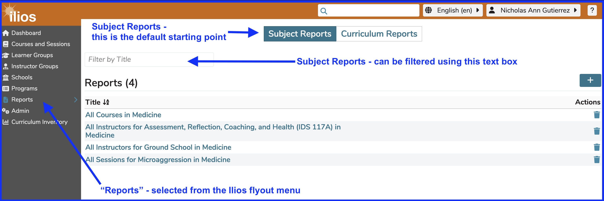

# Reports

## Starting Point 

Clicking on "Reports" from the Ilios menu takes the user to "Subject Reports". 

The other option is "Curriculum Reports", which is the new reporting suite, including the ability to access, save and download reports for multiple courses as a set, in a given year or longitudinally across years. This provides real-time access to complex data. We will be continuing to add additional functionality to this area.

