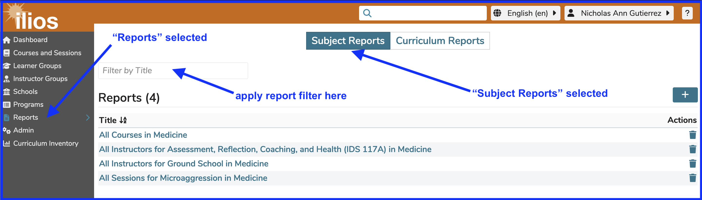
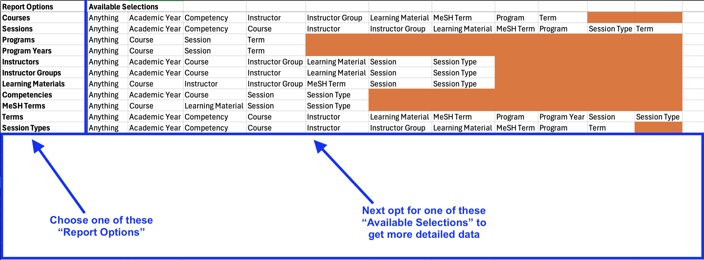
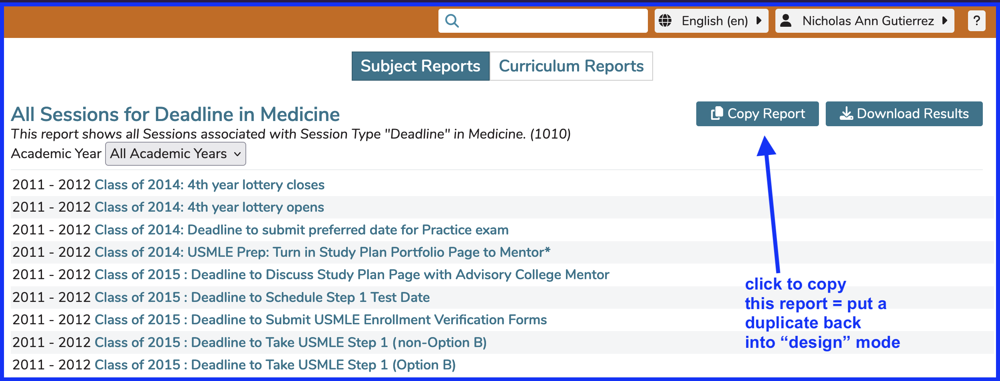
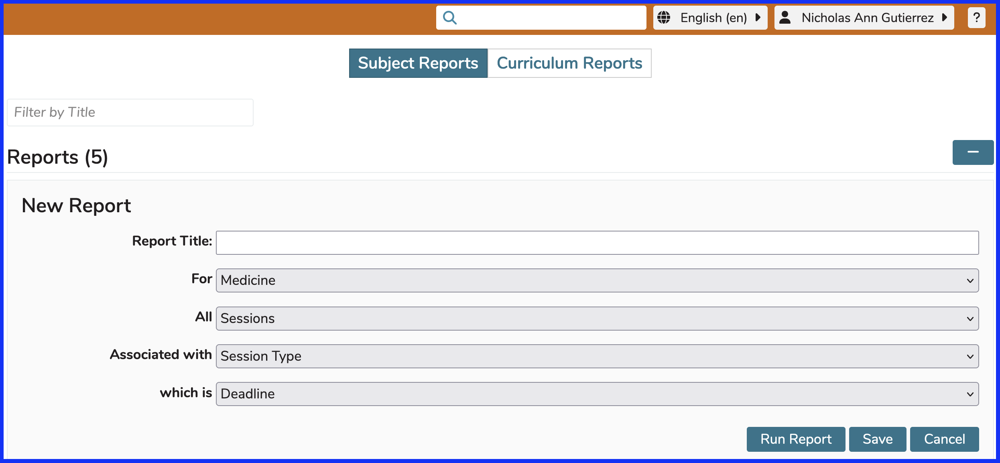

# Run Saved Report

This shows a typical user's saved reports, which can be run at any time by this user. At this time only Subject reports can be saved and stored in Ilios. Curriculum reports are created and viewed with the output available for download at run-time. As detailed [here](https://iliosproject.gitbook.io/ilios-user-guide/reports/curriculum_reports), curriculum reports can be shared with other users after being created.

Running any of the reports here is as easy as simply clicking on the link. This is shown below.

After clicking as shown above, the screen will refresh with the data outputted to the screen. 

**NOTE:** In the output shown above, the part of the linked data to the left will take ythe user to the course level, whereas the part of the linked data farther to the right will route to the course AND the session. For the fourth output record, if the link `"Brain, Movement and Behavior"` is clicked, the user will be routed to that course but not to the referenced session. If the right part is clicked, the user will be taken directly to that session `"Neurobiology of Bias"`, which is a session in the course "Brain, Movement and Behavior".

## Download Report Data

As shown above, there is a link available to download the report's output. After clicking as shown above (on a Mac anyway), the report file (.csv) is named automatically and saved in the user's "Downloads" folder.

In this report example, the .csv download includes the following fields ...

* Session Title 
* Course Title 
* Academic Year
* Session Description
* Session Objective (one per row)

You can use a spreadsheet program (Excel, Google Sheets, Numbers etc.) of your choice to set up formatting and sort order of this exported output.

# Create New Report

It is now possible to run an "on the fly" report. You can choose to save it for future use or use it as a one-off report, opting to download the data or not.

Creating a new report can be easily done using the guidelines shown below. The choice of whether to save the report or not is made after selecting the report's output.

After clicking as shown above, the screen appears similar to the following screen shot. This only shows the first of several drop-down options to be choosing for new reports (to be saved or not).

## Top-level Options

The following options are available at this top level (after choosing School) ...

* Courses (currently selected as default)
* Sessions
* Programs
* Program Years
* Instructors
* Instructor Groups
* Learning Materials
* Competencies
* MeSH Terms
* Terms
* Session Types

The information being presented below will vary depending on which of these top-level reporting objects you select. The subsequent drop-downs are content driven in the sense that they will vary based on selection here.

Choose "Sessions" as the next selection option. This will ensure to retrieve a list of sessions that meet the speicifcations being selected.

After choosing the value "Sessions" as shown above, we are now ready to select the next reporting option. 

## Second Level Options

The available options for drilling down below "Session" are ...

* Anything (gives all sessions for specified school)
* Course
* Program 
* Instructors
* Instructor Groups
* Learning Material
* Competency
* MeSH Term
* Session Type
* Term

We will continue on to specify the data set we'd like to review. The screen refreshes as shown below after making the selection of "Term".

It is worth keeping in mind that any school can have a number of different Vocabularies set up to be chosen under "Terms". In this case, we are selecting from the Vocabulary "Topics". The value chosen in this example is "Anatomy".

# Report Output Options

As shown in the previous steps, it has been decided to run a Term based report which will display all Sessions assoicated with the Topic of "Anatomy". It can now be run immediately or saved to run at any point in the future. Reports that are believed to be generally useful and informative throughout time should be saved, whereas one-off ad hoc style reports can be immediately run and not saved. Below is the screen showing these two options at this juncture. 

## Ad-hoc / View Only

This workflow allows the user to view and / or download the data from a newly created report but not save it for future use. This would be for situations when the data is only needed this one time.

If you want to download the outputted data, the report needs to be saved and then run again in order to get the download to be available for use.

See the image below for the current reporting matrix.

## Save Report

Under the same scenario as above, a report can be saved and run at any point in the future. The steps for running this type of reports are covered at the top of this page. This is helpful when the data continues to be useful over time.

## Copy Report

This functionality allows the user to make a copy of a saved report and then make modifications to its parameters and / or to rename it.

The starting point for all of this is shown below. It is required to first run a report before performing this "copy" operation.

Ater clicking the report as shown above, the screen becomes similar to the way it was when the report was initially created except that at this time, we are working with a "copy". It is sort of like editing but you are working with a duplicate of the original. If no changes are made and this "copy" is saved, there will simply be two identical saved subject reports available to this user.

### In Edit Mode

Here is the screen as it now appears after clicking "Copy Report".

### Options

At this point, changes can be made to any of the parameters of the original report. The original report will not be modified in any way since this is a "copy" of it. The same principles apply though as far as the naming of this copy is concerned. The title of this new report will either be generated by the paramters selected or entered (if there is no title entered). If there is a title entered, that will be the title that gets saved. There will be no interpretation of the parameters as far as the naming process is concerned. 

**NOTE:** If you have typed in a report title manually rather than accpeted an auto-generated title and have made a bunch of parameter changes, you will have a "copy" of the original report but with different paramters selected, essentially creating an inexact duplicate of the original. This may not be the easiest to deal with since there will be two reports using the same name with no real distinction from the Subject Reports list.
