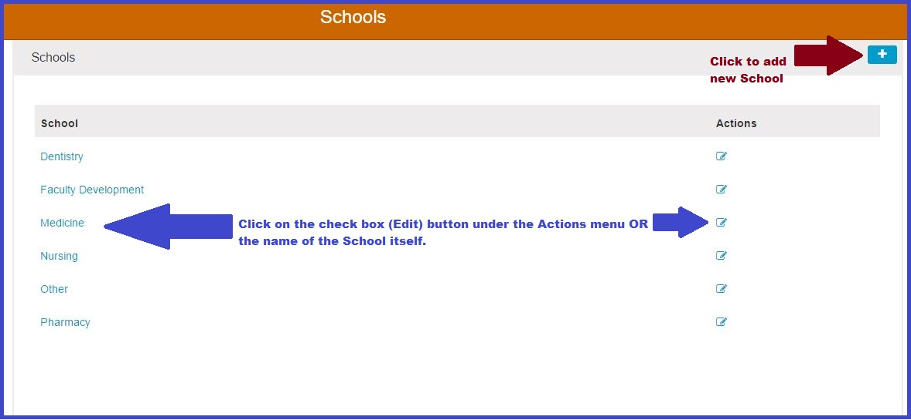

# Schools

Selecting Schools from the Ilios flyout menu takes the user to a location which lists all of the Schools of the entire University that are using Ilios.

## Initial School Attributes

These are set only at the time of creating a School for use in Ilios. There are only two fields that are set at School creation time.

* **Title**: The Title of the School \(ie Medicine\) is set at creation time. This can be modified later.
* **Administrator Email**: This is currently set at creation time as well. It will be added as a configurable item in the interface but is not available for modification yet.

**More Info**

* [Add New School](https://iliosproject.gitbook.io/ilios-user-guide/schools/add-new-school)
* [Multi-School Environment](https://iliosproject.gitbook.io/ilios-user-guide/schools/multi-school-environment)

## Additional School Attributes

* [School Leadership](https://iliosproject.gitbook.io/ilios-user-guide/schools/school-leadership)
* [Competencies](https://iliosproject.gitbook.io/ilios-user-guide/schools/competencies)
* [Vocabularies](https://iliosproject.gitbook.io/ilios-user-guide/schools/vocabularies)
* [Session Types](https://iliosproject.gitbook.io/ilios-user-guide/schools/session-types)
* [Session Attributes](https://iliosproject.gitbook.io/ilios-user-guide/schools/session-attributes)

The attributes listed above for the selected School can be configured once the School has been selected or initially entered. The selection screen appears as shown below.

