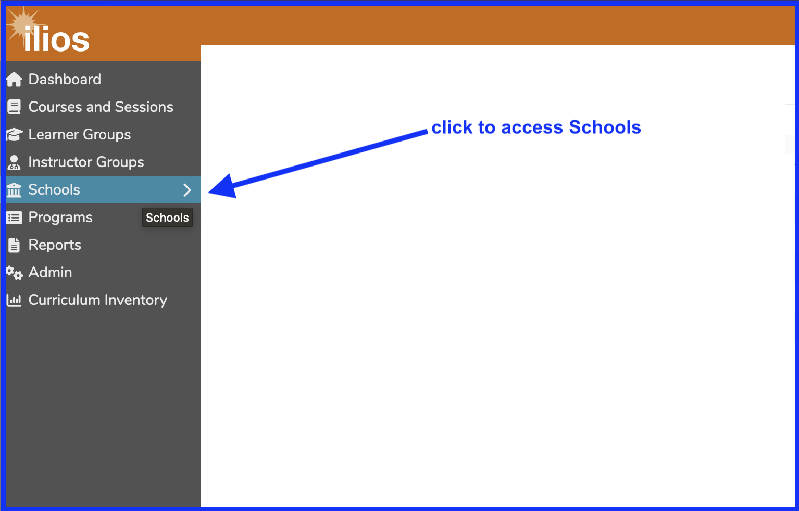
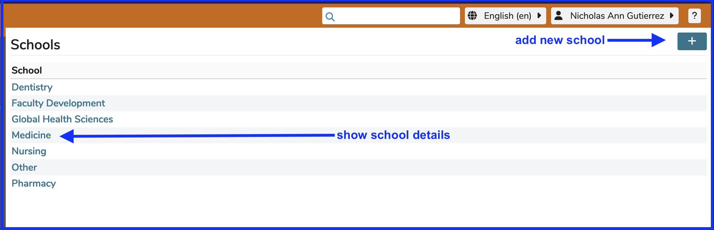

# Schools

Selecting Schools from the Ilios flyout menu takes the user to a location which lists all of the Schools of the entire University that are using Ilios.

<figure>
    
    <figcaption>
        
Access Schools from menu

    </figcaption>
</figure>

## Initial School Attributes

These are set only at the time of creating a School for use in Ilios. There are only two fields that are set at School creation time.

* **Title**: The Title or name of the School is set at creation time. This can be modified later.
* **Administrator Email**: Like School Title above, this can be entered when a school is created but cannot be modified in the interface. See [Add New School](https://iliosproject.gitbook.io/ilios-user-guide/schools/add-new-school) for more information.

## Additional School Attributes

* [Leadership](https://iliosproject.gitbook.io/ilios-user-guide/schools/school-leadership)
* [Competencies](https://iliosproject.gitbook.io/ilios-user-guide/schools/competencies)
* [Vocabularies](https://iliosproject.gitbook.io/ilios-user-guide/schools/vocabularies)
* [Session Types](https://iliosproject.gitbook.io/ilios-user-guide/schools/session-types)
* [Session Attributes](https://iliosproject.gitbook.io/ilios-user-guide/schools/session-attributes)
* [Institutional Information](https://iliosproject.gitbook.io/ilios-user-guide/schools/curriculum-inventory-institution-information)
* [Multi-School Environment](https://iliosproject.gitbook.io/ilios-user-guide/schools/multi-school-environment)

The attributes listed above for the selected School can be configured once the School has been selected or initially entered. The selection screen appears as shown below.

After clicking as shown above, detailed information pertaining to this school appears. From here, the remaining configurable attributes can be entered.

