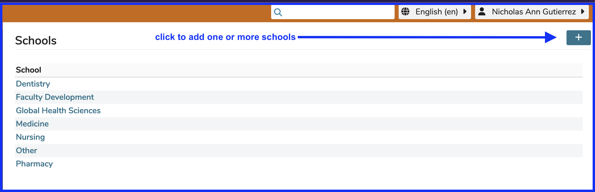
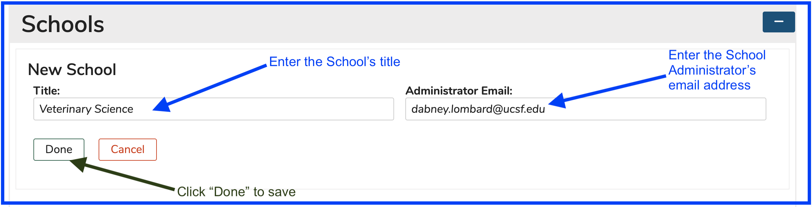
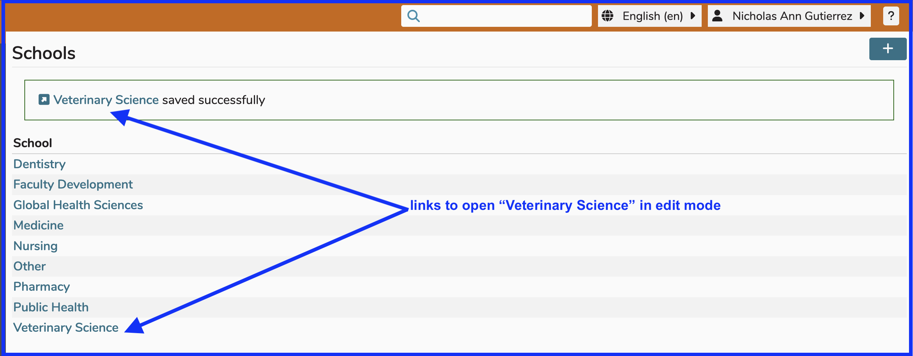

# Add New School

To start the process of adding a new school to Ilios, click the (+) button as shown in the screen shot below.

Once the step above has been taken, the school can be entered as shown below. A valid email address must be entered into the School Administrator's Email field.

The user has now clicked "Done" (as shown above) to add "Veterinary Science" as a newly created school. Click on any of the locations indicated below to configure the remaining school attributes.

Since this is a new school, the screen will not initially contain any data. It can be added now or at any point in the future. Refer to upcoming sections for more details on configuring the new school for use.

## Delete / Remove School

This action must be done at the database level. We do not provide this in the interface currently. 
