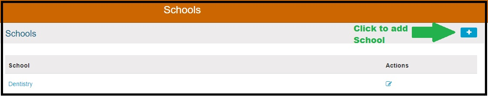
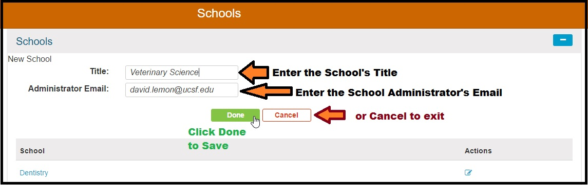
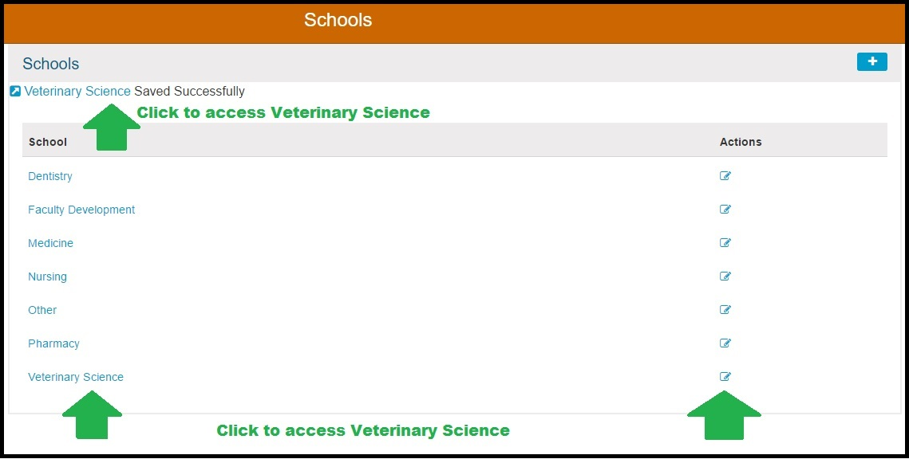

# Add New School

To start the process of adding a new School to Ilios, click the \(+\) button as shown in the screen shot below.

Once the step above has been taken, the School can be entered as shown below. A valid email address must be entered into the School Administrator's Email field. 

Now that "Veterinary Science" has been added, click on any of the locations indicated by the green arrows to configure the remaining School Attributes. All are covered in subsequent sections of this chapter.

Since this is a new School, the screen will not contain any data. It can be added now however. Refer to upcoming sections for more details on configuring the new school for use.

