# Competencies

Competency domains and sub-domains can be managed within the Ilios application. To access this functional area of Ilios, from the flyout menu select "**Schools**" as shown below.

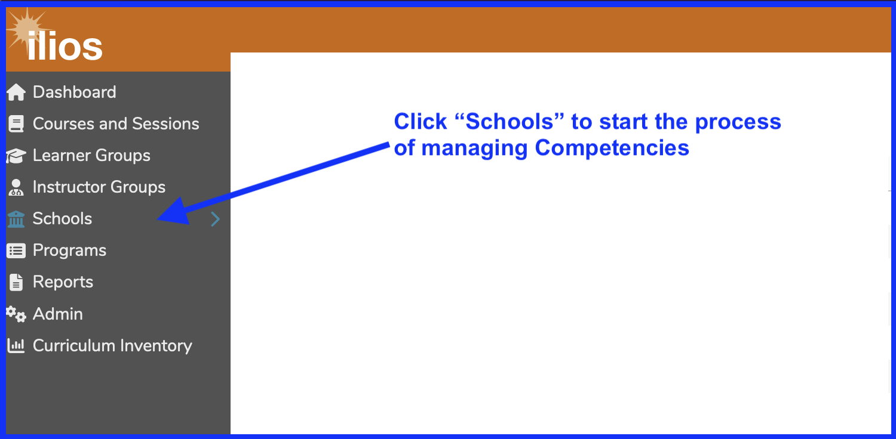

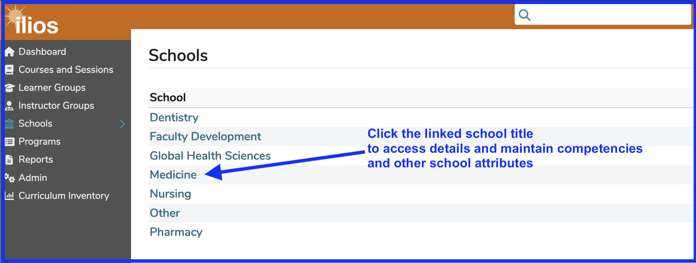

Now that the School of Medicine has been selected, Competencies can be maintained using the following interface and commands. An oveview of the Schools screen is shown below. Maintaining email addresses and now defunct Curriculum Inventory information is not shown in the screen shot. Aside from those, the screen shot is complete.

## School Screen Overview

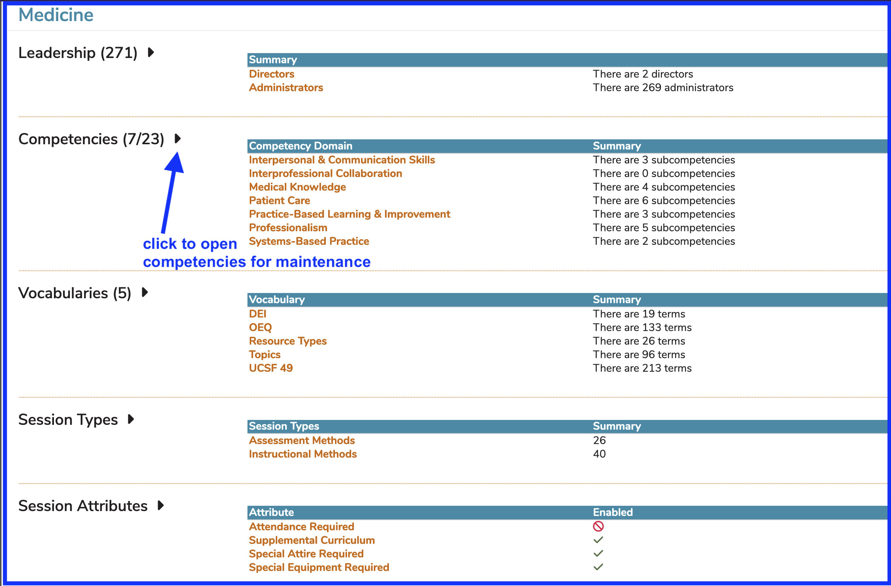

The highest level Domains are shown initially with the count of associated Competencies displayed underneath the Summary column header. Click the Competencies(x) link to open up the detail screen, shown below. This breaks out into a visual representation to show the details of the competencies counted up under the Summary header. This gives a more detailed viewpoint as shown below.

In the screen shot below, the "7" refers to the count of Competency domains, whereas the "23" refers to the count of Competencies within these domains.

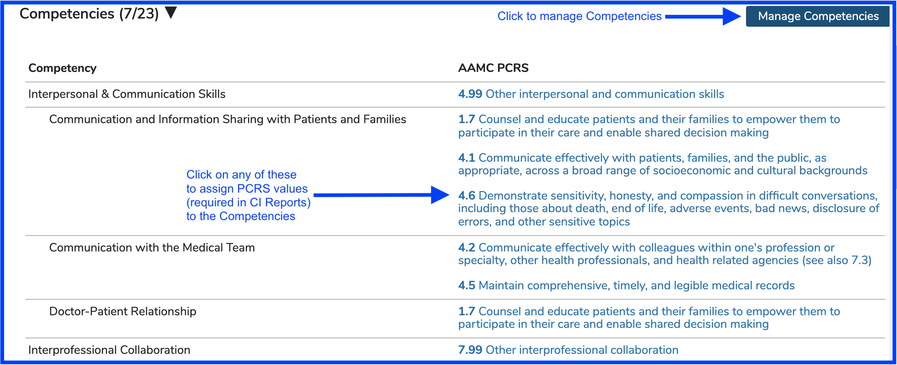

Now that "Manage Competencies" has been clicked as shown above, the screen changes to the functional area as shown below, allowing the competencies to be managed. Only the top domain "Interpersonal & Communication skills" is displayed to save space and for clarity. "Email and Database Etiquette" was recently added and is not attached to any courses or sessions and can be deleted. The existence of the trash can icon instead of the count of times it has been attached confirms this.

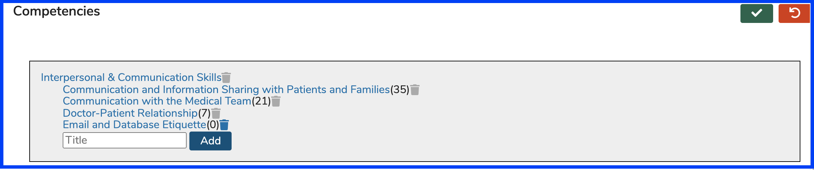

## Add New Competency

To add a new Competency under (in this case) the "Interpersonal & Communication skills" domain, simply enter the text of the Competency and click "Add". "Another New One" has been started as a new Competency but not entered yet. This is shown below.

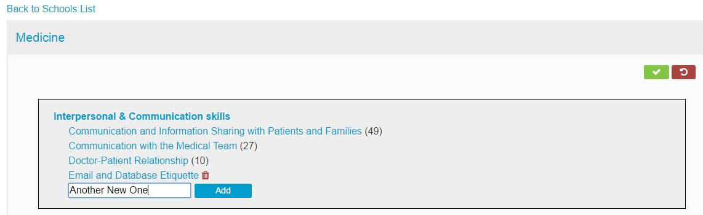

## Edit Existing Competency

To edit an existing Competency, simply click on the Name to edit it as shown below. Keep in mind that if it is referenced in Courses and or Sessions, the values there will update as well. In the example below, "Ethical Principles" will be changed to "Ethical Concepts" for no reason other than to demonstrate this functionality.

### Step One -- select the Competency to edit

### Step Two -- make the changes in the provided inline edit box

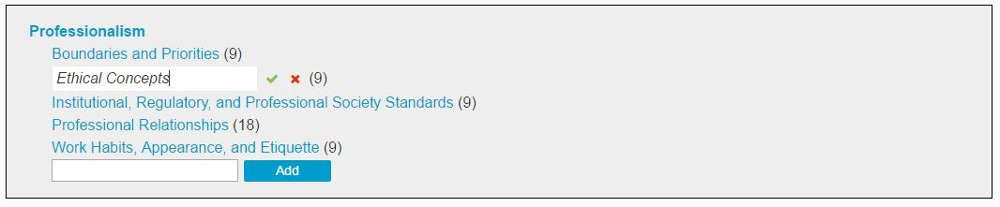

### Step Three -- commit the changes (or click the red (x) to cancel the event)

The changes are now reflected in the list.

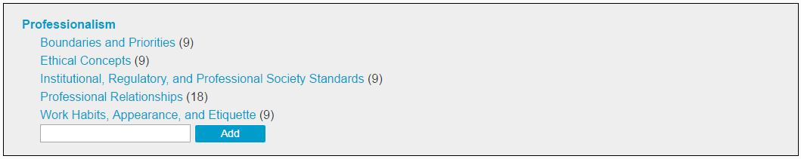

## Add New Competency Domain

Adding a new high level Competency Domain can be easily accomplished in this latest version of Ilios. To do so, scroll to the bottom of the screen and enter the new domain into the text box provided and the click "Add" as shown below.

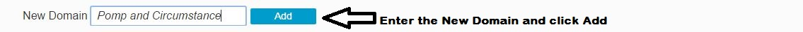

The new domain then appears in the list as shown. Only a portion of the screen is shown to save space.

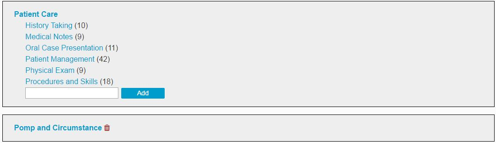

At this point, you can ...

* Add Competencies to this domain
* Delete the Domain since it is not attached to anything
* Edit the Domain

Editing a domain is performed in exactly the same way as editing a Competency is performed. The field is an inline edit field as shown below with the options described in the image.

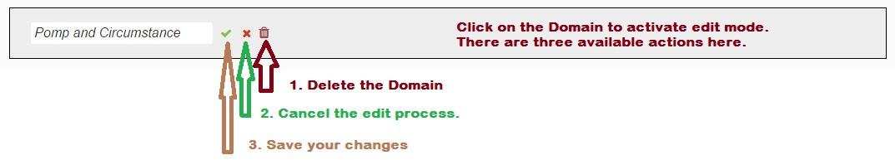

**NOTE:** Be sure to include any and all competencies you may wish to use at this level in order to be able to select them at the Program level.

**Configure** [**PCRS**](https://www.aamc.org/what-we-do/mission-areas/medical-education/curriculum-inventory/establish-your-ci/physician-competency-reference-set) **(Physician Competency Reference Set) terms for Competencies**

Ilios offers the functionality to attach PCRS terms to competencies either at the domain level or competency level (under domain). The starting point for the association is shown below.

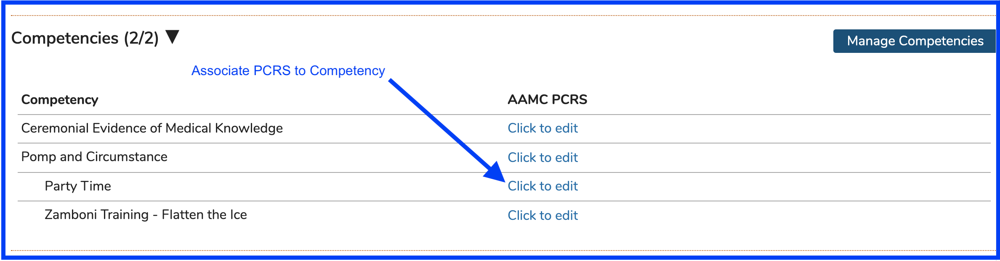

After clicking as shown above, the full set of Physician Competency Reference Set values are population for selection to be associated with the School's Competencies at any level. One or more of these can be selected as shown below.

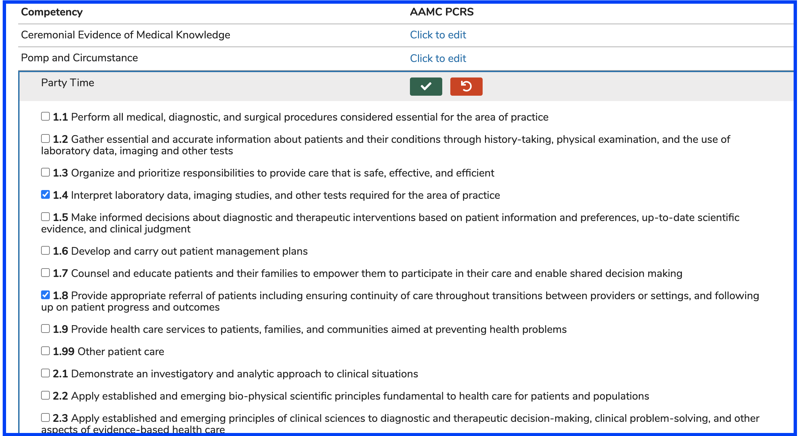

After saving the data in the scenario shown above, the PCRS values are now associated with the Competency.

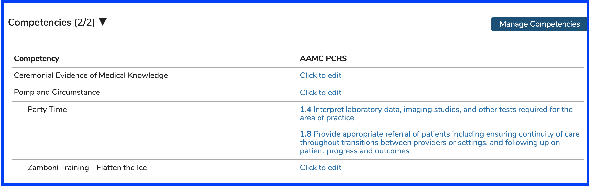

