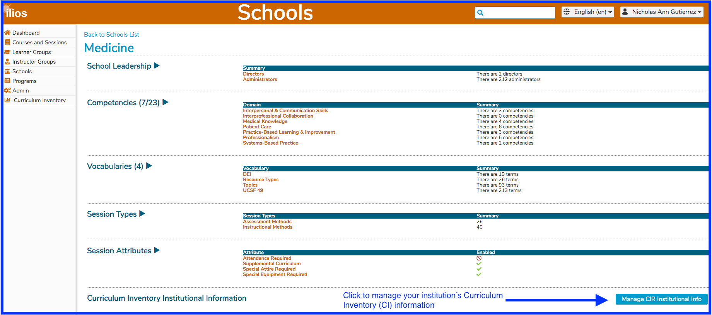
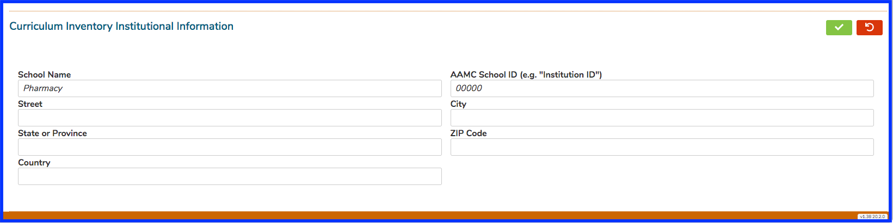

# Curriculum Inventory Institution Information

Managing your school's relationship with the AAMC can be maintained in Ilios from the Schools functional area. 

Click the button as shown above to edit your institution's Curriculum Inventory Report information. This will prove to be beneficial in uploading your Curriculum Inventory \(CI\) Report to the AAMC.

#### Available Fields

* School Name
* Street \(address\)
* State or Province
* City
* Zip Code
* Country
* AAMC School ID

Here is a screen shot of an institution that has not yet filled in this information. Saving or canceling is performed using the same green or red buttons as always in Ilios.

