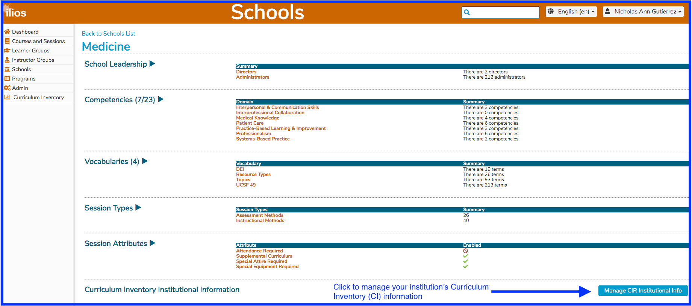
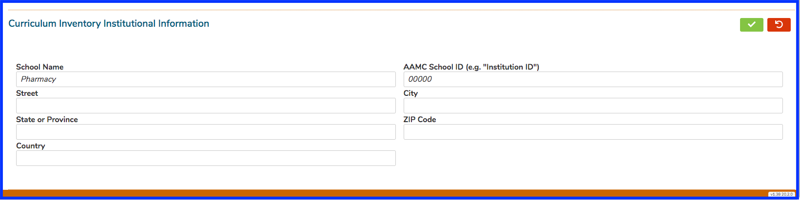

# Institutional Information

Managing your school's institutional information can be performed in Ilios from the Schools functional area. 

Click the button as shown above to edit your institution's information. 

## Available Fields

* School Name
* Street (address)
* State or Province
* City
* Zip Code
* Country
* AAMC School ID

Here is a screen shot of an institution that has not yet filled in this information. Saving or canceling is performed using the same green or red buttons as always in Ilios.

