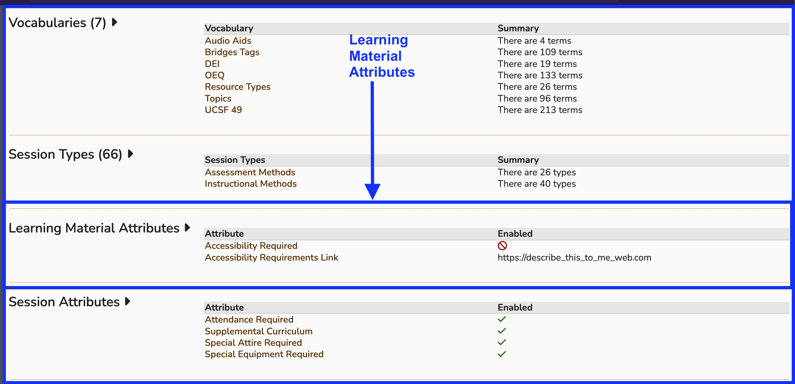
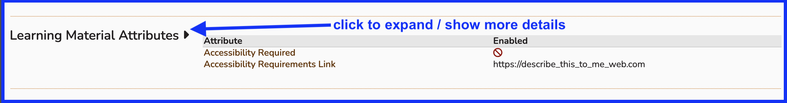
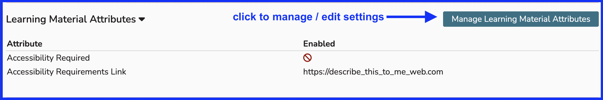

This is related to learning materials and their accessibility to learners who might need accomodations to fully utilize the learning materials involved with courses and sessions they have been assigned. The check box which indicates if a learning material has been determined to be accessible is available whether the "required" aspect has been set or not.

If the "Accessibility Required" check box has been set to true, the adminitrative Ilios would not be able to upload the learning material without checking the box, hence certifying the the learning mateial being uploaded is accessible.

# Initial Appearance

The "Learning Material Attributes" section of the schools area in Ilios initally appears as follows. It is located between "Session Types" and "Session Attributes" following the vertical flow of the page.

Before expanding to show more detail or entering into maintenance mode after that, the screen appears as shown below.

# Accessibility Required

## Click to View Details

To show more details regarding learning material attributes as currently configured, click as shown below.

## Click to Manage

After clicking as shown above, the screen appears as shown below revealing the current learning material attributes settings. More importantly, the "Manage Learning Material Attributes" button is available allowing for the adjustment of these settings.

When the value of "Accessibility Required" has been set to "true" (checked), any user uploading a new learning material to Ilios will need to declare that the learning material (file, link, or other) has been certified to be accessibile to those who may have individual requirements for full access to the learning material itself.

## Options Shown 

After clicking to manage these attributes as shown in the image above, the screen adjusts allowing for these values to be set here. 

# Accessibility Requirements Link

A field is provided for a link to be added to provide accessibility information (optional). This link gets appended to the "Accessibility Required" checkbox. It is added to provide additional context to accessibility standards at your school.