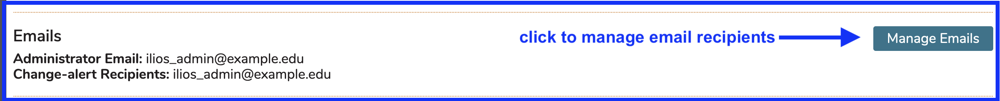
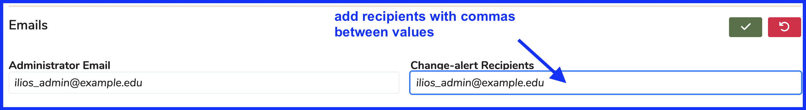
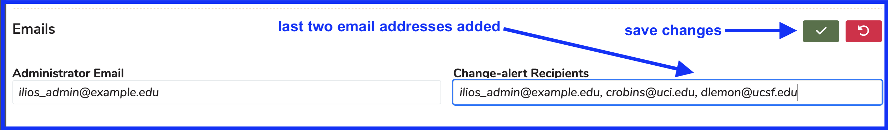
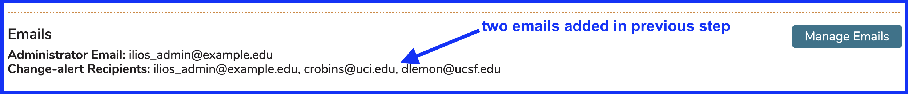

## Manage Emails

There is a section in the Schools functional area to maintain several important email addresses that pertain to any school's Ilios implementation.

Click as shown below to start the process of managing school-level email recipients in Ilios.

## Administrator Email

This email has been set up to identify the administrator of your Ilios instance. There can only be one entry in this field since this email address is used as the "from" address when email alerts are sent out and can only be associated with one email address at a time.

## Change-alert Recipients

This allows for the addition of one or more recipients who would like to receive change alert notification which are sent out automatically by the system when details (when, where, who) change especially regarding an offering location, instructor, or other pertinent details. The change-alert recipients will receive these email notifications.

For the sake of demonstration, it has been decided that two additional email addresses should be added in order to receive change-alert email messages. This is to test the content and delivery cycle - any changes within 7 days of the offering date/time trigger this notification to be sent out by the system. 

After clicking to manage, both fields become editable. 

### Add Change-alert Recipients

Additional change-alert recipients can be added but need to be separated using commas to distinguish individual email accounts.

Two recipients were added for demonstration purposes.

After clicking as shown above to process this recent change, the list gets updated with the newly added recipients displayed.

