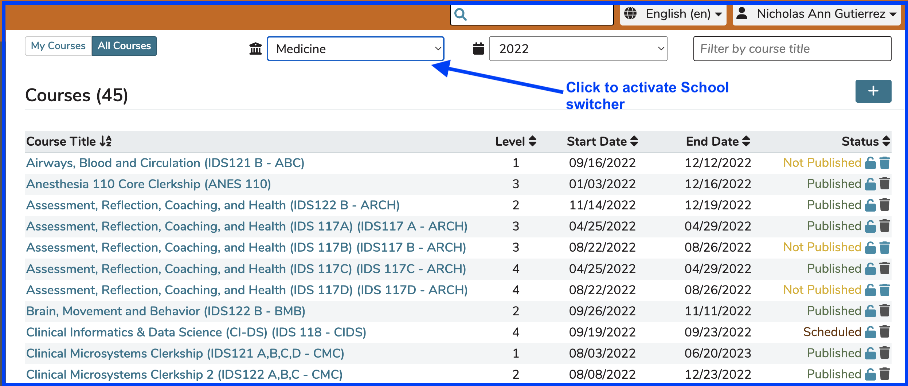
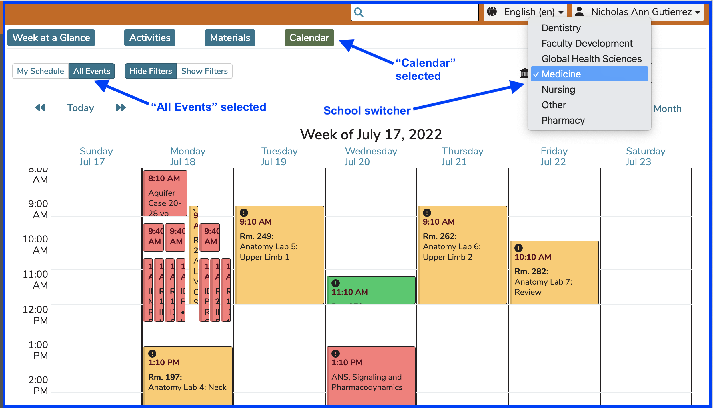

# Multi-School Environment

For institutions with multiple schools or unique curricula deployed within Ilios, it is possible to access the curriculum of another school by using the schools selection tool, which appears for users who have had multi-school permissions assigned to them. Any user in the system may be assigned access to one or more available schools in addition to their default home school. Assignment is managed at the School level using School Leadership and by clicking the "Manage Leadership" button. Any active Ilios user can be added as Administrator or Director of any School within your institution.

The school switcher appears on the Course and Sessions tab as shown below. It is not available or necessary if you are only in one school. This truth applies whether you are accessing "All Courses" or "My Courses".

After activating the School switcher as shown above, the available Schools to which you may switch (if applicable) appear in a drop-down similar to the display below in "Calendar School Switcher".

**IMPORTANT NOTE:** On the Calendar, if you are in more than one School, all curricular events for you in any and all of your schools will appear on the Calendar automatically. The school switcher also appears on the Dashboard but only when All Events is selected and the Calendar is selected.

