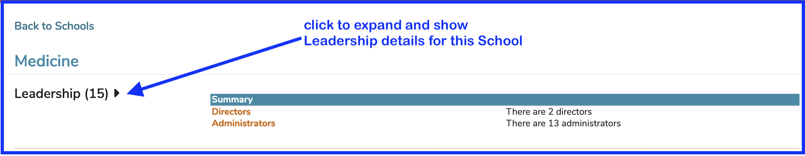
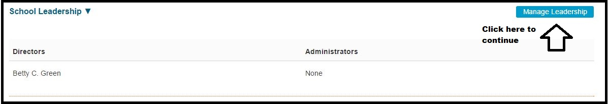
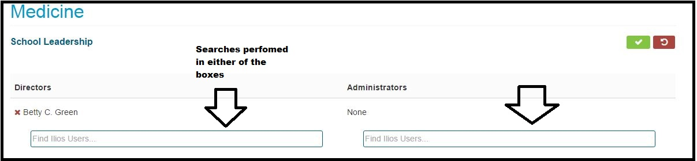
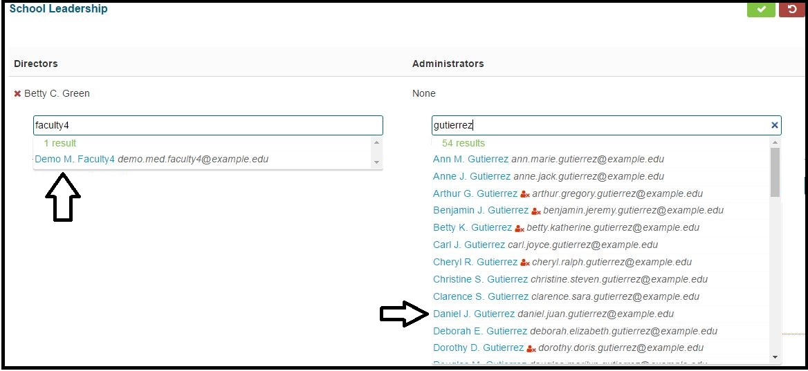
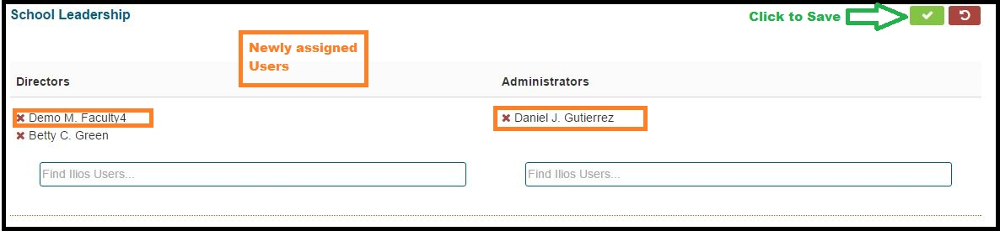
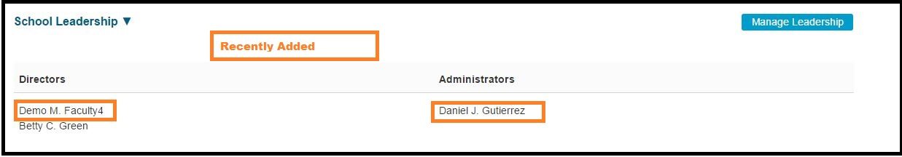

Leadership at the school level is easily maintained in Ilios. Ilios users can be granted or revoked permission to be (or not to be) Administrator or Director at the School level. 

## View Leadership details

After expanding School Leadership, currently assigned Directors and Administrators are listed. 

## Leadership Displayed

After clicking Manage Leadership as shown above, Ilios users may be assigned into either (or both) Director and Administrator permissions.

## Search to Add

While it is unlikely you would want to search for both at once, it is possible. The two Ilios users indicated below are selected as shown.

Once they have been selected, the screen appears as shown below. Click the Green button to save this information.

The screen refreshes to show the changes.

## Screen Updated

