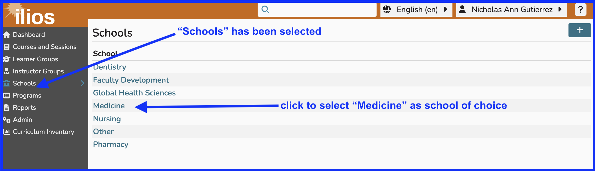
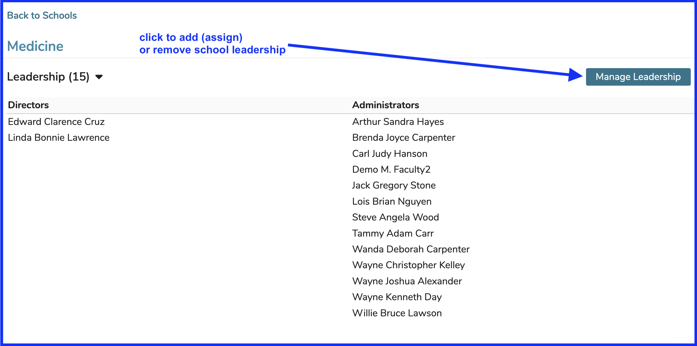
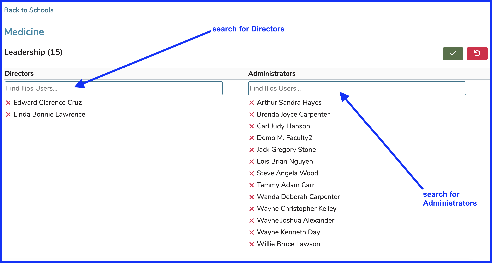
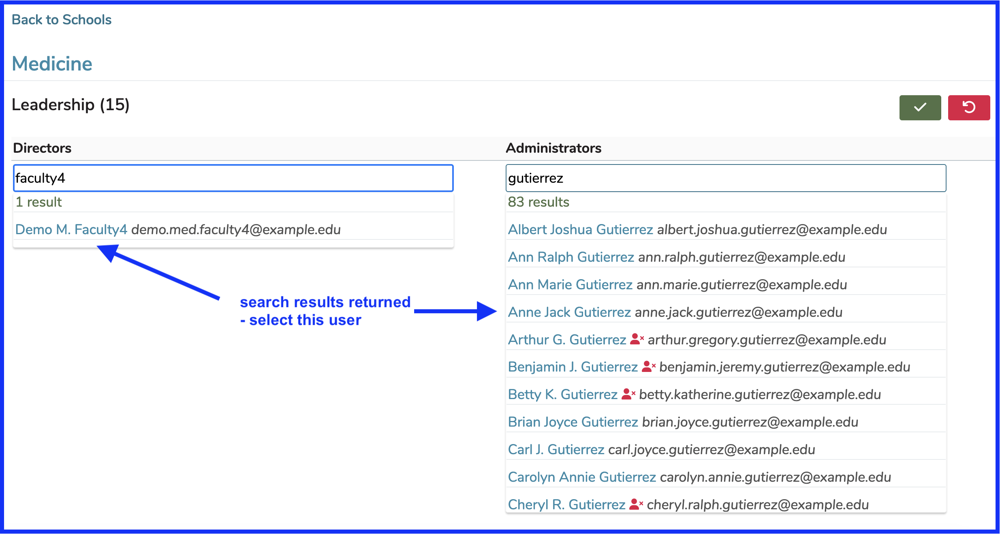
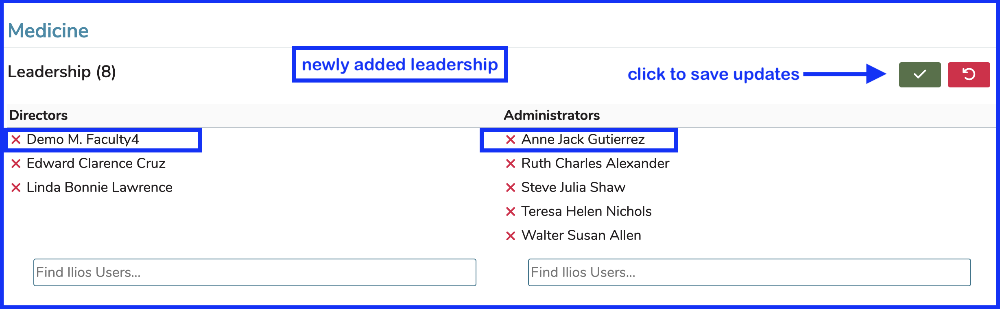
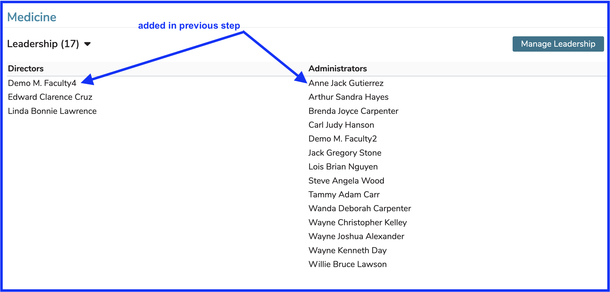

Leadership at the school level is easily maintained in Ilios. Ilios users can be granted or revoked permission to be (or not to be) Administrator or Director at the School level.

## Select School 

It is quite likely your list will not be as all-encompassing as the one shown below; but it is still necessary to select the correct school for maintenance, even if there is only one available to you.

<figure>
    
    <figcaption>
        
select from available schools

    </figcaption>
</figure>

## View Leadership details

After clicking as shown in the screen shot above, leadership details are exposed showing currently assigned school-level Directors and Administrators. 

## Leadership details shown

After clicking Manage Leadership as shown above, Ilios users may be assigned into either (or both) Director and Administrator permissions. Refer to the [permissions matrix](https://www.dropbox.com/s/431sdj2bfoi3v1f/Ilios%20New%20Default%20Permissions%20Matrix.pdf?dl=0) for more information about these user roles. Permissions involved in both are very similar if not identical. It is a matter of properly determining the correct identification in the educational structure of the user being assigned. If they are going to be setting up courses and sessions in Ilios but are not technically considered as a director of the school, Administrator should be used rather than Director.

## Search to Add

While it is unlikely you would want to search for both at once, it is possible. The two Ilios users indicated below are selected as shown.

Once they have been selected, the screen appears as shown below. Click the Green button to save this information.

The screen refreshes to show the changes.

## Screen Updated

