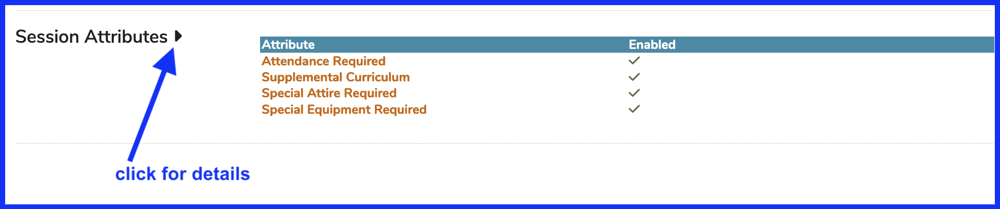

# Session Attributes

There are four optional attributes that can be used and tracked with the creation of Sessions (or not). Currently, there are "Attendance Required", "Supplemental Curriculum", "Special Attire Required", and "Special Equipment Required". These can be turned on or off at the School level. You can choose to use them or not. In order to activate or de-activate any of them, the following steps can be used. Additional session attributes can be added to your implementation if you prefer options other than these initial four presented here.

### Select School

Navigate to Schools from the Ilios Flyout Menu and select the School to review / modify.

### Display Session Attributes

Click as shown below to expand the listing of attributes.

    
Expand to review the details of the current settings

### Edit Settings

These Session Attributes are switched on or off for any selected session using Courses and Sessions >> Session Detail as shown below. In addition to Attendance Required (shown here), Supplemental Curriculum, Special Equipment Required, and Special Attire Required can be set as true or false here (if enabled).

In the case of `Attendance Required`, this is displayed as shown below in the Event Detail screen. The other Session Attributes also have display icons in the Event Detail screen.

