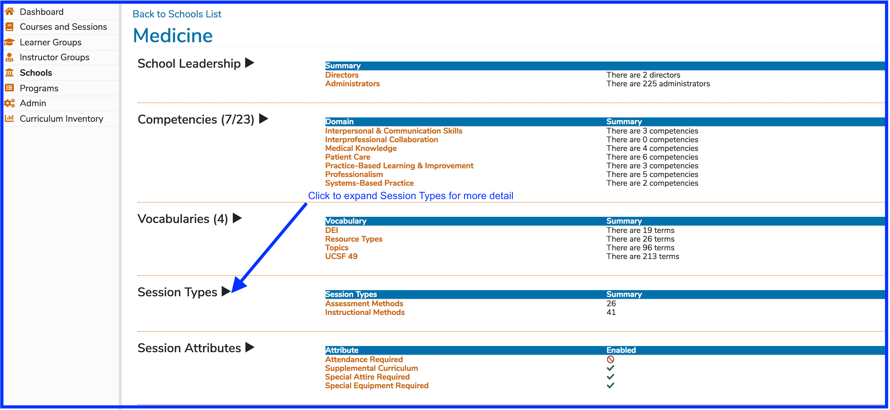
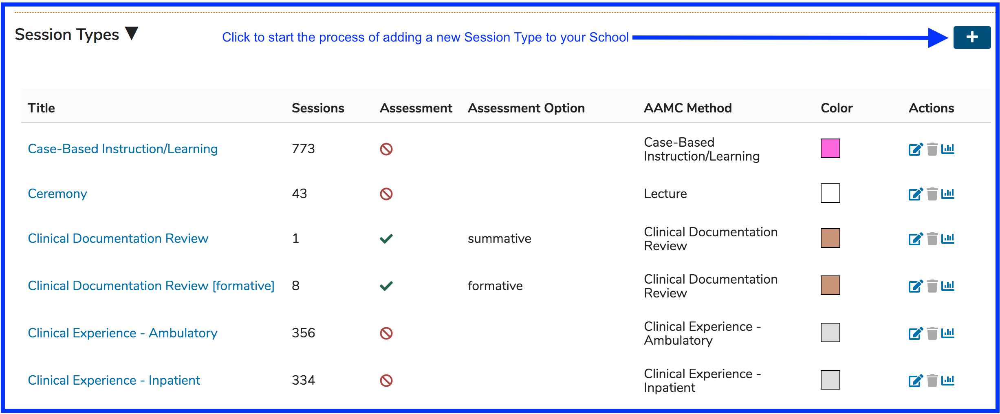
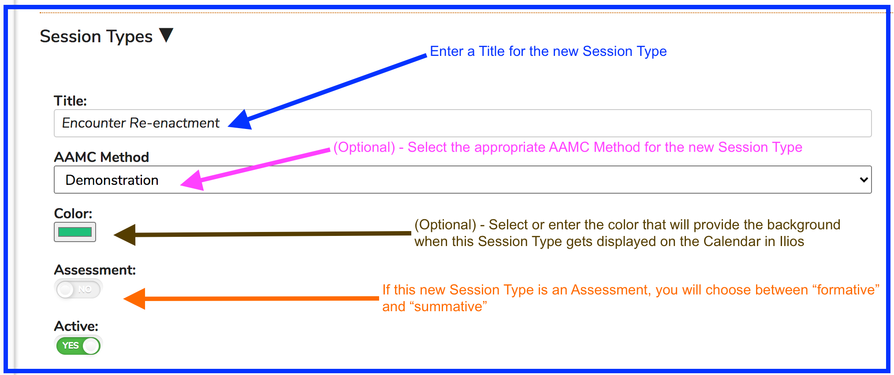
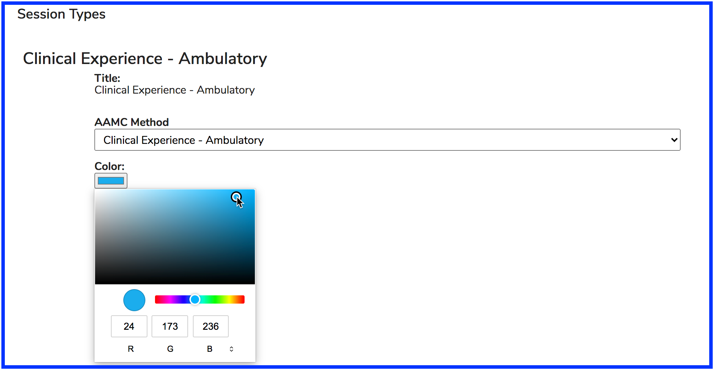
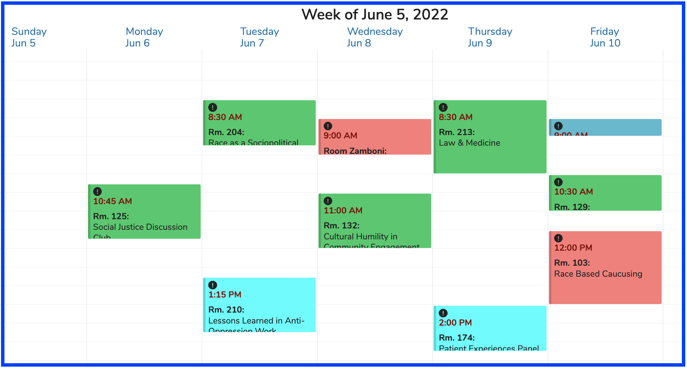
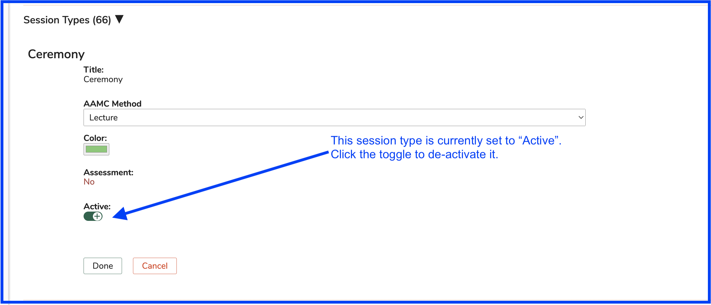
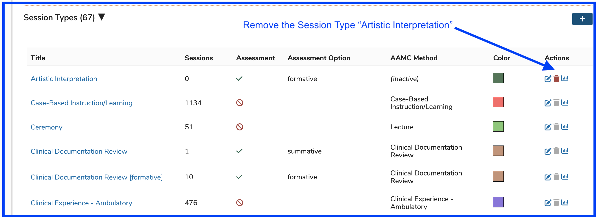

# Session Types

This refers to an educational activity's modality. Examples include "Lecture", "Small Group <12", and "Tutorial". These are customizable at the School level.

### Add New Session Type

To create a new Session Type or to review existing session types, click as shown below. A newly created session type can be used for existing or for future Sessions being created in Ilios.

### Edit Session Type

Edit a Session Type's description if it has not been attached to any Sessions. Once set, the value for Session Type title cannot be modified.

To do this ...

* Select the Session Type to be modified
* Click the "edit" button
* Edit the Session Type's title using the provided "Title" field.

### Select Session Type Color

Choose a color to display on the Calendar for all Session Types.

To do this ...

* Select the Session Type to be modified
* Click the "edit" button
* Select the new color using the color guide tool or enter a hex value for the new color.

### Colors Displayed

An example of how these colors appear on a Calendar is shown below.

### De-Activate Session Type

De-activate a Session Type if it is no longer in use. This does not change the legacy data but will result in the Session Type no longer being available for use in Ilios going forward. The controls for performing this action are shown below.

**NOTE:** When a Session Type gets de-activated, it is sent to the bottom of this list. "(disabled)" will appear after the Session Type name.

### Remove Session Type

Session Types can only be completely removed from the system if they have never been used. This is shown below. Like basically everywhere in Ilios, if the trash can is enabled, the object can be removed from the system.

