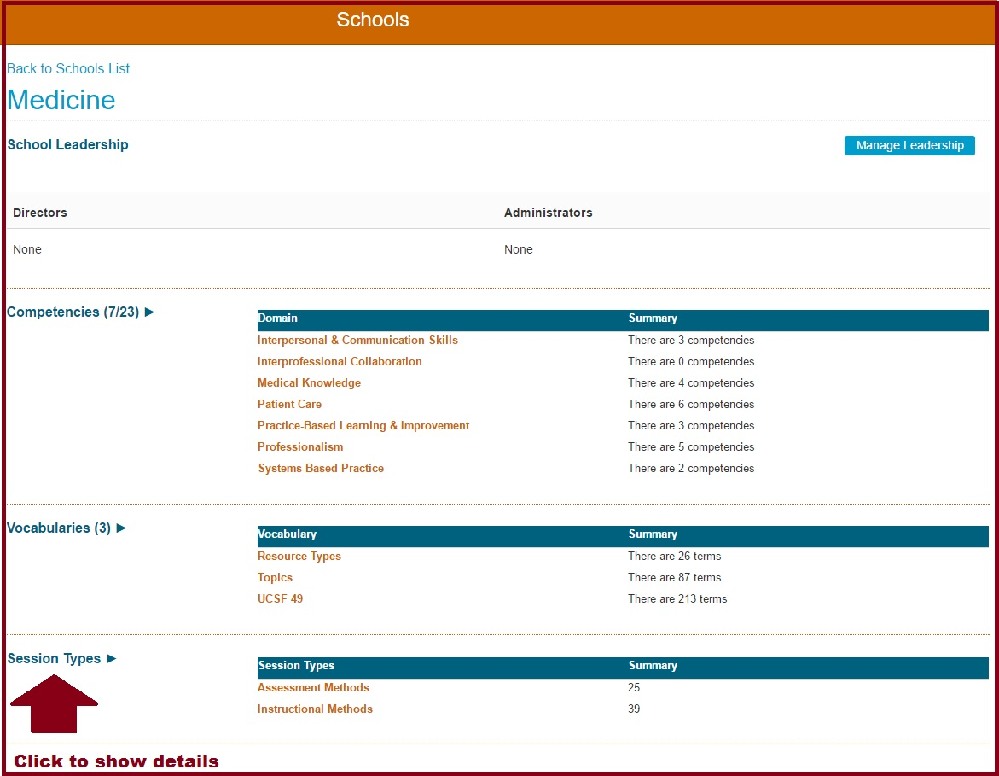

# Session Types

The maintenance of Session Types can easily be accomplished using the Ilios interface. Below are the tasks that can accomplished. The first step is to go to Ilios Menu &gt;&gt; Schools and then to select your School. Expand Session Types as shown below.

## Add New Session Type

Add a new Session Type. This newly created session type can be used for existing or for future Sessions being created in Ilios.

## Edit Session Type

Edit a Session Type's description if it has not been attached to any Sessions.

## Select Session Type Color

Choose a color to display on the Calendar for all Session Types.

## De-Activate Session Type

De-activate a Session Type if it is no longer in use. This does not change the legacy data but will result in the Session Type no longer being available for use in Ilios.

## Add New Session Type

## Edit Session Type

## Select Session Type Color

## De-Activate Session Type

