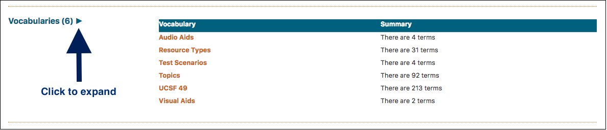
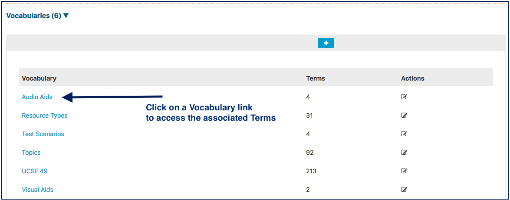
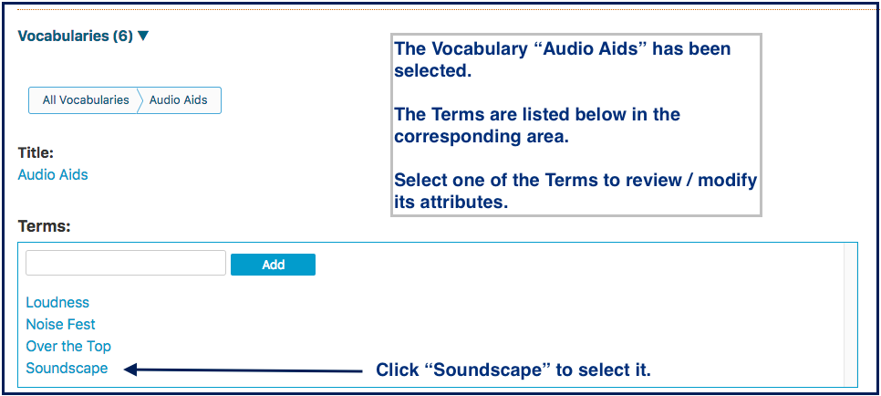
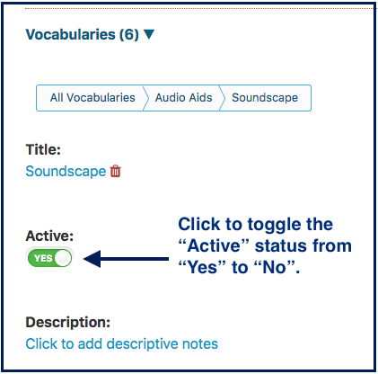
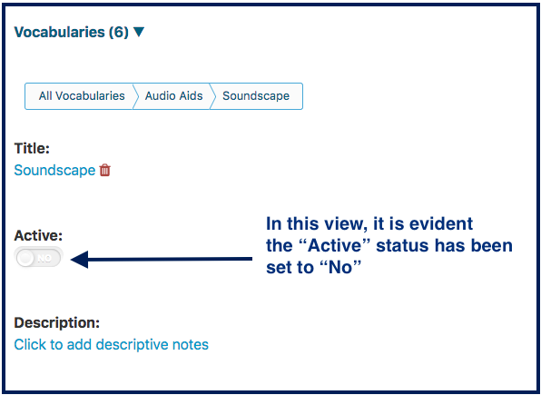
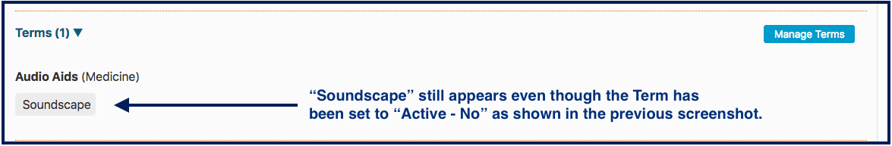
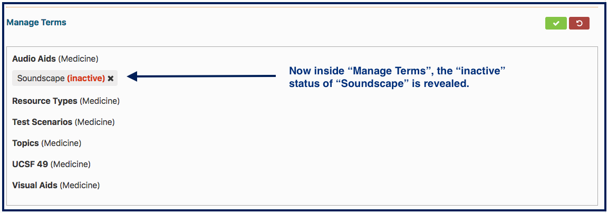

# Vocabularies

Vocabularies are categories or collections of Terms (school-specific categories of learning) that can be selected and attached to many curricular objects within Ilios. In previous versions of Ilios, these were known as Topics and even further into the past, Disciplines.

Managing Vocabularies at the School level is performed using the Schools tab as well. Vocabulary Terms can be used in the tagging of the following curricular objects within Ilios ...

* ****[**Session**](https://iliosproject.gitbook.io/ilios-user-guide/courses-and-sessions/sessions)****
* ****[**Course**](https://iliosproject.gitbook.io/ilios-user-guide/courses-and-sessions/courses)****
* **Objective** (Course, Session, Program Year)&#x20;

After clicking as shown above the Vocabularies become available to edit as shown below. For Schools that have not added additional categories beyond the original Topics mapping, the only Vocabulary that will appear in the screen as shown above will be Topics. In other words, Terms (formerly) have been converted into Topics.

In this example, \`UCSF 49\`, one of the Vocabularies for UCSF, has been selected. A new value "Autism and Related Issues" has been entered.

Now that "Add" has been clicked, the new Vocabulary has been added as shown below.

These Vocabularies can be nested in the sense that there can be a sub-term one or more levels lower than "Autism and Related Issues".

To show this ...

## Sub Terms

* Click on "Autism and Related Issues".

"Level 2 Diagnosis" has now been added as a lower level Sub-Term of "Autism And Related Issues". The results of this action are shown below.

## Activate / Deactivate Vocabulary Terms

It is now possible in Ilios to deactivate any Vocabulary Term that may no longer be in use.

By default, they are saved in an "Active" state so they can be used immediately in the application.

To set the "Active" status on a Term, expand the Vocabularies functional area on the Schools tab as shown below.

### What does it all mean?

* Terms that are set to "Active - Yes" are those that can be selected in the Ilios interface to be associated with Courses and Sessions.
* Terms that are set to "Active - No" will not appear as in the interface and can no longer be attached to Courses and Sessions going forward.&#x20;

**IMPORTANT NOTE:** Terms that were active in the past but now have been set to inactive status will still appear in the interface. None of the past associations have been lost by making a Term "inactive".

In the example shown below, "Soundscape" was selected as a Term for a Course sometime in the past (before the "Active" status was set to "No"). It appears as it normally would appear.

To reveal the Active status of the Terms, click "Manage Terms" to reveal details.

The inactive Term "Soundscape" **CAN** be removed but **CANNOT** be added to any Course or Session in the future unless its status is reset to "active".
