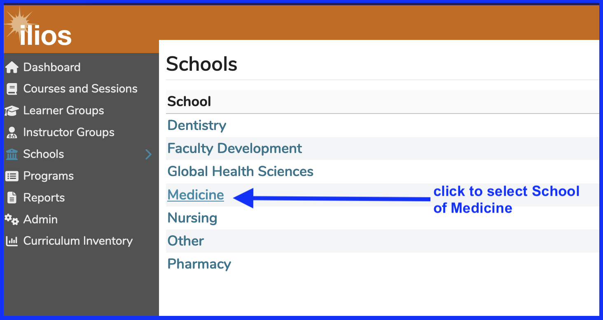
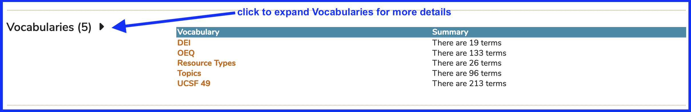
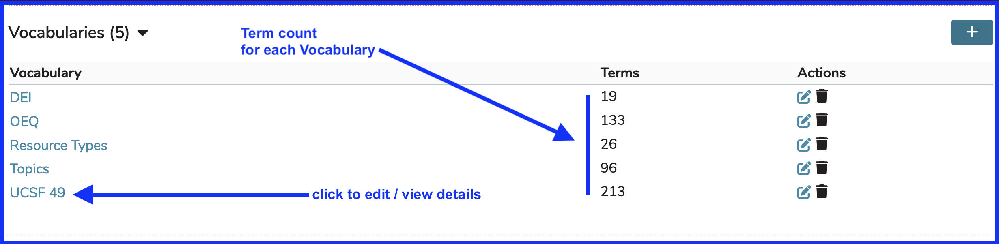
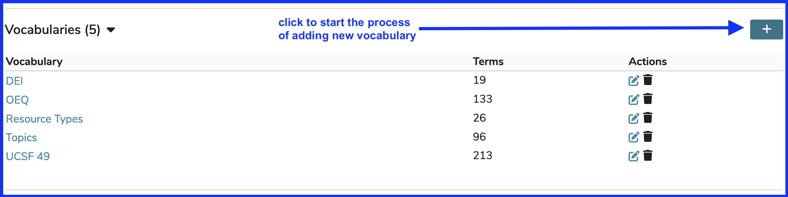
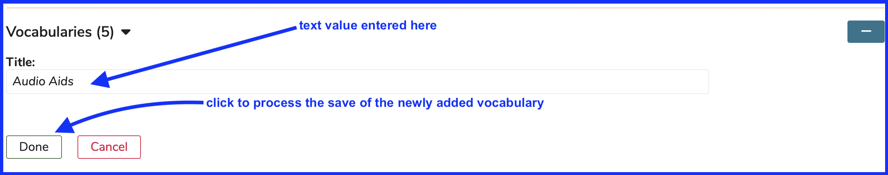
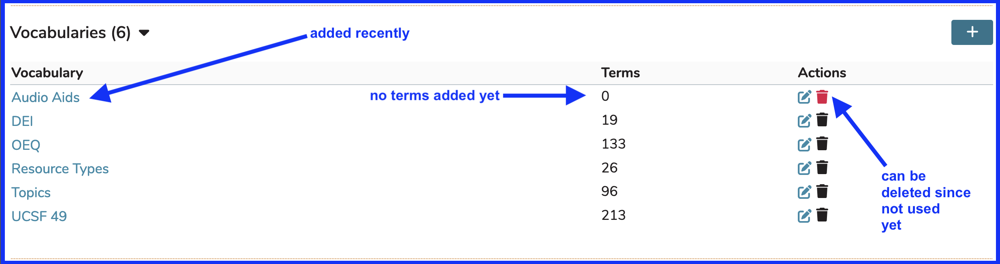
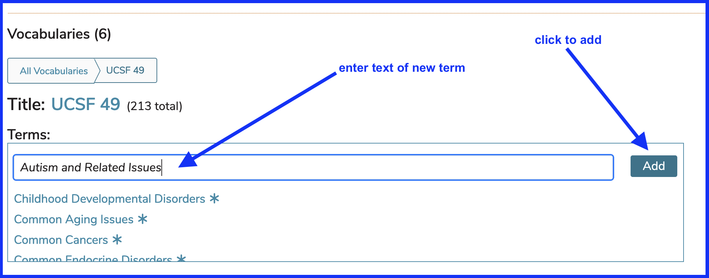
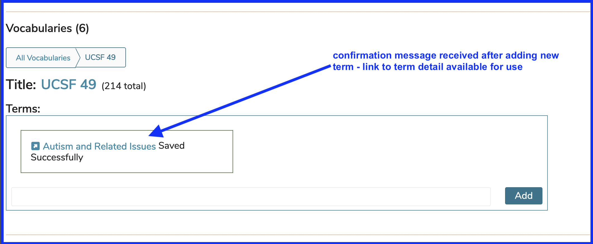
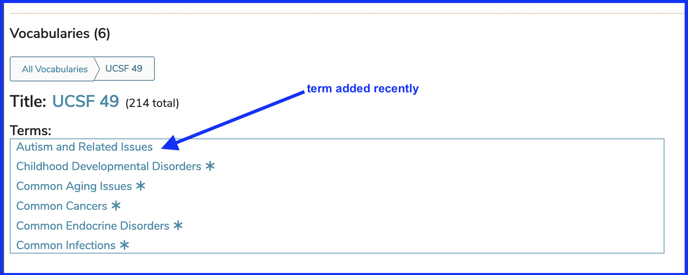
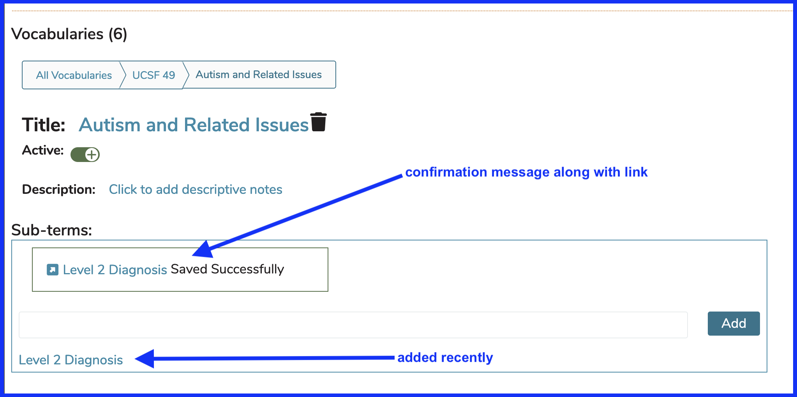

# Vocabularies

Vocabularies are categories or collections of **Terms** (school-specific categories of learning) that can be selected and attached to many curricular objects within Ilios. In previous versions of Ilios, these were known as Topics and even further into the past, Disciplines.

Managing Vocabularies and Terms at the School level is performed using the Schools tab as well. Vocabulary Terms can be used in the tagging of the following curricular objects within Ilios ...

* **[**Session**](https://iliosproject.gitbook.io/ilios-user-guide/courses-and-sessions/sessions)**
* **[**Course**](https://iliosproject.gitbook.io/ilios-user-guide/courses-and-sessions/courses)**
* **[**Objective**](https://iliosproject.gitbook.io/ilios-user-guide/glossary#objective) (Course, Session, Program Year)**
* **[**Program Year**](https://iliosproject.gitbook.io/ilios-user-guide/programs/add-program-year)**

## Choose School

The first step in this process is to choose the school for which you wish to maintain these Vocabulary Terms. This is shown below.

Once the school has been chosen, expanding the list to reveal the vocabularies is the next suggested step.

After clicking as shown above the Vocabularies become available to edit as shown below. For Schools that have not added additional categories beyond the original Topics mapping, the only Vocabulary that will appear in the screen as shown above will be Topics. 

## Add Vocabulary

The addition of a new vocabulary is accomplished here in the Schools maitenance area as well. For the sake of demonstration, it has been decided that a new vocabulary called "Audio Aids" should be added to the School of Medicine. This new vocabulary will later have terms added as well. 

### Click to Add

The screen shot below shows the first step in adding a vocabulary to your school.

### Enter Vocabulary Title

The next step is to simply enter the name of the vocabulary to be used. The phrase "Audio Aids" is added in the provided field for demonstration purposes. Pressing "Done" as shown will complete the saving and addtion of this new vocabulary.

### New Vocabulary Added 

The list refreshes to include the newly added vocabulary.

## Add Term

In this example, `UCSF 49`, one of the Vocabularies for UCSF, has been selected. A new Term "Autism and Related Issues" has been entered.

Now that "Add" has been clicked, the new Term has been added as shown below.

### Confirmation Message

After adding the new term, a message confirming the addition of the new term appears.

### Term List Refreshed

The newly added term gets added to the list of terms in the associated vocabulary. The asterisks (*) that appear to the right of the other terms indicates the existence of sub-terms (covered later).

These Vocabulary Terms can be nested in the sense that there can be one or terms nested one or more levels lower than "Autism and Related Issues".

### Add Sub Term

To add a Sub Term, click on "Autism and Related Issues". The term being added here will be nested below "Autism and Related Issues". For this reason, it is considered to be a "Sub Term" of "Autism and Related Issues".

"Level 2 Diagnosis" has now been added as a lower level Sub-Term of "Autism And Related Issues". The results of this action are shown below.

## Activate / Deactivate Vocabulary Terms

It is now possible in Ilios to deactivate any Vocabulary Term that may no longer be in use.

By default, they are saved in an "Active" state so they can be used immediately in the application.

To set the "Active" status on a Term, expand the Vocabularies functional area on the Schools tab as shown below.

### What does it all mean?

* Terms that are set to "Active - Yes" are those that can be selected in the Ilios interface to be associated with Courses and Sessions.
* Terms that are set to "Active - No" will not appear as in the interface and can no longer be attached to Courses and Sessions going forward.

**IMPORTANT NOTE:** Terms that were active in the past but now have been set to inactive status will still appear in the interface. None of the past associations have been lost by making a Term "inactive".

In the example shown below, "Soundscape" was selected as a Term for a Course sometime in the past (before the "Active" status was set to "No"). It appears as it normally would appear.

To reveal the Active status of the Terms, click "Manage Terms" to reveal details.

The inactive Term "Soundscape" **CAN** be removed but **CANNOT** be added to any Course or Session in the future unless its status is reset to "active".

### Add Term Description

It may prove to be very helpful to add descriptive text values to these Vocabulary Terms. These will appear during and after the selection/attachment of Terms to curricular objects where Terms can be attached (Courses, Sessions, Program Years, and Objectives (Session, Course, Program Year)).

**Step One**

**Step Two**

For this example, we would like to add descriptive content to a DEI Term "Cultural Competency".

**Step Three**

**Step Four**

Now that this has been entered, the descriptive text will appear as shown below.

The example above shows the selection process for attaching a Term to a Session. The mouse-over will also display the description after the Term has been attached to a curricular object.

