# The Ilios User Guide
#### v 3.0 Release

# Contents
  - [General Information](#general-information)
	  - [Working with Ilios](#working-with-ilios)
	  - [Ilios Workflow](#ilios-workflow)
	  - [Glossary](#glossary)
  - [Logging In](#logging-in)
  - [Dashboard](#dashboard)
	  - [Calendar View](#calendar-view)
	  - [Multi-School Environment](#multischool-environment)
  - [Managing Programs](#managing-programs)
  - [Courses And Sessions](#courses-and-sessions)
	  - [Courses](#courses)
		  - [My Courses](#my-courses)
		  - [Add New](#add-new-course)
		  - [Maintain Existing](#maintain-existing-course)
	  - [Sessions](#sessions)
		  - [Add New](#add-new-session)
  - [Calendar And Offerings](#calendar-and-offerings)
  - [Course Summary](#course-summary)
  - [Group Management](#group-management)
	  - [Instructors](#instructors)
	  - [Learners](#learners)
  - [Learning Materials](#learning-materials)
	  - [Attributes](#learning-materials-attributes)
  - [MeSH](#mesh)
  - [Competencies and Objectives](#competencies-and-objectives)
	  - [Enter A Course Objective](#enter-a-course-objective)
  - [Alerts](#alerts)
	  - [Custom Reminder Alerts](#custom-reminder-alerts)
  - [Publishing](#publishing)
  - [Administration](#Administration)
	  - [Course Cloning and Rollover](#course-cloning-and-rollover)
	  - [Archiving](#archiving)
		  - [Locking](#locking)
		  - [Filing](#filing)
	  - [User Account and Role Management](#user-account-and-role-management)
  - [Curriculum Inventory Management](#curriculum-inventory-management)
  - [Calendar Embed for 3rd Party Applications](#calendar-embed-for-3rd-party-applications)

## General Information

####Working with Ilios

One important thing to remember:

**Ilios is a web application.**

This application is web-based, meaning it must be accessed through web-browsing interfaces. While it may be used on any current web browser including Internet Explorer 10 and above, Ilios is optimized for use with Mozilla’s Firefox web browser 32 and above, as well as all webkit-based web browsers such as Google Chrome (ver. 30.x and above) Safari (for Mac), or Opera (ver. 10.x and above).

***Saving Work***

Work processed in Ilios is presented and collected in real-time, but is only saved to the system when a save event occurs.  Much of the saving activity in Ilios 3.0 takes place automatically in real-time using in line editing or other user-friendly editing areas.  This guide describes in detail how the save process occurs (ie. when you will need to manually save and when it takes place automatically).  When there is work that is unsaved, action buttons will become active and should be used to process the save event before navigating away.

***Top-level Search***

Ilios is designed to provide as much information as possible in a single display page.  Ilios screens (Courses, Sessions etc.) allow for real-time text searching on multiple fields to make it easy to find the information you need.

***Optimal Viewing***

Your primary view is that of an editor and content creator. In order to facilitate this complex view, the system currently works best on a high-resolution display monitor. Other views such as Learner views, and other non-content creation views, are usable at lower resolution, and can be viewed on smart phones and other handheld devices.

***Course Calendar***

Ilios is built explicitly on the concept of user-centric information, rather than course-centric information. What this means is that the default view for a user entering the system is not an individual course, but the aggregate of all courses with which they are associated. As a course developer/ director, the maintenance of a single course and its sessions and offerings can easily be performed by selecting “Courses and Sessions” from the Ilios Menu.

___
###Ilios Workflow

The Ilios workflow is based on a curriculum structure which incorporates several interconnected levels (displayed below starting with the highest level -- program):

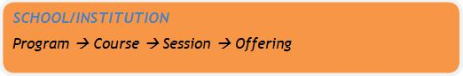

- A deployment of Ilios may include multiple related schools or institutions.
- Every school or institution creates and owns specific programs of study.
	- Each program is divided into specific academic years.
- Each course managed is associated with a specific program or programs, via those years.
- Each course is made up of a number of sessions, or units.
- Each session or unit is “offered” at a specific time and location, or given a specific due date. These “offerings” are expressed as items on the calendar display, which provides access to detail information for users of the system.
- When working in Ilios, each of the levels maintains its state and changes do not cascade up or down.  This is so work can be done on each level independently and is a result of our wanting to provide as much information as possible on one screen.

__________
###Glossary

The following list of terms are currently used to describe attributes and activities associated with Ilios.

***Cohort:*** A group of learners identified with the same graduating year, and thus having the same set of curricular, or graduation, requirements upon matriculation. Cohorts are usually identified by school/program and graduation year: "SOM Class of 2017." Within Ilios, the Cohort is the key associating factor between individuals (Instructors, Learners) and Courses, as well as defining the particular “Level” or “Levels” of a Course.

***Competencies:*** A controlled vocabulary of school-specific educational domains of knowledge. Competencies may be divided into sub-domains, and may be mapped to Objectives within a curriculum. Competencies are loaded into the system at implementation.

***Course:*** A Curricular object that defines the content and structure of a specific instance of coursework available to the school or program.

***Curricular Object:*** A Program, Course, Session, or Offering.

***Designation:*** A subgroup within a larger Learner Group often referred to by a name (Blue group/team) or number (group 1, group 2b). These may be made up of both individual person objects and other subgroups.

***Enrollment:*** The entry of a Learner into a specific Program or Course.

***Group:*** A collection of people (Learners or Instructors) which can be associated with Sessions.

***Group Attributes:*** Assigned metadata for a given Group. These labels do not create hierarchical associations or relationships with other objects or data in the system. Group Name and Default Room are examples of this.

***Group Content:*** Data related and/or associated with a given Group that also exists independently within the system. Person Objects are an example of this.

***Independent Learning Unit/ Independent Learning Module:*** A Session for a Course without a specific location or time of occurrence. Independent Learning Units are comprised of Learning Materials, an expected number of educational hours or duration for the learner to complete the content, and a due-by date. These are also referred to as ***ILM's***.

***Learners and Educators:*** The record of an individual who can be assigned to an object within the system. Learners are the user records for people who become enrolled in curricular activities.  Educators are basically everybody else in that they are the people who create, manage, and deliver the curriculum. They could be faculty, staff, or executive leadership.

***Learning Materials:*** Digital assets (such as files) and information (such as citations and web links) which may be associated with curricular objects.

***Learning Objectives:*** Free-text entry fields of the desired learning outcomes for Programs, Courses, and Sessions.

***Level:*** Point in educational time / progress within a given program for an individual or cohort of individuals. This is represented as an attribute of Course.

***MeSH (Medical Subject Headings):*** A controlled vocabulary that may be associated with curriculum objects and learning materials.

***Not Published:*** The default status of an object (Session, Course) which is not finalized and does not display in detail on the public calendars or to learners. Users with edit privileges may see, edit, and modify these objects. The other states available for objects are Published and Scheduled.  Draft status is no longer used in Ilios 3.0.

***Objective:*** The desired learning or teaching outcomes for a given curricular object. These may be general Program level Objectives (also referred to as graduation requirements), Course level learning Objectives, or Session level teaching Objectives.  Objectives may be associated with Competencies; however, only one higher level competency can be associated with each Learning Objective at the Session level.

***Offering:*** The scheduled (time and place) representation of a Session or teaching unit, represented on the calendar: in other words, when the curriculum for a particular session is “offered”.

***Program:*** A specific course of study for a given school.

***Published:*** The final, accessible version of curricular material that is delivered to learners and made available for public access via such interfaces as a calendar or search.

***Scheduled:***  An intermediate state of a Session or Course where some required elements are missing; but you wish to have the students block off this time for the Session Offerings. These offerings show up on the Students’ calendars at “TBA”.

***Session:*** A section or unit of a course with specific attributes of type and content. Sessions may be represented as multiple time and place "Offerings," or as Independent Learning units with an estimated duration of educational time.

***Topic:*** A controlled vocabulary of (school-specific) categories of learning. Topics are loaded into the system at implementation. Previously known as “Disciplines”.

##Logging In

Ilios allows for either native or enterprise authentication. If your institution uses either shibboleth authentication or basic LDAP, Ilios provides configuration for this. If not, you may either modify the configuration of the authentication files to meet the needs of your system, or implement the native Ilios username/password authentication system.

##Dashboard

Once you are logged in, you will be presented with the “Dashboard” or landing page, which will display (by default) the events for the current week for the logged-in user.  There will be a toggle switch available for the user to indicate whether to display the calendar view or a list view of all events coming up within the selected week.  This listing or calendar will appear on the top portion of the screen.  Below that, Recent Activity will be displayed along with Your Reports, Your Courses, and Your Alerts.

The Dashboard is designed to provide quick access to common sets of information and simple task and activity tracking. Navigation is performed by using the Ilios Menu, which appears on the upper left part of the screen and can be accessed and expanded by clicking “Ilios Menu” as shown below.  It is a fly away menu that expands once it has been clicked and is available even if you have scrolled down the page.

Available menu items include:

- **Dashboard:** This is the default Home page
- **Courses and Sessions:** Displays a filterable list of all courses and sessions for the schools with which your name is associated in Ilios.
- **Learner Groups:** Contains functionality to maintain (add/modify) learner groups to which students must belong in order to get assigned session offerings.
- **Instructor Groups:** Contains optional functionality to associate groups of Instructors with one or more Instructor groups which can be attached to offerings.
- **Programs:** Contains functionality to Add or Modify program objects.

Course directors and administrative users with correct privileges will have access to the **Administration** module, which provides access to the **Management Console** and the ability to activate archiving and course rollover.

##Calendar View:

The center of the display is a view of the Ilios calendar, defaulting to a display of all items in Ilios with which you are directly associated. If you are a user with both student and non-student roles, the calendar will currently display your associated activities according to which role you are currently using to view the calendar; it will not show both sessions in which you are enrolled as a learner, AND sessions to which you are assigned as an instructor/director. For users who work with multiple roles, a toggle is provided to switch between these calendar views.

Clicking on any event in the calendar will bring up the detail viewing panel for that specific offering of the session. Clicking on any linked event listed in the sortable box below the calendar will jump the calendar display to the date of that event.

***Generating a feed URL:*** Ilios provides users with synchronized calendar access, via URL. This allows real time embedding and synchronization of a user’s Ilios calendar with mobile appliance calendars, Google calendar, and any other web-enabled calendar system which allows external calendars to be added via URL.

To connect a calendar application with Ilios, you will need a unique URL that you can copy and paste into the other calendar application. To get one, log into Ilios and click the calendar feed button to obtain a URL that looks something like `"https://your-ilios-server/ilios.php/calendar_exporter/api/..."`. Copy that URL into your calendar application of choice. For more information, please click [here](https://wiki.library.ucsf.edu/display/DevUCSF/Ilios+Calendar+Feed+API) for more information.

**NOTE:** The URL generated for this is like a password. Anyone who knows it can view your calendar! Keep it safe. If you are ever concerned that someone knows your feed URL, you can change it by pressing the ‘Generate’ button under where the URL appears. If you generate a new URL, you will have to update any applications you configured with the previously used URL. The assignment of a secure URL with encrypted token for access to your calendar is similar to the methods in practice with other online calendars such as Google Calendar.

**Acessing Learning Materials via Calendar Feed:** The ability to access specific learning materials via the calendar feed uses a similar system. A unique and encrypted token or "pseudo-key" is created for each available item within your calendar feed, which allows you to directly access that file. This is a similar mechanism to that used by tools such as Google Drive, Dropbox, Box, and other cloud storage systems. The encrypted pseudo-key for a learning material or file may only be accessed via the secure calendar feed, which in turn may only be generated from within the secure access login of Ilios. Like any such token, and like the feed URL itself, this link to the learning materials is again like a password and should not be shared indiscriminately. The providing of file access to the calendar feed follows the same business rules as Ilios in general. But as with any materials provided to users, once downloaded or shared, it is up to the user to protect that material from misuse.

**Protected information (eg. PII, ePHI etc.):** This type of confidential and personal information should not be stored in Ilios.

In the initial iteration of this feature, there is no interface for removing, regenerating, or reviewing the pseudo-key for learning materials. This key is stored in the learning_material table, as the value `token`. Removing this value from a record in the database will make it inaccessible for download from the feed. Currently this may be done by request to the Ilios technical support team. Unless it is certain that materials should **NOT** be accessible to students, this is not recommended.

**Calendar Search/Filter:** This functionality is available to all users in all modes of view. It provides the ability to review and filter the curriculum that has been published to the calendar in a number of different ways.  Details will be coming soon regarding this functionality in Ilios 3.0.  The descriptions below apply to Ilios 2.4.x and are provided for reference. As this functionality and other get finalized in Ilios 3.0, this guide will reflect these changes.

Search criteria can be defined by choosing between the two radio selections at the bottom of the search panel: ***"show all activities for selection"*** will search and display results from the entire curriculum of the given school and academic year; ***"show my schedule only"*** will display only those results which are available within the user’s current schedule.  There are two methods of searching (***“Search By Topic/Detail”*** and ***“Search By Course”***).  Switching from one to the other is accomplished by clicking the correct hyperlink to the left of the Academic Year drop-down.  The text of the hyperlink switches back and forth depending on which search is currently active.

**Search By Course**

This search option allows the user to search and display all of the activities for any course in the selected academic year and school. That course selection can be further filtered for specific session types.

**Search By Topic/Detail**

This search option allows the user to search and display all activities for any course in the selected academic year and school, which have the selected search attributes. Search is possible by each of the following, or any combination of the following categories of data:

- **Topic** (formerly known as discipline)
- **Session Type**
- **Course Level**
- **Program/Cohort**

In either of these search modes, a search can be made against the entire school curriculum entered into Ilios, or exclusively against the user’s specific enrollments and associations by selecting the appropriate radio button at the bottom of the search panel.

Once the desired selections for search were made, clicking the “search” button will activate the search and display the results. A breadcrumb text above the calendar will display the search filter selections which have been chosen. These results  remain on display until either a new search is entered, or the search is cleared by clicking the red “delete” icon at the left of the breadcrumb search filter information above the calendar. The search panel can be toggled between display and hidden modes by clicking the search icon.

Detail information is available for all search results on the calendar, however: learning materials for which the user does not already have access privileges will be visible (file name and info) but will not be downloadable.

The detail panel provides access to offering details of time, place, date, and instructor; course and session Objectives, associated learning materials, and the session description. Clicking on the Show Course Summary link at the upper right of the detail panel will open a complete listing of all sessions and their details for the entire course, including learning materials.

The option is available to provide visual change alerts for calendar events. If activated in the Ilios configurations file for an institution, the alerts add a small icon to the upper left of any calendar event (day and week view only), as well as to its agenda list item listing whenever there has been an addition or update for that event. The icon would display for a set number of days after the change (configurable value, currently set to 3 days; system default was 7 days). After that, the event display returns to normal.

***Multi-School Environment***

For institutions with multiple schools or unique curricula deployed within Ilios, it is possible to access the curriculum of another school by using the schools selection tool, which appears for users who have had multi-school permissions assigned to them. Any user in the system may be assigned access to one or more available schools in addition to their default home school. Assignment is managed in the Permissions Administration page. Please note that the overall role and permissions set for a user in their default home school will be carried over to any other school to which they have been provided access. This applies to both students and non-students.

##Managing Programs

The Ilios Programs module allows for the creation and management of any number of unique programs of study for your institution. A program may be defined as a course of study which has 1 or more academic years of involvement, and in which learners matriculate and graduate as an identifiable group (a “cohort” of learners).
An institution may have any number of programs.

This model allows for the greatest flexibility among institutions to manage programmatic curricula according to their own models and needs.

To create a program, a user must have full edit privileges. Simply click on the “Add New” button, provide a Title for the Program to add. Clicking the Save button will save your work immediately as a new Program in a state of Not Published.  To publish and add details to the Program, select it from the list of Programs.

Once a program is created, other attributes may be added to that program by creating individual Academic Years. The Academic Year is a container for all curricular material for that particular year of the program. All additional program attributes are unique to each academic year of that program; attributes given to a program’s academic year and saved will be automatically copied to the next academic year, so it is best to create a single academic year, add its attributes, and then add further years as needed.

**Program Attributes:**

- ***Name:*** Up to 200 characters in length.
- ***Short Title:*** (abbreviation) - Up to 10 characters in length.
- ***Duration:*** May be between 1 and 10 years.

**Program Year Attributes:**

- ***Academic Year:*** This may be set up to 7 years forward, or up to 5 years backward from the current year.
- ***Competencies:*** selected from a school-specific, pre-defined list of competency domains and sub-domains.
- ***Objectives:*** Free text entry. Program Objectives, once entered, may be associated with available competencies.
- ***Topics:*** selected from a school-specific, pre-defined list.
- ***Program Directors:*** Selected from list of available names. The list is populated with users identified and tagged as “Director” level in the user access system. (see ‎op.48)
- ***Stewarding Department(s) or School(s):*** Selected from a list of available departments/schools, which are loaded into the system on implementation. Assigning a school or department other than the default school of the program will provide access to that program and its associated curriculum for the stewarding school, allowing for interdisciplinary curriculum development and management. **PLEASE NOTE:** for any course which has multi-school stewardship, that course will appear in the search listings for each stewarding school. This may make it appear to some users that there is a unique course in each school which shares the same attributes, but this is not the case. It is the same course, and each school is accessing the same data.

To search for a previously created Program, enter a part of the name of the program into the “Filter by Program title” field, then click on the adjacent search icon or hit the return button on your keyboard or merely keep typing until the results are found (v 3.0). A list of all matches will populate your search panel; highlighting and selecting the desired program will load it to your screen.

##Courses And Sessions

####Courses

#####My Courses

By default, in Ilios 3.0, all courses for the selected school are displayed.  There is a toggle switch at the top left of the screen which will change into My Courses when clicked as shown below.

***Original appearance:***

***After clicking / toggling:***

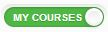

The screen is then refreshed to display only the courses with which the logged in user is associated. In this example, the logged-in user is not associated in any way with the Anesthesia 110 course so it is no longer displayed.

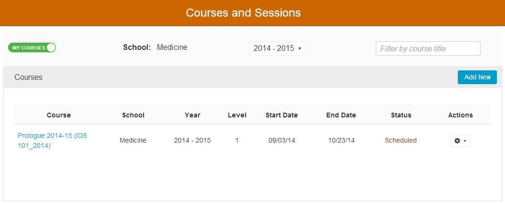

#####Add New Course

Courses are unique to the academic year in which they are taught. To create a new course, click the ***Add New*** button, and provide a course name and select the appropriate year of instruction.

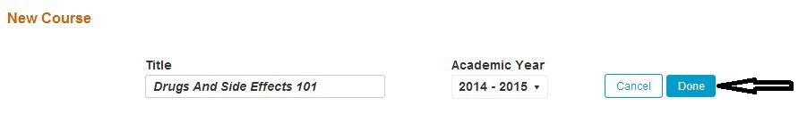

After clicking ***Done*** in the example shown above, the remaining details of the new Course can now be added.  Click ***Back to Courses*** to return to the Course  list to complete these details at a later time.  The Course is initially saved with a state of ***Not Published*** since it has no Sessions or Offerings at this point.

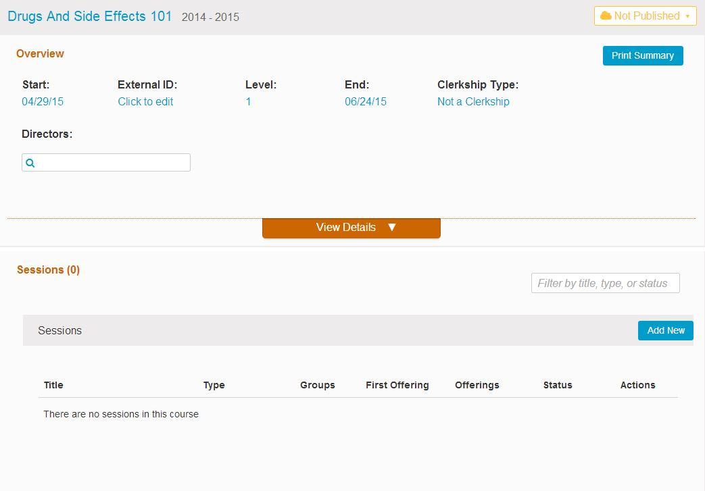

After clicking ***Back to Courses***, the screen appears as follows with the New Course being appropriately titled ***Drugs And Side Effects 101***.  The Courses are sorted by default in alphabetical ascending order.

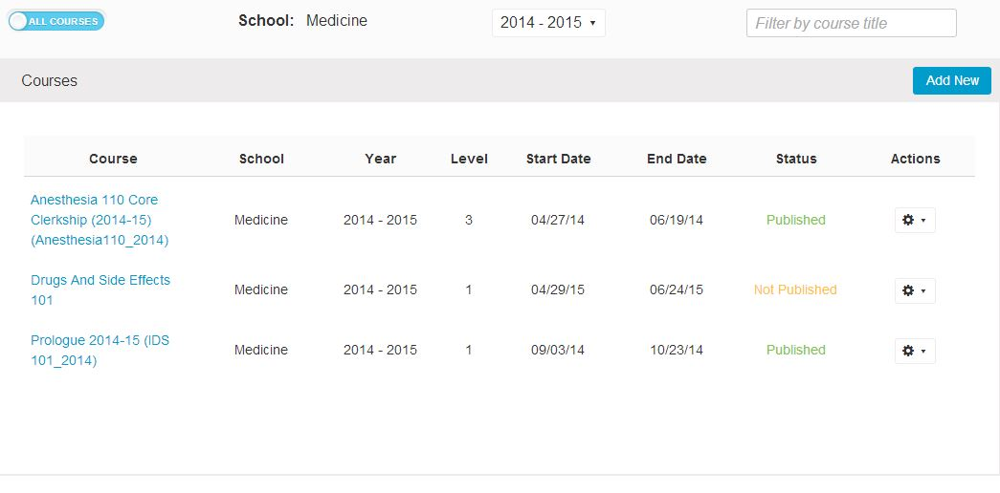

#####Maintain Existing Course
To manage an existing course, enter part of the course’s title into the ***"Filter by course title”*** text field located above the ***“Add New”*** button.  The result will automatically return a course list which applies the critieria entered.  A list of all matches will populate your search panel; highlighting and selecting the desired program will load it to your screen.

***Courses Pre-filter***

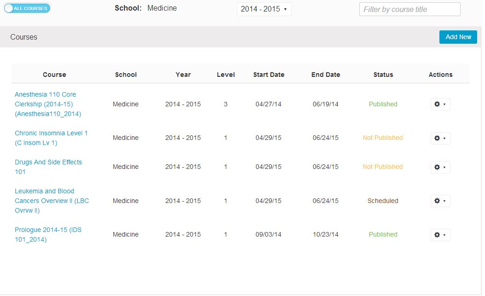

***Courses Post-Filter***

In this second screen shot, a search string of “chro” has been entered and as a result, only one course gets returned.

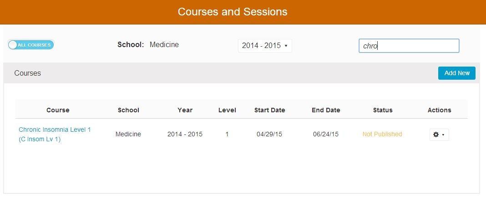

For courses which are given more than once in an academic year, the course name or Course ID should identify this: for example Intersession 1 (2011-12), Intersession 2 (2011-12), Intersession 3 (2011-12), IDS 33A, IDS 33B, etc. Creating multiple instances of a course within an academic year is handled using the Course Rollover feature. For courses that are given more than once in an academic year, the listings are in chronological order according to start date.

In order to populate courses with learner groups, the course must first be associated with the desired Program(s), as well as the desired learner cohorts within that program. Cohorts are listed by graduation year. If you select the program Doctor of Medicine, and its cohort Class of 2015, then the course will now be eligible for population with any learner or learner group from that program / cohort. A course may be associated with any number of programs and cohorts, allowing for interdisciplinary courses as well as mixed level courses. Only cohorts, to which the user is provided access, either by explicit permission granted for school or program, or by joint stewardship of a program, will be available for selection. Cohorts previously selected for which a user has no permissions will not be changeable by the user.  In the example shown on the following page, Doctor of Medicine >> Class of 2017 has been chosen.  When you are finished, click the green check to return to the Courses and Sessions screen.

***Selection Screen (Program Cohort)***

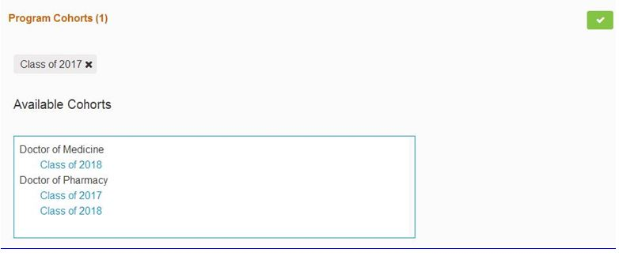

***Courses and Sessions (after Cohort Selected***)

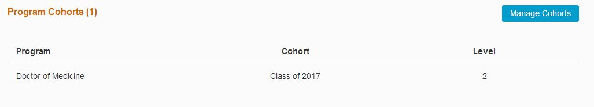

***Course attributes:***

- ***Course Name:*** Long title of the course, entered on course creation. 200 character max.
- ***Course ID:*** Field allowing any internal or external ID up to 18 characters to be entered.
- ***Course Year:*** Academic year during which instruction will take place. Set at the creation of the Course object, this field cannot be modified once it is saved.
- ***Course Level:*** May be set at any numeric value from 1 to 5. The Course level identifies what point in the curriculum trajectory the course is meant to be addressed by learners, but is not a constraint.
- ***Clerkship Type:*** A course may be identified explicitly as a clerkship using this attribute. The available selections are Block clerkship, Integrated clerkship, or Longitudinal clerkship. These may be modified as necessary in the `"course_clerkship_type"` table. The default value for all courses on creation is “not a clerkship”.
- ***Programs / Cohorts:*** Selected from the list of available Cohorts and Programs already entered in the system. Only authorized users from a given program’s home school may edit that program cohort’s relationships to the course.
- ***Start Date:*** A calendar selection, which should be within the range of the Course’s academic year.
- ***End Date:*** A calendar selection, which should be within the range of the Course’s academic year and must fall after the Start Date.
- ***Competencies***: Competencies listed for a course are a subset of the full set of competency domains for the program(s) associated to the course. When a course Objective is linked into the competency tree via its association to a program Objective, the competency domains to which those program level Objectives are assigned will be displayed and reported as the specific attributes of the course.
- ***Objectives:*** Free-text entry field. Each Objective entered at the course level may be associated to a single Program-level Objective for each program associated with the Course. So if a course is associated with a single program cohort, then each course Objective may have one associated parent program Objective from that program’s set of Objectives. If there are five unique program cohorts associated, then each course Objective may be associated with one Objective from each of the five programs. Only authorized users from a given program’s home school may edit the relationships of an Objective to that program’s cohorts. Course Objectives may also be assigned their own MeSH terms.
- ***Course Director(s):*** Selected from list of available names. The list is populated with users identified and tagged as having “Director” level permissions in the database.
- ***Topics:*** Selected from a school-specific, pre-defined list.
- ***MeSH Terms:*** Selected by searching the MeSH database.
- ***Learning Materials:*** Course level learning materials are available to all Sessions of a Course, and are entered using the Learning Materials search/upload tools.

####Sessions

The screen shot below shows the Courses and Sessions screen with the list of associated Sessions for a course.  These sessions do not have associated offerings or else First Offering would be populated with the date of the first session offering.

***Session List***
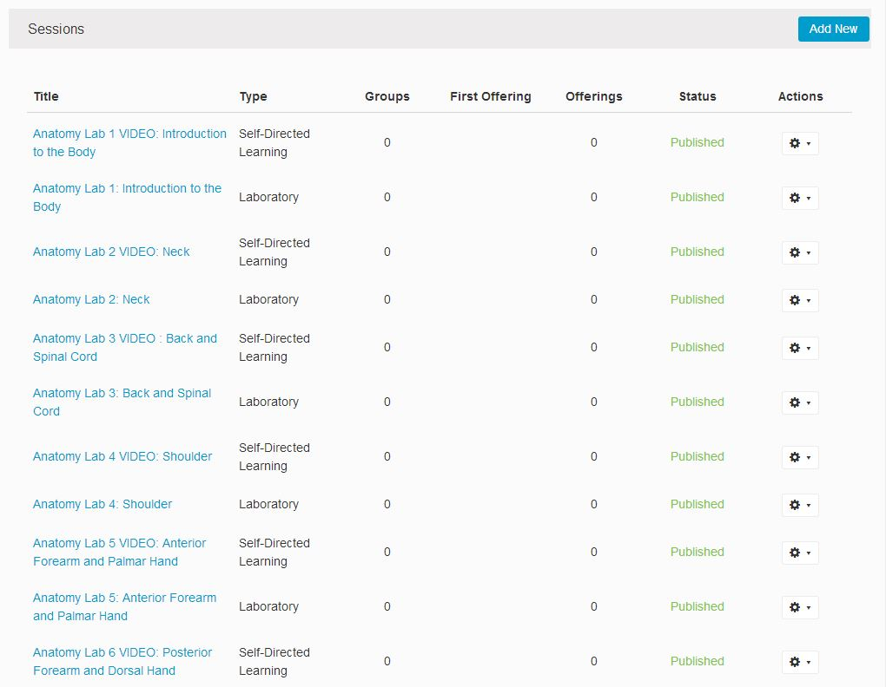

***Session Detail***

The session detail screen is very lengthy so in this situation, the top part is shown in the screen shot below.

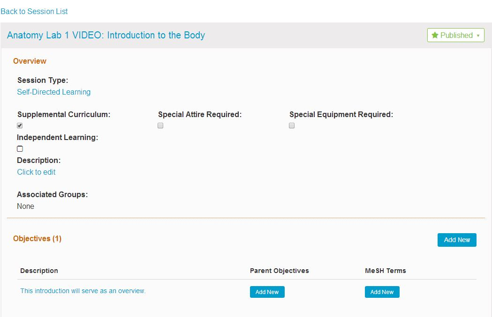

Once a course has been saved, Sessions may be added to the course. A Session is a discrete instructional unit of curricular material or activity within a course. To add a new session, click “Add New”. This will create an empty Session, ready to be populated  with the Session's attributes.  Follow the steps shown below.

**Add New Session**

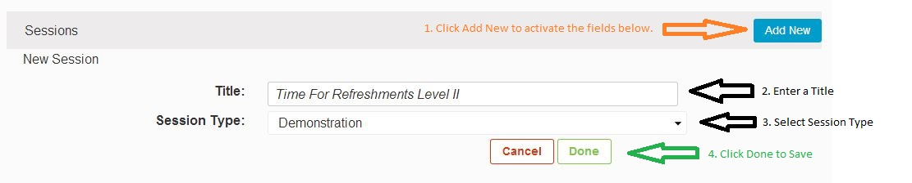

Once a session is saved by clicking the Done button shown above, offerings for that session can be added. Offerings may be created individually on the calendar and populated with group, instructor and location information using the calendar tools. Offerings also may be generated using specific learner groups as the seeding mechanism, by selecting the “Open Offering Small Group Generator” link. This link allows you to select one or more eligible learner groups, a time slot on the calendar, and automatically generated offerings via one of two strategies:

1) a single offering in that time slot for each selected group, regardless of the number of subgroups or divisions in the selected group (“add an offering per parent group”); or

2) an offering for each subgroup within a selected group (“add an offering per subgroup”). For example, using the first strategy, selecting the student group “anatomy labs” which has 38 subgroups would create a single offering for all the learners in the group anatomy labs and its subgroups --- in other words, all the small groups would be lumped together for a single event Offering date and time.

Using the second strategy, selecting the group “anatomy labs” would create 38 unique offerings, and associate each of the subgroups and its learners with one of those offerings. The default selection is strategy #2. The Default Instructors and locations for each group will be displayed as the Instructors and Locations for the offerings created; these may be edited via the calendar any time after creation.

**Independent Learning Sessions**

Sessions may also be saved as independent learning units, providing an estimated number of educational hours rather than a calendar-based date and time. To create such a session, select the “independent learning” check-box, and enter the associated number of educational hours, a "due-by" date, Description.  Learner Groups and Instructors can be added by clicking the "Manage Learner Groups" button.

**Session attributes (all session types):**

- Groups: (Currently displays only in aggregate at the course level.) Display only. Shows a list by name of the Learner Groups currently associated with the Session.
- Session Type: Selected from a predefined list of instructional and assessment methods, loaded into the system at implementation.
- Description: Free-text entry allowing for detailed information, instruction, and description of the Session curriculum and activities.
- Core/Supplemental: Allows for the flagging of elective vs. required curriculum units.
- Special Attire Required: flags the content as noted. Special instructions or details should be entered in the Session Description field.
- Special Equipment Required: flags the content as noted. Special instructions or details should be entered in the Session Description field.
- Topics: Selected from a school-specific, pre-defined list.
- MeSH Terms: Selected by searching the MeSH database.
- Learning Materials: Session-level learning materials are available only to the specific Session to which they belong.
- Objectives: Free-text entry field. Each Objective entered at the Session level may be associated with any number of the parent course’s Course-level Objectives. Session Objectives may also be assigned their own MeSH terms.

**Independent Learning Session Attributes (additional for ILM):**

- Expected instructional hours: Numeric entry of the total time in hours allotted for the activities associated with the session.
- Due Date: Date by which time the activities are expected to be completed. Default is the final day of the course.
- Assigned Learner Groups: Since there are no calendared offerings for ILM, groups are associated directly to the session.
- Assigned Instructors: Since there are no calendared offerings for ILM, the responsible instructors of record are associated directly to the session.

## Calendar and Offerings

The scheduling and review of offerings occurs using the Offerings section of the Session Details screen.

The scheduling of offerings for a session may happen in two different ways. Multiple offerings may be generated for the same scheduled time on the calendar, but for different unique learner groups. This is facilitated with the “Create a Set of Offerings by Group” link. Individual offerings may be created by clicking "Add New" from the "Add" menu. For both these options, the session must be saved with a valid name prior to the scheduling of offerings.

Selecting the link to create multiple offerings will bring up the tool to select the desired learner groups, a time and date for the offerings, and the option of making the offerings recurrent. For each group selected, an offering will be generated for display on the calendar. The default instructors and locations for each learner group will be displayed for their offering; these may be modified afterward from the calendar interface.

For single offerings, the link provided will make the necessary fields active and visible.

The Ilios Calendar Display provides a typical web calendar interface for viewing. The calendar will display a Week, Month, Day and Agenda view, selected from the tabs at the top right of the display. Each event on the calendar shows a header that displays the event start–end times, and the blocks are color-coded to distinguish different session types. The Agenda view or list of events provides a static list of events for the selected week. The Session Name, associated Learner Groups, and scheduled location are all shown in plain text in the calendar blocks. For events with multiple occurrences at the same time, but for different groups/locations, the block will display the word “multiple” in the week/month views. Detail data will display in the day view.

For ease of use, an inspection panel showing the details for the session being managed will display on the right side of the screen whenever a specific calendar offering for that session has been selected (clicked on). A sortable spreadsheet-format table of the offerings associated with the current session is displayed beneath the calendar. Clicking on the links in this table will take you to the display dates of the linked offering.

**Calendar View Filters**

There are filters that can be applied to the calendar view; they are located above the calendar itself. The filters currently available are:

- Show All Offerings for the Entire Course / Show Offerings for Current Session Only;
- Show Busy Times for All Learner Groups Associated with this Session;
- Show Busy Times for All Instructors Associated with this Session.

These may be used in any combination to aid in display management. Please note that only information from published sessions in published courses will reflect in the busy time filters. Draft materials will be ignored by these filters.

Only offerings for the session currently being worked are editable in the calendar for that session; when offerings from other sessions are displayed, it is as read-only. If you wish to switch from working one session’s offerings to another session, you may either return to the Session management display via the link at the top of the calendar (which shows the current session name), and from there select the Session you want to move to, or, if you have clicked on a different session’s offering on the calendar, you may select the link displayed at the top of the inspection panel for that session’s offering, and go directly to that session.

**Offering attributes:**

- Instructors - Selected from the list of available instructors in the system.
- Learner Groups - Selected from list of eligible associated groups attached to the course.
- Location - text entry.
- Date - Calendar selection.
- Start Time - Calendar selection.
- End Time - Calendar selection.
- Recurrence - Allows for the recurrence of an event on a specific weekday or days, for a specified number of weeks (or until a specific date).

**Course Summary**

The Course Summary provides a complete view of a given course: all detail for all sessions. It is available via the “Print Summary” link in the details panel for any course displayed in Courses and Sessions. The course summary loads a view of the entire course in a web page.

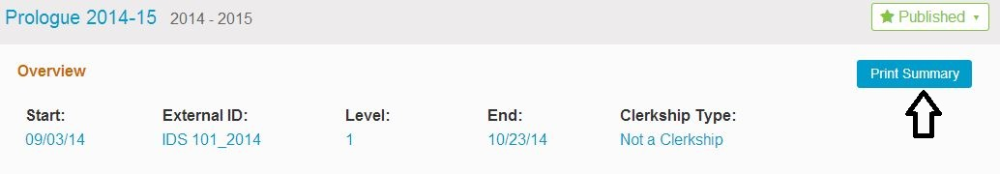

##Group Management

####Instructors

To manage Instructor Groups in Ilios, from  Ilios Menu, select ***Instructor Groups***.

The Instructor Groups module in Ilios allows for the creation of reusable and trackable sets of instructors that can be associated to course/session activity. The groups are populated from the existing directory of instructors, and can be modified and added to as needed. An instructor may be associated with any number of instructor groups, or none at all. Instructors and instructor groups are associated with course content at the offering level for each session (session offerings).

Instructors who are not already in the directory provided should typically be added via the administrative user tools (See p.?). However, they may be added manually here, either individually or via csv-formatted spreadsheet using the “add new members” link in any existing group.

***Please note:*** Instructor select lists in Ilios will provide up to 500 unique listings for review, as well as an auto-complete filter search at the top of the list panel. For names which are beyond the 500 item limit, while they will not display on initial load, they have been added to the database and may be found and accessed using the auto-complete search.

####Learners

To manage Learner Groups in Ilios, from Ilios menu, select ***Learner Groups.***

Group Management is a method of tagging, grouping and managing the learners who are attached to curricular activity in Ilios. This module allows for the association of sets of learners to specific content, and the makes possible reporting on those associations. The demographic details of individual learners are not tracked within Ilios.

The groups in Ilios are persistent data containers, which exist outside the context of a course or session. Each Group belongs to a specific program cohort; the members of that cohort may be added or removed from any of its groups. A Cohort is created each time a new Program Year is added to a Program; essentially, this means that for any year in which a Program is active and a Program Year has been added in Ilios, there is automatically created a Learner Cohort for “The Class of 20XX”. A group may be attached any number of times to any number of sessions in any number of courses. Groups may also be subdivided into any number of smaller groups. Groups are associated to courses and sessions via calendared offerings of sessions and independent learning units; the groups of any learner cohort will be available for association to a session once that cohort is attached to the course in question.

For learners to be associated with curricular material in Ilios, they must be associated with a learner group.

***Learner Groups are Hierarchical***

A key to the Group Management system is to understand the hierarchical nature of the groups, and the way it relates to Programs of study.

For each entering class of learners, a unique container is created in the system. This is the learner (All Class) “Cohort”. It is populated via the user management console with data from the campus systems to identify individual learners. Typically, learners should not be added manually to the Ilios system; all registered students should be available from the feed provided in the administrative tools. However, if learners need to be manually entered into Ilios, the process is similar to that for Instructor Groups. Learners who are not already listed as part of a cohort in the directory provided may be added manually, either individually or via csv-formatted spreadsheet using the “Add New Members to Cohort” link. Students by default are assigned into a primary cohort for tracking, but may (as may any Ilios user) be assigned into any number of “Secondary Cohorts”, to allow for multi-year and program assignment, transfer from one cohort to another, and other various needs. Initial primary and secondary assignment is handled via the administrative User Management console.

From a particular cohort, any number of “top level” groups can be created. Each top level group may be created either with the entire population of the cohort, or as an empty group which may be manually populated. You may create any number of top level groups. Individual members of any group may be removed (“unassigned”) at any time. In this way, top level groups may be modified to contain specific subsets of the total cohort population, and lower level sub-groups may be managed as necessary. Each student in a Class cohort may belong to multiple top level groups.

Once a top level group is created, it may be partitioned into any number of smaller groups (sub-groups or designations), which will then be seen as members of the top level group. Those smaller groups may also be divided into smaller partitions. A group may have as members both individuals and groups --- all remain members of the same “top level” group.

A learner may only appear once within the tree of a single top level group.

Note that when selecting learners for addition to a group, disabled user names are displayed in grey, to allow for historical tracking and management. They still may be added or removed from groups, but the users will not have access unless their accounts are re-enabled.

Only one group may be edited at a time. To open a different group for editing, either a parallel group in the same level of the hierarchy, or a group in a higher level of the hierarchy, click on the “open this group” link; this will close the group currently available for edit, and open the selected group for editing and management.

***Learner Groups Attributes:***

- Default Instructor(s) - Selected from the existing population that has been entered into Ilios by campus systems and manual entry. Shown in display as the instructor of record for activities to which a group is associated when no other instructors are identified.
- Default Location - Shown in display as the location of record for activities to which a group is associated when no other location is identified.

##Learning Materials

Learning Materials may be attached to courses or sessions. In order to be used with Ilios, materials must be tagged with certain additional information: a display name, owner and copyright information, MeSH vocabulary, etc. These elements are available for the user to input and edit when Learning Materials are loaded to the system.

Learning Materials are currently stored in an Ilios-specific file directory system. Items in the file directory may be attached to the curriculum directly by searching the repositories from the search interface for Learning Materials; if a desired item is not found, it may be uploaded directly to the server from the same interface.

**Protected information (eg. PII, ePHI etc.) should not be stored in Ilios.**

If there is a need to associate PHI with an Ilios session or course, it should be stored as a link to a secure location or citation, not added to the file system or entered directly.

Learning Materials may be physical objects (digital files) such as presentations, images, documents, video and sound recordings; they may be specific links to external data (websites, streaming media, or documents with a qualified URL); or they may be a citation for a 3rd party document, journal or reference.

Learning Materials may be given the status of “draft”, “final”, or “revised”. Only items stored with a status of “final” will be visible and accessible to learners; file owners may modify the status of their Learning Materials at any time. Only the owner of a file may modify its status.

Once Learning Materials are loaded to the system, their associated metadata attributes will be provided for review when they are selected.

In order to save a learning material in connection with a session or course, that session or course must first be saved to the database. Attempting to load learning materials to an unsaved session will generate an error alert.

**The current default size limit for learning material upload in Ilios is 100 MB.**

For lectures and other similar media, where the likely method of delivery is streaming/viewing from the server, rather than downloading, materials should be stored elsewhere, and the links to them should be the resources saved in Ilios.

**Learning Materials Attributes:**

- ***Display Name:*** Free-text entry field of up to 60 characters. This name is what will display for users of the system to identify the Learning Materials.
- ***File Name/Web link/citation:*** For files: the physical or actual name of the uploaded file; for web links, the literal URL; for citations, the specific cite content.
- ***[file size]:*** For uploaded files, the size in KB. Non-editable. Provided by system.
- ***[file type]:*** - For uploaded files, the file mime-type / extension. Non-editable. Provided by system.  Allowed file types include:  aiff, avi, csv, doc, docx, gif, gz, html, jpeg, jpg, mov, mp3, mp4, mpg, pdf, png, ppt, pptx, rtf, swf, tar, tiff, txt, wav, word, wmv,  xls, xlsx, xml, zip.
- ***[Owner]:*** The user who has uploaded the Learning Materials. Non-editable. Provided by system.
- ***Owner role:*** Select from Author, Co-author, or Instructional Designer.
- ***Content Author:*** Free-text entry field of up to 80 characters to capture the actual author (if known) of the Learning Materials content.
- ***[Upload date]:*** Non-editable. Provided by system.
- ***Status:*** Select from Draft, Revised, or Final. Only learning material with Final status will appear to learners in the system.  Final is the default for this Status.
- ***Description:*** Free-text entry field to allow brief description of the Learning Materials.
For each unique use of a learning material, additional attributes may be added specific to that particular usage in the curriculum:
- ***MeSH Terms:*** Selected by searching the MeSH database. MeSH terms selected are unique to a given instance of use for any Learning Materials.
- ***Notes:*** Free-text entry field to allow commentary and instruction for the Learning Materials. Notes may be set to be visible to all users, or set as visible only to instructional faculty/staff. Notes provided are unique to a given instance of use for any Learning Materials.
- ***Required:*** Identifies required vs. recommended materials in the context of use. Requirement is unique to a given instance of use for any Learning Materials. In the learner view, required items will be noted by a star to the left of the item title.

##MeSH

Ilios has an incorporated a version of the searchable MeSH (Medical Subject Headings) thesaurus maintained by the U.S. National Library of Medicine, to allow the tagging of various levels of curricular data with appropriate (shareable) vocabulary.

An example of adding a MeSH term to a Course Objective is shown below.
________________

**1. Select the Course**

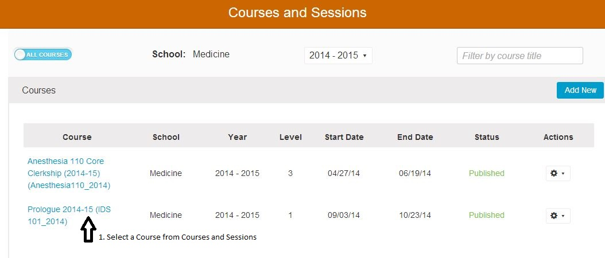
________________

**2. Expand to see the Course Details**

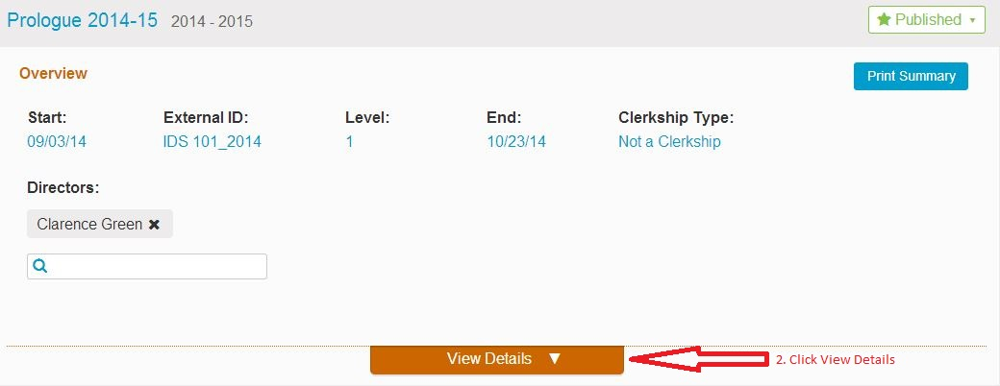
________________

**3. Select the Objective**

________________

**4. Select the MeSH Term**

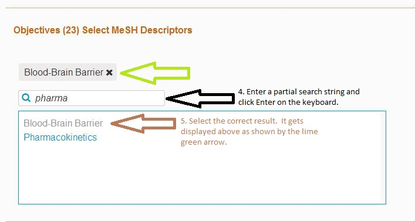
________________

MeSH terms may be associated with Courses, Sessions, Learning Materials, and Learning Objectives (at any level - Program, Course, or Session).

To select a MeSH term from the thesaurus, type in the word or phrase you wish to find, and hit ‘enter’ using your keyboard. The results will display all related concepts, terms and topics, along with their associated descriptor and tree node codes; at the top will display a list of those which have previously been returned and used for similar searches. Clicking a term will add it to the MeSH vocabulary for your selected item.  Click the green confirmation button once all terms have been added.

The current version of Ilios has the 2014 MeSH thesaurus loaded. Administrative tools are available to update the MeSH thesaurus in Ilios when desired via the Ilios MeSH parser (https://github.com/ilios/mesh-parser).

To learn more about MeSH, visit the [MeSH](http://www.nlm.nih.gov/mesh/) website.

##Competencies and Objectives

Ilios has a robust ability to track and manage educational competency domains as well as specific course- and session-level learning Objectives. Objectives are entered as part of a complex tree or hierarchy; while each level of the curriculum structure (Program, Course, Session) may be provided with any number of competencies/Objectives independently, these Objectives may also be linked to an Objective or competency at the level immediately above them if desired.

To learn more about the framework of the Ilios competency hierarchy, please click [here](http://slidesha.re/wUI5no).

The competency structure for Ilios follows current usage for the UCSF School of Medicine, and conforms to the MedBiquitous specifications for Health Education Competency Frameworks.

To learn more about these specifications, visit the [MedBiquitous](http://www.medbiq.org/working_groups/competencies/) website.

The hierarchy in Ilios contains 5 levels available for competency-objective association:

- Competency Domain
- Competency Sub-Domain
- Program Objective
- Course Objective
- Session Objective

Competency domains and their sub-domains are pre-loaded into the Ilios system. They are selected at the Program level, and are selected discretely for each Program Year. The domains selected create the pool of eligible parent domains for all courses associated to that given program.

Program Objectives (graduation requirements) are created at the Program Year; each Program Objective may be associated with a specific Competency domain.

###Enter A Course Objective

To enter a Course level Objective, select a Course and open up the details and then ...
_______________________

**1. Add New Objective**

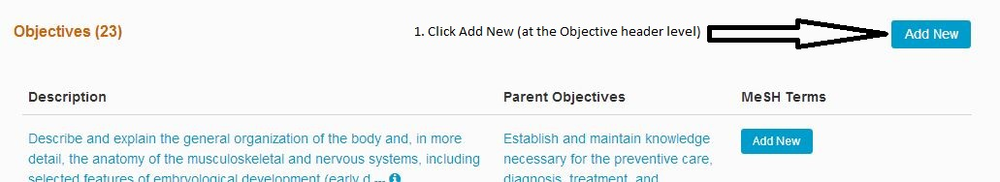
_______________________

**2. Enter Details**

Course Objectives are created at the top level of each course, and may be associated with any of the available Program Objectives from the Program(s) associated to that course.

Currently, Course Objectives may only be associated with a single Program Objective in a parent-child relationship. Session learning Objectives in turn may be linked to one or more of the Objectives in their parent Course, and in turn will inherit the linkage to any program Objectives and specific competency domains specified within the pool of eligible program competencies.

When used, the competency and Objective tracking system allows for a complete structured tree to be traced back from any specific unit of instruction to include (session)-specific learning Objectives, general course Objectives, the program Objectives toward which they are best directed, and the overarching domains of competency in which all these fall.

While all course level Objective information is directly associated with the course, in order to create a direct relationship between a course and a set of associated Competencies (and to have those competencies appear in the course information displayed to Ilios users), you must select a parent association from the available competency domains for one or more of your course Objectives.

##Alerts

Ilios is set to notify selected parties when A) they have upcoming teaching responsibilities, and B) there are changes to the schedule or content of curriculum. For all published Calendar offerings, an email reminder is sent to the instructors responsible for that offering 7 days prior to its scheduled start date. The timing of this alert is modifiable in the configuration settings file.

If there is a change to curricular materials after their publication to the calendar, an email notice will be sent to the responsible parties identified by the configurable email list which is managed on a school-by-school basis within the Ilios system. Changes which trigger alerts include:

- Modification of Date or Time
- Modification of Location
- Modification of instructors
- Modification of content (Learning Materials)
- Modification of Course Directors

Any number of email addresses for each school may be entered into the file for the receipt of change notices. If a school does not wish to send alerts for changes, the configuration may be turned off for that school by leaving the recipient email blank in the configuration file.

Please note: the title header of the email is auto-generated from the date of the change and the external ID for the course in question. It is therefore extremely important if you are using this feature to make certain that the external course ID is entered for all courses in your school. The development of an effective work practice around the assignment of, and consistent entry of the external course ID will be a tremendous aid to effective use of the alerts system.

For instructors and students, a visual alert icon on the calendar will appear when an item on the above list for a scheduled and published session has changed. The icon will remain visible for a set number of days (the number of days may be set in the configurations file, and the default is 7).

####Custom Reminder Alerts

Ilios allows for the insertion of custom email templates on a per-school basis for the 7-day teaching reminders. The generic, global template (located in `/application/system/alert_templates` ) is still used by any school which has not provided a custom template.

Custom templates should be placed in the `/application/system/alert_templates/custom/` directory on the Ilios server, and must have the school prefix prepended to the file name, followed by an underscore. The school prefix is found in the SCHOOL table, as the attribute school.template_prefix (VARCHAR 8), for example:

**Standard global template filename:** `system/alert_templates/upcoming_teaching_session_template.txt`

**Custom School of Medicine template filename:** `system/alert_templates/custom/SOM_upcoming_teaching_session_template.txt`

Custom templates should be saved as a plain text (.txt) file. Once the custom template is placed in the custom directory, it will be used instead of the global template for all reminder notifications sent for the school identified by its prefix.

The following dynamic attributes may be plugged into the custom template:

- User (recipient) Name		[%%RECIPIENT_NAME%%]
- School Name				[%%SCHOOL_NAME%%]
- Course Title				[%%COURSE_TITLE%%]
- Session Title				[%%SESSION_TITLE%%]
- Session Type				[%%SESSION_TYPE%%]
- Offering Date				[%OFFERING_DATE%%]
- Offering Start Time - End Time	[%%OFFERING_START_TIME%%, %%OFFERING_END_TIME%%]
- Offering Location			[%%OFFERING_LOCATION%%]
- Associated Learner Groups 		[%%STUDENT_GROUP_LIST%%]
- Course Objectives			[%%COURSE_OBJECTIVE_LIST%%]
- Session Teaching Objectives		[%%LEARNING_OBJECTIVE_LIST%%]

Dynamic attributes should be formatted as noted above in the parentheticals.

## Publishing

Ilios has a built in publishing workflow for curricular material. The publishing workflow serves the purpose of allowing the review of data prior to release, and to provide for the option of release in both interim (“TBD” or “Scheduled”) and final (“Publish”) modes. This is made possible by providing a summary checklist to the user for review. The checklist takes one of three different forms, depending on the workflow chosen: ***Course Level Only***, ***Single Session Only***, or ***Full Course with All Sessions***.

**To Publish a Course ...**

In the example below, all of the required fields have been entered and the Sessions have been entered and are ready to be published as well.

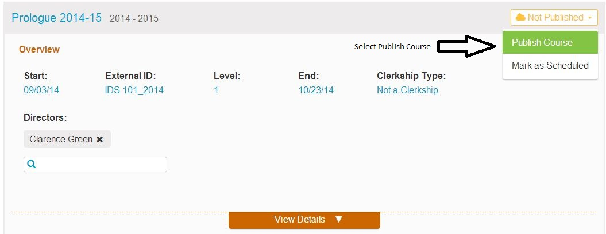

**To Publish a Course (with one or more Missing Items) ...**

There are 2 different types of data attributes available for checking in the workflow: ***required*** fields, which must be present for publishing, and if unavailable will make the publish button in the checklist inactive; and ***desired*** fields, which may be overridden after review, or left as-is without override. If overridden, the course object publishes normally. If left as-is, the course object is published as “TBD”, or “Scheduled” – which reserves space on the calendar for users to see, but does not provide details of the session. Re-publishing a course or session at any time will update the information contained in it to its most recent state. Courses and sessions are independent of one another in the workflow, and can be published individually. A course, as the umbrellas container of its sessions, may also be published together with all of its associated sessions.

In the ***Course Level Only*** workflow, the top-level (“course-level”) attributes in a course are checked to verify required information. Course level attributes which are checked are:

- Start Date (required)
- End Date (required)
- Associated Cohort (required)
- Topics
- Objectives
- Mesh

The required fields for publishing a Course are indicated above. The others are desired fields. The absence of one or more of the required fields will disallow publishing or override. The absence of one or more of the desired fields will activate the display of a “Review X Items” value on the Publish drop-down menu. If you choose to review the missing items, the Publish option will be available on the review screen.  You are required to review the items before publishing the Course or select Publish As Is.

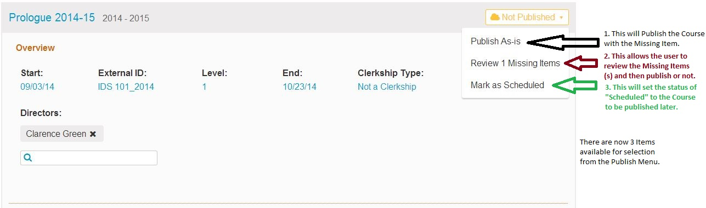

In the ***Single Session Only*** workflow, a single session is checked to verify data. Session level attributes checked are:

- Title (required)
- Offering / Due Date (required)
- Topics
- Objectives
- Mesh

The fields required to create a Session are indicated above. The others are desired fields. The absence of one or more of the required fields will disallow publishing or override. The absence of one or more of the desired fields will activate the display of a “Review X Missing Items” value on the drop-down menu. If all fields are completed, then clicking the “Publish” button will immediately publish the Session, without a review check.  If you choose to review the missing items, the Publish option will be available on the review screen.  You can choose Publish As Is if you choose not to review the items before publishing the Session.

***To Publish a Session (with one or more Missing Items)***

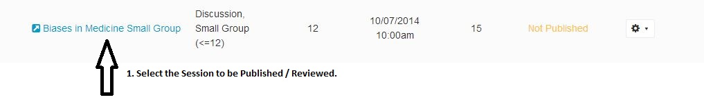

**Session Detail** appears.

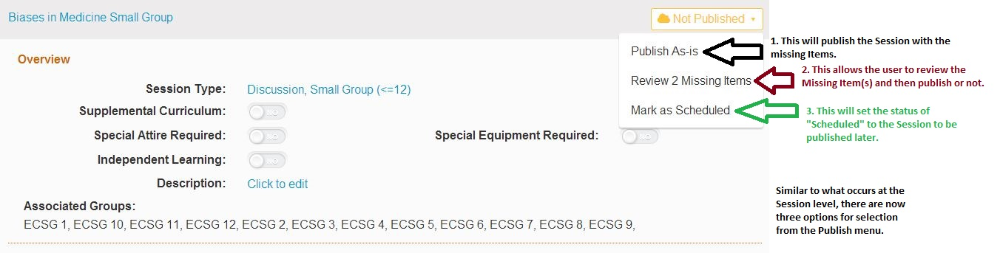

***Review Missing Items***

Upon clicking Option #2 (***Review 2 Missing Items*** - see above), the screen will display what data from among the desired fields is missing.

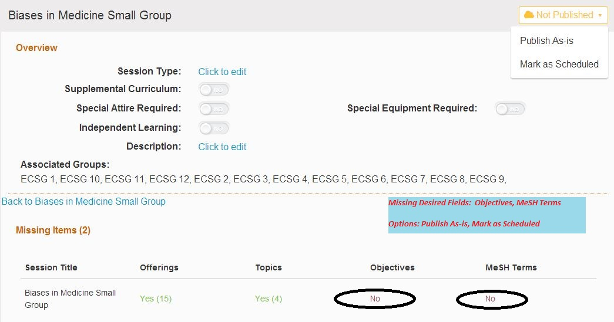

In the ***Publish Full Course with All Sessions*** workflow, a display of the course level info and every associated session is made available. The course level info and each session function independently as above, allowing override individually. If an associated session was previously in published state, it will still be displayed in the list and allow for republishing following the rules above. Any changes to a previously published session will overwrite its previous status. A course may be in Not Published state, yet have sessions which are Published or Scheduled. The Published/Scheduled sessions will not display on the public calendar until the parent course is in published or Scheduled state. Not Published sessions never display on the public calendar.

When a course is in Scheduled state and has sessions in Published and/or Scheduled state, those Published and Scheduled sessions will display as TBD until the course is published. A published course will display any Scheduled or Published sessions as their state indicates accordingly.

##Administration
###Course Cloning & Rollover
Ilios provides administrative users with the ability to clone, or “roll over” any published course for which they have edit permissions. Course rollover takes a complete course and replicates it for a new time period any time after the final date of the original course.

In order to rollover a course, the user chooses a target academic year for the new course (the default is the academic year following that of the original course), and a new start date. The target year may be any available academic year, including the current year. In order to maintain integrity of recurring and regular activities, a course start date must be the same day-of-week in the new course as it was in the parent. This can always be modified, along with any other information in the course, after the rollover is complete. The weekday on which the parent course begins is noted in the upper right corner of the rollover panel.

A user also has the option of replicating all the scheduled offerings from the original course, and placing them on the calendar for the new course. This is the default option; you may also choose to create the new course without scheduled offerings, retaining only the course and session curricular data.

At this point, the user is presented with the opportunity to review the new course prior to generation. A summary of course level information is provided in the modal panel. Please note that if a course is rolled over into a new academic year (one other than that of the original course), programs, their associated competencies, and cohort relationships will not be maintained. Learner group relationships are never rolled over with course information from one academic year to another.

For courses cloned into the same academic year as the original course, programs, their associated competencies, and cohort relationships will be maintained and presented in the summary for review. A numeric count of total sessions is also displayed for reference.

Once generated, a new course is immediately available for management (in draft mode) and re-association to appropriate cohorts, competencies, and all scheduling needs.

***KNOWN ISSUE:*** Course rollover calculates all generated dates from the entered start date of the parent course, not the first calendared event. Since there is currently no explicit constraint on start date vs. first offering event (in calendar time) entered for a session, it is important for users to note and correct any discrepancies in those dates. If there is a date mismatch there is a chance that the rolled over offering days will be out of sync with their parent offering days-of-week.

###Archiving

Ilios provides the ability for two-level archiving of material: locking of course and program information, and filing of program and course information. The archiving functions are activated on a per-session basis, for programs and/or courses, via the archiving link in the Administration console of the dashboard. Once active, links for archiving will appear in the upper right corner of archive-eligible program years and courses. Only fully published courses may be archived; if the course or any session for a course remains in draft state, archiving is not available until the draft state is changed to a published state, or the sessions are removed from the course.

***Locking***

Locking a course or Program Year sets all information within that course or program year to read-only. The material is still available for view and review within the system, but may no longer be modified by users.

***Filing***

A Course or Program Year may also be filed once it is locked; filing removes the material from the system interface and lists. It does not remove it from reporting activities or search audits, but only from the visible interface of the Ilios application UI.

###User Account and Role Management

Currently, there are two tools available in the Management Console: ***User Account Management***, and ***Permissions***. The default page is User Account Management, which provides alerts on accounts requiring administrative attention, as well as the default user search link.

***A Note on User Roles***

Ilios provides for four distinct user roles which determine mode of access for a given user, in two broad categories of NON-STUDENTS (those who are not registered as students with the campus registrar) and STUDENTS (those who are). Any user may be assigned any combination of the roles.

**Non-Students**

- ***Director:*** The Director role provides for full editorial access to the system for the primary school of the user. It adds the user as an entity in the Director and Instructor lists for association. In the `user_role` table of the database, this role is identified with a value of 1.
- ***Developer (aka Administrator):*** The Administrator role provides for full editorial access to the system for the primary school of the user. It does not add the user to any associative lists. Allows for access to the “Management Console” section from the “Administration” module on the dashboard. In the `user_role` table of the database, this role is identified with a value of 2.
- ***Instructor:*** The Instructor role provides for full editorial access to the system for the primary school of the user. It adds the user as an entity in the Instructor list for association. . In the `user_role` table of the database, this role is identified with a value of 3.

**Students**

- ***Student:*** The student role allows for the automatic ingestion from an external LDAP directory, and the association to any program cohort. Students may also be assigned additional, non-student roles, but their primary role will remain that of student.. In the `user_role` table of the database, this role is identified with a value of 4.

**Former Students**

- ***Former Student:*** The former student role allows for the additional attribute of “former student” to a given user, to identify those users who are graduates, or who were previously (but no longer) enrolled as learners. They remain in the database as students, along with all other assigned roles, but can now be tracked as graduates. In the `user_role` table of the database, this role is identified with a value of 9.

The ***User Account Management*** console feature allows for:

- The resolution of conflicts between account data in Ilios, and in the campus directory of record
- The assignment of newly entered student accounts to their correct program cohorts
- The disabling of inactive or invalid accounts
- The management of existing accounts and their role assignments
- The creation of new non-student accounts

Ilios provides a basic LDAP interface to provide for the ingest and update of users into the system. This can be extended and customized as necessary by your institution. If used, this provides the data of record for all user accounts. For more information, please see the installation notes as well as the Ilios GitHub wiki. Users are defined in two broad groups: student records and non-student records.

Student records are those which are identified in the ingested records as currently enrolled individuals, whether active or not. These records are automatically loaded into Ilios if they are not already present. However, since many external directory systems do not always provide consistent program registration information which conforms to the needs of Ilios, once a student record is ingested it must be manually assigned to its correct program cohort.

This assignment is managed from the alert panel shown. Student records may be assigned individually or in bulk; there is no time constraint on assigning them, but until they are assigned and cleared from the alert panel, the students in question will not have access to their information in Ilios, and will not be tracked as part of the educational hours and activities within the curriculum.

Non-student records are those which are valid active records, (i.e. have a valid ID and email), but are not currently noted as enrolled. These records are not automatically ingested, but are reconciled against accounts which have been entered into Ilios already.

When there is a conflict between an Ilios account record and its parent record in the campus directory, this will appear on the Management Console. Each record may either be updated --- replacing the conflicting information with the data found in the external directory --- disabled, or ignored until the next ingest cycle. Any record that is found to be in conflict will remain in the alert panel until action is taken.

To manage existing accounts and their roles, go to the ***Management Console*** and open the ***Manage User Accounts*** link. An alert icon will display on the dashboard when there are accounts awaiting attention.  Accounts requiring reconciliation will appear in the top alert panel on the Management console landing page, and students requiring cohort assignment in the bottom alert panel. If there are no items requiring attention, the default page will show the user search panel.

**Note:** When using the search panel, the default view of returned records will be from all available records in Ilios, regardless of School affiliation. However, creation of a new record will automatically associate the new record with the primary school affiliation of the current admin user.

***Resolving Account Conflicts***

Accounts which appear to have a conflict with the registered data in the external directory will be listed in the alert panel; each will provide details including what points of data are in conflict.

Selecting to ***Disable*** the account will freeze the account until further action is taken, preventing the user from accessing Ilios and removing them from select lists for further assignment, but will not change the historic Ilios record; selecting to Update will update the account with the information in the external directory; Selecting ***Leave As Is*** will remove the account from the alert list until the next ingest cycle; not selecting an option will leave the account on the alert list, waiting for reconciliation. You may also set an individual account to be ignored by the reconciliation process; this is done on the individual user account detail page by selecting the option of ***"Exclude this account from synchronization process"***.

***Assigning Student Accounts***

For institutions running scheduled updates from an LDAP source, when new student records are found, they are immediately ingested into Ilios. The records must be assigned to their program cohorts manually.

A user will only see those student records for their own primary school affiliation in this list; records for other schools will be ingested, but are only currently manageable by admin users for that specific school. Only student records which have not been entered into Ilios and are unassigned to a specific cohort will appear on this list; if students have been manually entered via the Learner Groups page, the external record will be matched with it.

This assigns students to a “primary” cohort, which will be their parent cohort in the system. Both students and non-students may be assigned into any number of “secondary” cohorts.

***Disabling Accounts***

The ***“disabling”*** of an account is blocking the user’s access to Ilios. This means that a user who has been disabled will no longer be able to log in to the system, and instead will be alerted that their account has been disabled, and to contact the Ilios administrator for assistance.  This is the default state for newly ingested student records until they have been assigned to a cohort. For Instructor and Director records, they will also be removed from the current selection lists in the system.

To disable an existing Ilios Account, search for the user account in question, and select them from the results list. From the available actions, choose ***“disable this account”*** and click ***continue***. The account is now disabled.

Similarly, for managing existing account roles, simply find the desired account, select the desired active roles for the user in question and click continue.

***Ignoring Accounts for Directory Ingest and Reconciliation

An account may be set to be ignored by the reconciliation with external directory information; this provides for avoiding repeating alerts on accounts that may have information which is unavailable to the campus system, or which are specific to Ilios for any reason. Clicking the box labeled ***“Exclude this account from synchronization process”*** will set the account to be ignored by the process.

***Account Creation***

There are two methods of creating a user in Ilios: via the Management Console, or via csv file upload. To upload a csv list of instructors, go to the Instructor Groups page, create or open a group, and click on the “add new” button. To upload a csv list of students, go to the Learner Groups page, create or open a group, and click on the “add new” button. Please note that inputs must be formatted exactly as described, without any headers, and will not allow the upload of duplicate records. Each row in the csv must be as follows:

`Last Name, First Name, Middle Name, Phone, Email, Campus ID, Other ID`

Once uploaded, the users listed will be added to the instructor group or learner cohort in which you are working.

The other, preferred method of creating users in Ilios is to use the ***Management Console*** search tool. When a search for a user is run, if no results are found in Ilios, the user is presented with the opportunity to create a new Ilios account.

Selecting ***“Create Account”*** will bring up the template for entering a new account: The required fields are name, UCID, and email. These must match the official records in the directory for accuracy. Note that if internal authentication is not active, the username and password fields are disabled or not visible at all in more recent versions; these are only for use in situations where Ilios native authentication, rather than shibboleth, is in use.  Passwords must adhere to a high security standard.

Please note that only non-student accounts may be created here. The account may later be associated with a learner record via external directory reconciliation as described above, but in general student accounts should only be entered into Ilios via external directory feed or via the Learner Groups page.  Minimum and maximum lengths of the UC Id field may be set in the configuration file `config/ilios.php` as variable attributes. The default min and max values are each initially set to “9”, but can be modified in the file `web/application/config/[default.]ilios.php`.

There are three basic non-student roles available for assignment in Ilios: Developer, Director, and Instructor.

Assigning Developer privileges allows the user full editorial access to data for their primary school, but does not associate them with the curricular selection lists.

Assigning the role of Director will add the user to the select lists for Course and Program Directors and Instructors, and provide them editorial access to any material to which they are associated.

Assigning the role of Instructor will add the user to the select lists for Instructors, and provide them editorial access to any material to which they are associated.

Leaving a user without a role assignment provides them view access only; this is the default for student users ingested into the system.

If synchronizing with an external directory, user accounts will be checked against that store on a scheduled basis. To remove an individual account from that check, you may check the “Exclude this account from the synchronization process” box. The user account will then be ignored in checking for external changes or updates and the record will no longer appear as an exception.

***Cohort Assignment***

Both students and non-students may be assigned into any number of “secondary” cohorts. Students may be assigned to secondary cohorts whether or not they have been assigned to a primary cohort. Secondary cohorts may be selected from any active program in any active school. Once assigned to a secondary cohort, a user may be managed in that cohort’s groups as would any learner.

To assign a user a secondary cohort, click the “edit” button beneath the user cohort information listing on their account information page. Select any available program cohort from the list provided in the picker, and save. The assignment will now be shown on the user’s page.

###Access Control and Permissions

Ilios provides a management interface to allow for the simple control of edit – level permissions for existing users and their access to curricular data. Combined with the option of joint program stewardship, these permissions provide an extremely powerful mechanism for creating and deploying interdisciplinary curricula.

By default, any existing non-student user will automatically have edit privileges to the curriculum for their assigned school. To assign school privileges, or to assign direct course privileges to users, the Management Console should be opened. It is accessed by clicking on the “Open Management Console” link in the Administration section of the Dashboard. Only users assigned admin control for the system (directors, developers) may access the console.

Clicking on the ***Manage Permissions*** link will bring up a select box of all Ilios users, regardless of school association. You may select one or more users for permissions management.

Selecting one user will return a display of that user’s current access permissions to Schools, Programs and Courses.

**Current Schools:** This provides access to the curricula for multiple schools in an institutional deployment of Ilios. Roles and access levels are carried over from school to school for any given user.

**Current Programs:** Provides explicit admin access to the Programs listed, regardless of role or access level.

**Current Courses:** Provides explicit admin access to the Courses listed, regardless of role or access level.

Selecting the appropriate link will allow for the addition/removal of items from their access list. Assignment is immediate upon display of the course or program in the access lists. You may only modify one category of permissions at a time. To modify additional permissions, save your selection(s) and return to the permissions selection screen.

Only Programs and Courses for the current School being accessed by the admin user will be available for assignment.

Selecting more than one user will allow for the bulk assignment of permissions. When setting permissions for multiple users, please note:

- Only access permission may be granted. In order to remove access permission, you must access an individual user.
- If any permissions exist for any of the selected users in association with the selected Course or Program, they will be overwritten by the new assignment.

Assignment is immediate upon display of the course or program in the access lists.

Clicking the **“Finish”** button returns the user to the main **Management Console** Menu display.

##Curriculum Inventory Manager

The Curriculum Inventory Manager is designed to allow Ilios users to craft standards-compliant xml output reports for the AAMC’s new Curriculum Inventory, as well as to provide a platform for modeling new frameworks for the curricula held in Ilios.

Access to the CI Manager is restricted to Course Directors and those users given “developer” role privileges.

In this first iteration, the tools allow for the basic construction of curriculum blocks (“sequence blocks”) and their appropriate population with course and other data. Usage follows the model found in program, course, and group management.

It is important to note that all fields in the UI forms are effectively mandatory; there are no fields presented to the user which are not explicitly called for by the specification and standard. In certain circumstances, certain attributes may need to be left blank (as in the ‘Course’ attribute for a master parent sequence block with nested child blocks in it); or as in the case of Clerkship dates and durations a selection of either/or variables may alter into a set of mandatory required variables. These circumstances are dictated by the standard and the AAMC business rules. For further details on the various attributes available to the CI, please see the detailed information and examples provided by the AAMC [here](https://www.aamc.org/initiatives/cir/), as well as the Medbiquitous standards information found [here]( http://bit.ly/1dPMh8e), or contact the AAMC for additional information. For information on mapping Ilios data to the PCRS, configuration settings, and further detailed information on the Curriculum Inventory tools, please go to the Ilios wiki [here](https://github.com/ilios/ilios/wiki/The-Curriculum-Inventory-Manager).

Reports may be created, edited and/or deleted up until they are “finalized”. Selecting the finalize button saves the report to the database as part of the historical record.  These reports can no longer be modified.

Only one report for each year of each program may be in place at any time; this includes finalized reports.

The export created by the report is compliant with the Medbiquitous standards and the AAMC inventory business rules. Once generated it may be delivered directly to the AAMC for input into the CI and MedAPS system.

When building the report, each “block” of the curriculum, regardless of whether it is a track, a set of courses, or a single course, is created as a “sequence block”. Sequence blocks may be nested at any level, so you can put blocks within blocks (within blocks), and so on, as shown below.

Any number of levels may be nested; it is important to note that the highest level block must be created first, as this iteration does not allow for the moving or shifting of blocks from one container to another or one level to another.

It is strongly recommended that the structure of your report is well defined prior to creating it in Ilios; this will facilitate the process of modeling your high level tracks, blocks, and nested sequences.

Note that in the current iteration, it is necessary to create the highest level block in a nested set first, and work down. So in the case of complex parallel and intersecting longitudinal curricular mappings, the topmost container (or curricular title or structure) should be created as your first sequence block. For example, for a block of 1st and 2nd year courses associated together as “Essential Core”, which include 5 major course blocks, as well as a parallel longitudinal program for Foundations of Care, you would first create a block called “Essential Core”, and then within it nest 5 ordered blocks – one for each course --- and then an additional parallel block for Foundations of Care.

***Working with Instructional Time***

When you create a course-based sequence block in your report, the block will list every session given for that course, and the total instructional time for each. Along with each session listing, a checkbox is available; checking this checkbox (which is by default in the “unchecked” state) marks the session as a single event, regardless of the number of times it is offered. In other words, for small groups sessions, small lab sessions, and similar, all the group time or labs will be counted only as one event when checked. If a one-hour lab is given for 24 groups, then when checked it will be listed as a one-hour event.

Unchecking the box (or leaving it by default in the unchecked state) will allow the system to add the sum of all offerings for a session; so in the above example, a one-hour lab given for 24 groups would be counted as 24 instructional hours.

You may modify this setting for each session at any time until finalization of your report.

**NOTE:** If a session contains multiple offerings of different time lengths, then when the checkbox is checked Ilios will identify the longest available offering for that session and use that as the basis for its calculation; so if there are three offerings for a lab, with durations of 1 hour, 1.25 hours, and 1.75 hours respectively, with the checkbox checked the report will list the session as 1.75 hours of instructional time. Unchecked it will list it as 4 hours of instructional time.

Once a report is created in draft form, it becomes available in the “select report” list which appears when clicking the “select report” button at the top left of the screen. Reports may be edited at any time until they are finalized. Once finalized, they may not be modified, and changes to the existing active curriculum or Ilios data will not modify their contents.

##Calendar Embed for 3rd Party Applications

In many cases, it will be desirable to have access to Ilios calendar and learning material information within an external system, such as an LMS. To facilitate this, we provide a controller which may be called from an external authenticated source location, and will present a calendar view within an iframe in that environment.

The Ilios code is contained in the `Calendar_Controller.php` file, and we have also released a moodle code block to allow for this feature to be used at institutions using moodle 1.9.x. thru moodle 2.4.

